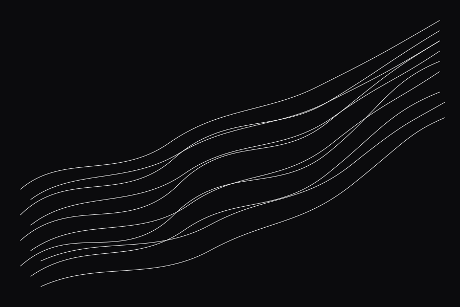
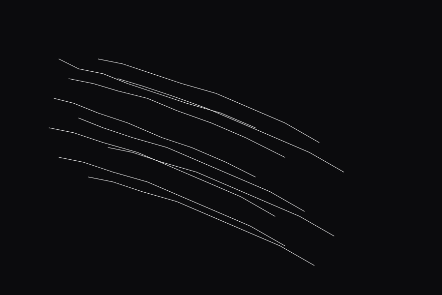
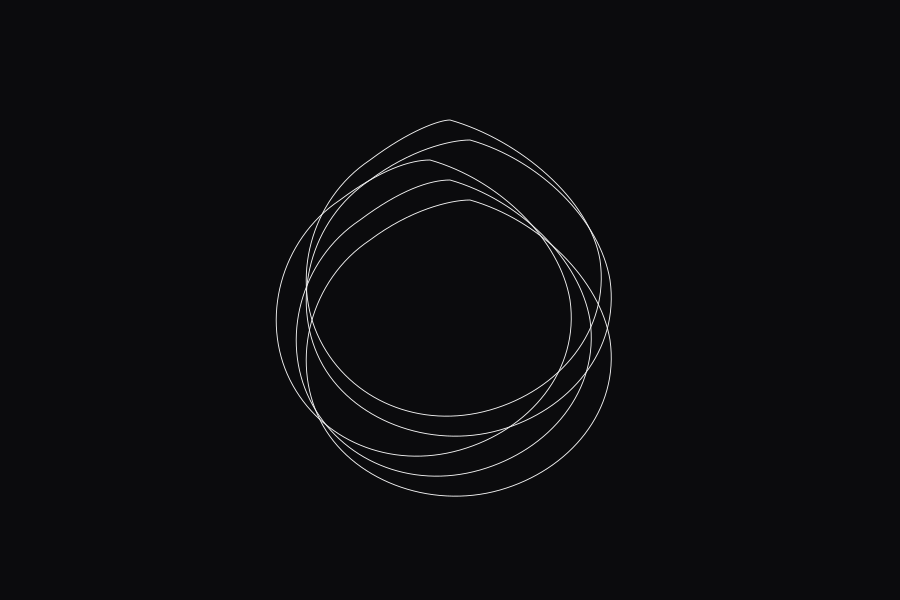
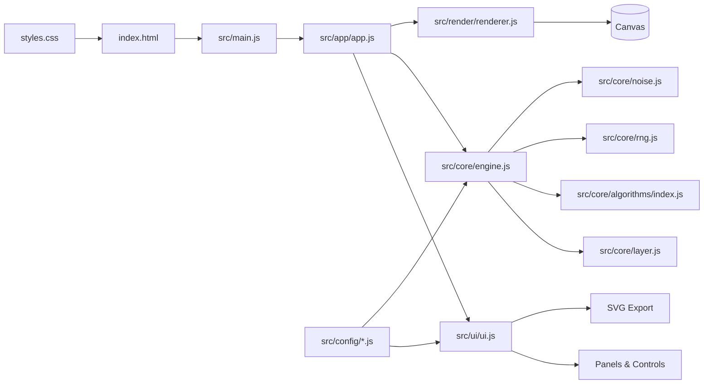

# Vectura Studio

Vectura Studio is a physics-inspired vector generator for plotter-ready line art. It is deliberately no-build: open `index.html` in a browser and everything runs with modular JavaScript and Tailwind loaded via CDN.

## Highlights
- Plotter-first output in millimeters with machine profiles (A3, A4, AxiDraw V3).
- Layered generation with visibility toggles, ordering, and per-layer stroke/line-cap settings.
- Seeded, repeatable results with live transform controls (position and scale).
- Multiple algorithm families (flowfields, lissajous, wavetable, boids, attractors, hyphae, shape pack).
- One-click SVG export with configurable precision.
- Live formula display and estimated pen distance/time.

## Gallery
Sample outputs included in `assets/gallery/`. 

| Flowfield | Boids | Attractor |
| --- | --- | --- |
|  |  |  |

## Quick Start
Option A - open directly:
- Double-click `index.html`.

Option B - serve locally:
```bash
python -m http.server
```
Then visit `http://localhost:8000`.

## How to Use
1. Pick an algorithm in the left panel and adjust its parameters.
2. Use the transform controls (seed, position, scale) to nudge the layer.
3. Manage layers on the right: add, reorder, hide, or tune stroke width and line cap.
4. Use Settings for machine size, margin, stroke, background, and SVG precision.
5. Export with the [EXPORT SVG] button.

Pan: Shift + Drag. Zoom: Mouse Wheel.

## Algorithm Library
Each layer is powered by an algorithm with its own parameters and formula preview:
- Flowfield: noise-driven vector fields for organic line flows.
- Boids: emergent flocking paths.
- Attractors: Lorenz-like and chaotic systems.
- Hyphae: branching, growth-like structures.
- Lissajous: harmonic parametric curves.
- Wavetable: layered noise wave stacks.
- Shape Pack: circle/polygon packing with rotation and perspective controls.
- Cityscape: four-point perspective blocks with inward hatch lines toward a central core.

Defaults live in `src/config/defaults.js` and descriptions in `src/config/descriptions.js`.

## Architecture


## Project Structure
- `index.html` - app shell, Tailwind CDN config, and script order.
- `styles.css` - custom UI styling and texture effects.
- `src/app/` - application orchestration and lifecycle.
- `src/core/` - vector engine, layers, RNG/noise, and algorithms.
- `src/render/` - canvas rendering and view transforms.
- `src/ui/` - panels, controls, settings, and SVG export.
- `src/config/` - machine profiles, defaults, and UI descriptions.
- `dist/` - optional prebuilt output (not required for local dev).

## Customization Tips
- Add new algorithms by extending `src/core/algorithms/index.js` and wiring defaults/UI in `src/config/` and `src/ui/ui.js`.
- Machine sizes live in `src/config/machines.js` and are used for bounds and export dimensions.
- Keep script order intact in `index.html`; `src/main.js` expects globals to be registered on `window.Vectura`.

## Deployment (GitHub Pages)
1. Push this repo to GitHub.
2. In Settings > Pages, set Source to "Deploy from a branch".
3. Select your branch (for example, `main`) and the root (`/`) folder.

All asset paths are relative (`./...`), so the site works under a GitHub Pages subpath.
