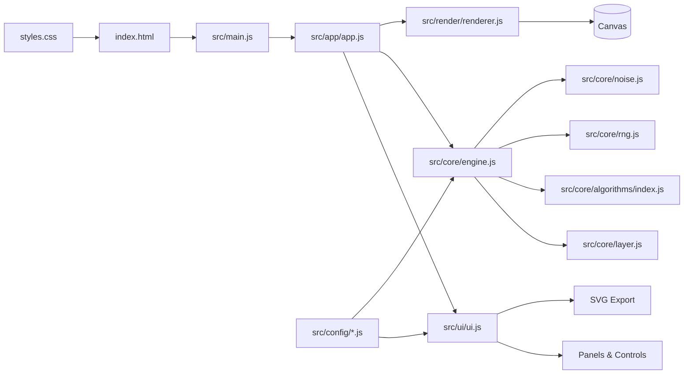

# Vectura Studio

Vectura Studio is a physics-inspired vector generator for plotter-ready line art. It is deliberately no-build: open `index.html` in a browser and everything runs with modular JavaScript and Tailwind loaded via CDN.

## Highlights
- Plotter-first output in millimeters with machine profiles (A3, A4, AxiDraw V3).
- Layered generation with visibility toggles, ordering, and per-layer stroke/line-cap settings.
- Seeded, repeatable results with live transform controls (position, scale, rotation).
- Direct canvas manipulation: drag to move the selected layer, drag corner handles to resize, rotate via the upper-right handle, and double-click to rename layers.
- Multi-selection: shift-click ranges in the layer list, Cmd/Ctrl-click to toggle, or drag a marquee, then move/rotate the group together.
- Layer grouping/ungrouping via Cmd/Ctrl+G and Cmd/Ctrl+Shift+G.
- Illustrator-style tool bar with selection, direct selection, hand, pen (bezier), and scissor tools (V/A/Space/P/C). Press V/P/C again to cycle subtools.
- Pen long-press subtool menu with Illustrator-style modes and shortcuts (P, +, -, Shift+C).
- Direct path editing for individual line endpoints and bezier handles.
- Expand any layer into per-line sublayers for fine-grained selection and pen assignment.
- Canvas shortcut overlay that stays above the formula panel (toggleable in Settings).
- Alignment guides for canvas center and size matching while dragging.
- Guide visibility and snapping toggles in Settings (Cmd while dragging overrides snapping).
- Optional 10mm grid overlay toggle in Settings for layout alignment.
- Auto-colorization for active/selected/all layer scopes with `None` reset mode, one-shot Apply, and Continuous Apply Changes.
- Optional cookie-backed UI preference persistence from Settings.
- In-app help guide and shortcut menu (press `?`).
- Parameter randomization and simplification controls with live line/point counts.
- Double-click any value to edit it inline, and double-click a control to reset to defaults.
- Fast duplication and nudging: Cmd/Ctrl+D duplicates selection, Alt-drag (Option-drag) to duplicate, arrow keys to nudge (Shift for larger steps).
- Configurable undo with Cmd/Ctrl+Z and adjustable history depth.
- Multiple algorithm families (flowfields, lissajous, harmonograph, wavetable, rings, topo, boids, attractors, hyphae, shape pack).
- Harmonograph pendulum list with add/delete/toggle controls and optional guide overlay.
- Rainfall generator with wind, droplet styling, and optional silhouette masking.
- Wavetable noise stack with per-noise blend modes, tile patterns, image effects, polygon noise, and drag-to-reorder layers.
- Petalis generator with radial petals, center morphing, shading, tip curl, and 20 named presets (plus an in-dev light source marker).
- Petalis Designer algorithm variant with an embedded full Petal Designer panel in the parameter stack.
- Petal Designer window (draggable 2x2 editor) for outer/inner petal profile drawing, copy-left/right, and live shading preview.
- Pen palette with assignable colors/widths, reorderable list, drag-to-assign per layer or selection, double-click-to-apply on selected layers, plus palette selection and add/remove controls.
- Plotter optimization slider to remove fully overlapping paths per pen before export.
- Optimization pipeline (linesimplify, linesort, filter, multipass) with scope selection, preview overlays, and export toggle.
- One-click SVG export with configurable precision and grouping by pen assignment.
- Live formula display and estimated pen distance/time.

## Gallery
Sample outputs included in `assets/gallery/`. 

| Flowfield | Boids | Attractor |
| --- | --- | --- |
|  |  |  |

## Quick Start
Option A - open directly:
- Double-click `index.html`.

Option B - serve locally:
```bash
python -m http.server
```
Then visit `http://localhost:8000`.

## How to Use
1. Pick an algorithm in the left panel and adjust its parameters.
2. Use the transform controls (seed, position, scale, rotation) to nudge the layer.
3. Use Post-Processing Lab for smoothing/curves/simplify plus optional optimization passes and preview.
4. Manage layers on the right: add, reorder (drag the grip), duplicate, hide, rename (double-click), expand into sublayers, and assign pens (drag a pen onto a layer to apply to the selection).
5. Use Settings for machine size, margin, truncation, margin guides, stroke, background, SVG precision, auto-colorization, and optional cookie preference saving.
6. Save/Open full projects via .vectura files, or import SVGs as new layers.
7. Use [PETAL DESIGNER] on Petalis/Petalis Designer layers, or switch to the Petalis Designer algorithm for an embedded inline designer panel.
8. Export with the [EXPORT SVG] button.

Pan: Shift + Drag. Zoom: Mouse Wheel. Move layer: Drag. Resize layer: Drag corner handles. Rotate: Drag the upper-right handle (Shift snaps). Duplicate: Alt-drag. Expand: Cmd/Ctrl + E. Pen tool: click to add points, click-drag for bezier curves (Shift constrains, Alt breaks handles), double-click near the first point to close, Enter commits, Esc cancels. Pen subtools: `+` add anchor, `-` delete anchor, `Shift+C` convert anchor. Direct tool (`A`) edits endpoints and handles on individual line paths. Scissor tool: drag a line/rect/circle to split intersecting paths.

## Algorithm Library
Each layer is powered by an algorithm with its own parameters and formula preview:
- Flowfield: noise-driven vector fields with selectable noise types, octaves, and minimum-length filtering.
- Boids: emergent flocking paths.
- Attractors: Lorenz-like and chaotic systems.
- Hyphae: branching, growth-like structures.
- Lissajous: harmonic parametric curves.
- Harmonograph: multi-pendulum curves with damping and frequency control.
- Wavetable: layered noise wave stacks with multiple noise types, image effects, and polygon shaping.
- Rings: concentric rings with noise-modulated radii.
- Topo: contours extracted from a noise-based height field.
- Rainfall: rain traces with droplet shaping, wind, and silhouette/ground controls.
- Petalis: radial petal structures with presets, center modifiers, and shading controls.
- Petalis Designer: Petalis variant with embedded interactive petal-shape and shading designer controls.
- Spiral: includes optional closure for looping the outer end back into the spiral.
- Shape Pack: circle/polygon packing with perspective controls.

Defaults live in `src/config/defaults.js` and descriptions in `src/config/descriptions.js`.

## Architecture


## Project Structure
- `index.html` - app shell, Tailwind CDN config, and script order.
- `styles.css` - custom UI styling and texture effects.
- `src/app/` - application orchestration and lifecycle.
- `src/core/` - vector engine, layers, RNG/noise, and algorithms.
- `src/core/algorithms/*.js` - one file per algorithm, with `src/core/algorithms/index.js` assembling the registry exposed to the engine.
- `src/render/` - canvas rendering and view transforms.
- `src/ui/` - panels, controls, settings, and SVG export.
- `src/config/` - machine profiles, defaults, UI descriptions, palette library, and cross-system preset registry.
- `dist/` - optional prebuilt output (not required for local dev).

## Customization Tips
- Add new algorithms by creating `src/core/algorithms/<algorithm>.js`, registering it in the algorithm registry, and wiring defaults/UI in `src/config/` and `src/ui/ui.js`.
- Machine sizes live in `src/config/machines.js` and are used for bounds and export dimensions.
- Pen palettes live in `src/config/palettes.js` and can be edited or extended.
- Presets live in `src/config/presets.js` as a shared registry; each entry requires `preset_system`, `id`, `name`, and `params`.
- Post-Processing Lab includes smoothing/curves/simplify plus the optimization pipeline (linesimplify, linesort, filter, multipass).
- Keep script order intact in `index.html`; `src/main.js` expects globals to be registered on `window.Vectura`.

## Deployment (GitHub Pages)
1. Push this repo to GitHub.
2. In Settings > Pages, set Source to "Deploy from a branch".
3. Select your branch (for example, `main`) and the root (`/`) folder.

All asset paths are relative (`./...`), so the site works under a GitHub Pages subpath.
