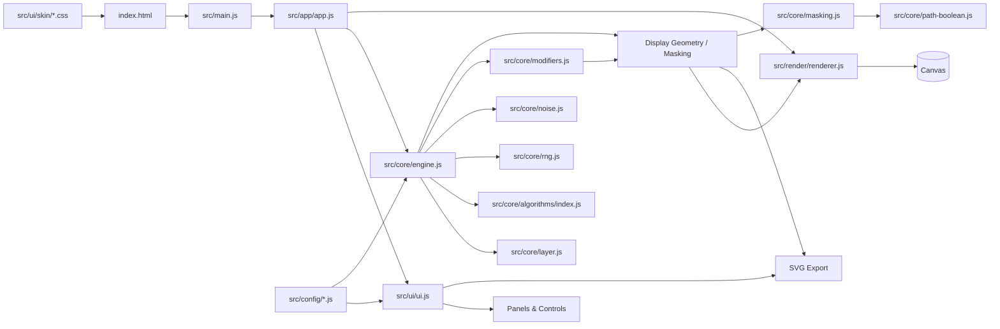
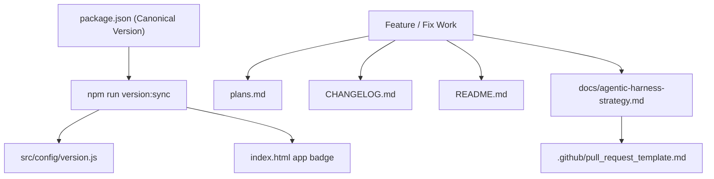

# Vectura Studio

**Physics-inspired vector generation for plotter-ready line art.** No build step, no framework — open `index.html` and go. Vectura combines a rich algorithm library (flowfields, boids, attractors, Petalis, and more) with a full layer system, mirror & morph modifiers, SVG export with plotter optimization, and a Noise Rack for layered generative noise — all in vanilla JavaScript.

---

## Gallery

| Flowfield | Boids | Attractor |
| --- | --- | --- |
|  |  |  |

---

## Quick Start

**Option A — open directly:**
```
Double-click index.html
```

**Option B — serve locally:**
```bash
python -m http.server
# then visit http://localhost:8000
```

**For tests:**
```bash
npm install
npm run hooks:install   # one-time: installs pre-commit + pre-push (test:fast) hooks
npm run test:ci
```

> The `pre-push` hook runs `test:fast` (~12s — unit + integration + visual + perf) before every push. E2E is gated only by CI to keep local pushes snappy. Bypass with `SKIP_PREPUSH=1 git push`.

> If your Node runtime doesn't support Unicode regex property escapes (some Node 18.16.x builds), run `npm run patch:test-runtime` first.

---

## Features

### Layers & Modifiers

Vectura uses an Illustrator-style layer system with full undo history for every structural edit — reorder, group, reparent, mask toggles, and modifier changes are all first-class history steps. Layers support per-layer stroke/line-cap settings, visibility, and drag-to-reorder. **Mirror Modifiers** let you wrap layers in a reflective container with a full mirror-axis stack, and **Morph Modifiers** blend 2+ child layers into graduated in-between rings (an Illustrator-style Blend, but plotter-native).

<details>
<summary>Full layer & modifier feature list</summary>

- Layered generation with visibility toggles, ordering, and per-layer stroke/line-cap settings
- Illustrator-style parent masks from the Layers panel: a visible parent silhouette clips all indented descendants, with optional `Hide Mask Layer` for invisible mask artwork and a live dimmed-descendant preview while the mask parent is being transformed
- `Insert > Mirror Modifier` adds a group-like container with drag-to-assign or drag-out child layers, `+ Add` child-layer creation from a selected modifier, fully editable selected child layers, and mirrored closed-mask silhouettes for masked subtrees
- `Insert > Morph Modifier` adds a blend container: drop 2+ layers in and it generates N graduated in-between rings morphing one shape into the next (sequential A→B→C chaining or a cyclic loop), with controls for steps, easing, vertex resampling, start-vertex correspondence, multi-path handling, source emission, closure, and output smoothing; children auto-lock and Expand bakes each ring into its own shape layer
- Mirror guides are dashed editor overlays with a centered reflection triangle; reflected geometry exports while guide lines stay editor-only
- The modifier row owns a Mirror Stack with per-axis show/hide, lock, delete, reorder, angle, and XY shift controls plus stack-level add/show-hide/lock/clear actions; deleting the modifier dissolves the wrapper and preserves children
- Layer grouping/ungrouping via `Cmd/Ctrl+G` and `Cmd/Ctrl+Shift+G`
- Illustrator-style **Pathfinder panel** for multi-selection: four Shape Modes (Unite, Minus Front, Intersect, Exclude) build non-destructive compound shapes (Expand to bake), and six Pathfinders (Divide, Trim, Merge, Crop, Outline, Minus Back) produce destructive baked output grouped under a `pathfinder` container. Silhouette mode chord-closes open paths; Shape-Only mode restricts to closed shapes. Outline preserves source `strokeWidth` for plotter-ready line art.
- Undo/Redo treats document-mutating layer-structure edits as first-class history steps, including reorder, grouping, reparenting, parent-mask toggles, and modifier/container edits
- Multi-selection: shift-click ranges, `Cmd/Ctrl`-click to toggle, or drag a marquee on the canvas; then move/rotate the group together
- `Cmd/Ctrl+A` selects all drawable layers from anywhere outside text inputs
- Double-click a layer name to rename it inline
- Expand any layer into per-line sublayers for fine-grained selection and pen assignment (`Cmd/Ctrl+E`)
- Fast duplication: `Cmd/Ctrl+D` duplicates selection; Alt-drag (Option-drag) also duplicates
- Configurable undo with `Cmd/Ctrl+Z` and adjustable history depth

</details>

---

### Canvas & Tools

An Illustrator-style shared toolbar now drives the main canvas plus the embedded designer surfaces, including selection, direct selection, hand, pen (bezier), shape, scissor, and fill tools. Shape tools create true straight-edge primitives with corner rounding, the pen tool supports full bezier editing with Illustrator-style subtool shortcuts, and Pattern texture fills now support nested-region targeting with drag-pour behavior.

<details>
<summary>Full canvas & tool feature list</summary>

- Shared Illustrator-style toolbar with shortcuts: `V` selection, `A` direct selection, `Space` hand, `P` pen, `M` rectangle, `L` oval, `U` line, `Y` polygon, `C` scissor, `F` fill, `Shift+F` erase fill; press again to cycle subtools where available
- Direct path editing for individual line endpoints and bezier handles
- Shape tools (Rectangle `M`, Oval `L`, Line `U`, Polygon `Y`) live under a single long-press group on the toolbar — single-tap activates the most-recently-used variant, long-press opens the variant submenu. All four create editable expanded layers; fresh shapes stay straight-edged on mouse release
- Custom canvas cursors: filled arrow for Selection (`V`), outline arrow for Direct Selection (`A`), pen-tip for Pen (`P`), and a paint-bucket overlay with an auto-positioning magnifier loupe for Fill (`F`) that stays inside the canvas viewport
- Shape tools support center-draw / square-circle constraints (`Alt`), polygon side-count changes while dragging (`Arrow Up/Down`), and Illustrator-style corner rounding (Selection rounds all corners; Direct rounds one corner, or all selected corners together when several are selected)
- Pen long-press subtool menu with Illustrator-style modes: `+` add anchor, `-` delete anchor, `Shift+C` convert anchor; while dragging a new bezier point, `Alt/Option` freezes the mirrored handle and lets the active handle move freely
- Scissor tool: drag a line/rect/circle to split intersecting paths
- Fill tool supports nested closed regions in the Texture Designer: click the smallest containing region, `Shift`-click to fill the whole containing stack, drag to keep pouring across new regions, and hold `Alt/Option` to temporarily erase fills while dragging
- The Texture Designer seam preview now includes a `Show Gaps` tolerance slider that reveals near-miss tile joins in yellow and offers auto-close fixes for closable seam endpoints
- Direct canvas manipulation: drag to move the selected layer, drag corner handles to resize, rotate via the upper-right handle (`Shift` snaps)
- Eight-handle selection box: the four corners plus four **edge-midpoint** handles for single-axis resize (`Shift` constrains proportions)
- **Flip Horizontal / Flip Vertical** mirror the selection (single or multi) about its bounds center — world-exact, self-inverse, one undo step; also available as icon buttons in the Transform section and the right-click menu
- **Numeric transform fields:** the Transform section shows editable **X / Y / W / H** for shape/text selections (single or combined multi-selection bounds) with a **link W/H** proportional toggle — setting W resizes to that exact width, one undo step. With Direct Selection and one anchor selected, X / Y become the anchor's world position and move it live
- **Right-click canvas menu:** a context menu of the usual verbs — Duplicate, Delete, Undo/Redo, Group / Ungroup / Isolate, Simplify, Smooth, Flip H/V, and Transform — each routing to the same command as the toolbar / shortcut / Task Bar
- **Object-to-object smart guides:** while dragging, magenta guides + snapping align to other objects' edges and centers with semantic labels (`path` / `anchor` / `midpoint` / `endpoint`), equal-spacing hint chips, and a hover-highlight of the path under the cursor — all behind the existing guide/snap toggles
- **Live measurement readouts (Illustrator-style):** a compact gray two-line chip rounded to 0.1 mm — `X / Y` position on hover/select (with a pink `anchor` feature label pinned at the point) and relative `dX / dY` while dragging — plus a **center helper point** (blue diamond + `center` label + `X / Y`) revealed when hovering any object's center. Both toggle off via Document Setup ▸ Guides & Display (**Coordinate readout**, **Center point**)
- **Multi-corner rounding (Direct Selection):** select several corners and drag one corner's rounding handle to round them all to the same radius under the cursor (already-rounded corners snap to it); unselected corners stay put
- Alignment guides for canvas center and size matching while dragging
- Guide visibility and snapping toggles in Document Setup (`Cmd` while dragging overrides snapping)
- Alt/Option+drag duplicates the whole selection (multi-select included); `Esc` mid-drag cancels with no copy left behind
- **Stroke Options** surface: cap (butt / round / projecting), corner (miter / round / bevel) with miter limit, align-stroke (center / inside / outside), and a live dashed-line editor — all serialized in `.vectura` and emitted on SVG export
- **Pen Picker popover:** click a stroke's pen chip to apply any document pen instantly, or mix a new pen (color + width + name); a mixed-selection chip shows `?`; shares the pen list with the docked Pens panel
- **Simplify / Smooth / anchor verbs** (`Vectura.PathEditOps`): scrubbable lossless Simplify preview, Auto-Smooth, one-shot Smooth, and anchor convert / cut / join — with live-shape auto-expand and a "Shape Expanded" toast (these become one-click Task-Bar actions in the next phase)
- **Outline Text:** convert a Text layer into a group of per-glyph editable path layers (each named for its character), one undo step; double-click isolation drills into individual glyphs
- **Contextual hint bar:** the bottom workspace strip shows per-tool hints, the active tool name, live zoom %, and rotation; the hint text clears during a drag. Toggle the hints in Document Setup → Guides & Display (readouts always show)
- Mask parents ghost-preview their masked descendants outside the silhouette while you move/resize/rotate them, then restore normal masking on release
- Tablet/touch parity: pointer-native canvas interactions, one-finger tool input, two-finger pan/pinch zoom, and touch modifier buttons (`Shift`, `Alt`, `Meta`, `Pan`)
- Switching algorithms restores transform defaults for the selected algorithm (position/scale/rotation do not carry over)
- Seeded, repeatable results with live transform controls (position, scale, rotation) via the collapsible `Transform & Seed` sub-panel
- Double-click any value to edit inline; double-click a control to reset to defaults
- Arrow keys to nudge layers (`Shift` for larger steps)

</details>

---

### Contextual Task Bar

Select an object and an Illustrator-style **Contextual Task Bar** floats just below it with the actions that matter right now — edit path, pen, stroke weight, shape properties, group/align, isolate, or text. Stroke weight and Simplify open inline sub-modes; live rectangles and polygons get a corner-radius / side-count popover. Double-clicking into a group shows an isolation breadcrumb across the top of the canvas. Toggle the bar under Document Setup → Guides & Display. No AI tooling anywhere.

<details>
<summary>Full contextual task bar feature list</summary>

- **Floating contextual bar** (`.ctxbar`) anchors below the selection, flips above near the viewport bottom, clamps to the viewport, yields to the tool rail, and hides during canvas drag / drawing / text-caret edits
- **Per-selection actions:** idle (Add Layer dropdown, Draw with pen icon, Document Setup); single path (Edit Path, pen chip, stroke, shape properties, lock); multi (Group, Align flyout, pen, stroke); group (Ungroup, Isolate group, pen, stroke); direct (Simplify, Smooth, six anchor verbs); text (family/style/size bound to the Text panel, Outline, pen)
- **Add Layer dropdown:** idle-state pill left of Draw, matching the sidebar's Add Layer menu — Algorithm Layer (drill-down to the same grouped/iconed algorithm list as the module dropdown), Mirror/Morph Modifier Group, Empty Layer, Empty Group. Opens toward whichever side (up/down) has more room, caret included, and keeps re-flipping live as the bar is dragged or auto-repositions
- **Stroke-weight sub-mode:** slider + steppers + document-unit field morph into the bar, with "Open Stroke Options" for the full popover; one undo step per gesture
- **Simplify sub-mode:** an anchor-reduction slider that runs complex → simple (left → right), starting at the untouched original; each step removes endpoints by fitting the fewest beziers that hold the shape (corners preserved), and the slider's travel is bounded by the deepest achievable reduction — a triangle or rectangle has nothing to simplify so the slider is disabled. Live `PathEditOps` preview with an Auto-Smooth pass and a "{pts} pts" badge; Done commits, Esc / click-away cancels
- **Shape-properties popover:** corner type & radius for live rectangles, side count (3–20) for polygons — round-trips with the on-canvas corner widget as one undo step
- **Overflow … menu:** Show panel · Hide bar · Reset position · Pin position · Quick help. A drag handle pins the bar; `role="toolbar"` with roving tabindex never steals focus on appearance
- **Isolation breadcrumb:** double-click into a group for a top-of-canvas ancestry strip (`Document › … › group`) — click an ancestor to step out one level, the back arrow to exit one level, or the root to leave isolation; a fixed-blue top-edge line marks the isolated state
- Toggle the whole bar under **Document Setup → Guides & Display** (default on); enabled state + pinned position persist via `.vectura` and cookie preferences
- Reduced-motion friendly (`≤120ms` fade/slide, animation disabled under `prefers-reduced-motion`)

</details>

---

### Algorithms

19+ algorithm families power each layer, all seeded for repeatable results. The **Noise Rack** is a universal multi-algorithm noise stacking system shared across algorithms — add layers, pick noise types, blend modes, and octave shaping without touching algorithm-specific code. Every algorithm also ships a **universal preset gallery**: a thumbnail dropdown of curated starting points grouped by Classic / Geometric / Organic / Complex / Evolving, plus a **User** section. Edit any preset and a colored **save pip** appears beside it — click it (or press `Cmd/Ctrl+S`) to name and save the look as your own preset, with one-click Undo; if you started from one of your own presets you can update it in place. Your presets save in the browser by default; in **Document Setup → Preset Storage** you can connect a folder on disk (Chrome/Edge) so they persist across sessions, or export/import a portable `vectura-presets.json` bundle to move them between machines. You can still import presets from `.vectura` files too. With **Developer Mode** on (Document Setup), the Save dialog becomes a small authoring tool: **overwrite any preset** — curated built-ins included — and **save into a category** (an existing group or a brand-new one you name), written straight into the repo's `user-presets/` folder so it's commit-ready.

<details>
<summary>Full algorithm feature list</summary>

- 19+ algorithm families: flowfield, boids, attractors, hyphae, lissajous, harmonograph, pendula, wavetable, rings, topo, grid, rainfall, phylla, petalis, spiral, shapepack, terrain, horizon, pattern, svgdistort, plus a 3D family — spirograph, spiralizer, polyhedron, topoform, raster-plane
- **3D suite:** the mesh-rendering algorithms (Topoform, Polyhedron) import binary or ASCII **`.stl` meshes** and render them as wireframes, depth-plane contours, or face/edge/vertex art with hidden-line removal; Topoform ships 10 primitives (sphere, torus, cube, cone, ellipsoid, cylinder, capsule, pyramid, superellipsoid, torus knot) with detail up to 100. All four 3D algorithms support **orthographic or perspective projection**, and contour/line smoothing produces true bezier curves on screen and in export. The live preview fidelity while dragging a 3D shape is tunable in **Document Setup → Guides & Display → 3D move preview** (Draft / Balanced / High)
- Universal **Noise Rack** with per-layer engine selection, blend modes, offsets, octave shaping — shared across flowfield, grid, phylla, rings, topo, wavetable, and petalis
- Polygon Noise Rack layers now use intuitive zoom semantics: larger `Noise Zoom` / `Noise Scale` values create a larger polygon footprint, and vertical line-displacement systems treat positive amplitudes as upward motion
- Seeded, repeatable generation; the `Transform & Seed` sub-panel (collapsed by default) exposes seed, position, scale, and rotation
- Parameter randomization with algorithm-aware bias profiles for Shape Pack, Petalis, Rainfall, and Lissajous (strong defaults with occasional outliers)
- Live formula display and estimated pen distance/time
- `Reset to Defaults` restores full algorithm defaults including transform values
- Collapsible left-panel sections with persisted state: `Algorithm` and `Algorithm Configuration`
- Petalis has an embedded inline **Petal Designer** panel with a pop-out window (`⧉`) and pop-back-in (`↩`) action; shape comes from visible inner/outer designer curves with always-on dual-ring controls, a `PETAL VISUALIZER` (`Overlay` / `Side by Side`), a `PROFILE EDITOR` with an `Inner | Outer` toggle (one side shown at a time, auto-switching to the side you touch), per-side profile import/export plus shared `Export Pair`, and matching Shading Stack + Modifier Stack cards where each card has its own `Petal Shape` target (`Inner`/`Outer`/`Both`)
- Wavetable supports line structures: horizontal, vertical, grid, isometric, and lattice
- In Wavetable `Isometric`, `Line Gap` controls the visible cell spacing and `Row Shift` shears the whole lattice so the isometric cells stay locked together
- Harmonograph multi-pendulum list with add/delete/toggle controls, anti-loop drift + settle cutoff, and a reveal-only Virtual Plotter preview with playhead scrubbing and speed presets: the figure is static and deterministic, and pressing Play traces the pen (red line) over the static grey figure 0→100% on a loop
- **Pendula** — a kinetic-harmonograph studio built in parallel with Harmonograph (which is left untouched). It shares Harmonograph's static renderer but adds a **Motion Rack** of drag-assigned temporal LFOs (sine/triangle/saw/square/sample-hold/random; free-Hz or synced-to-loop; depth/phase/polarity) routed to any parameter and *baked into the figure itself* (you shape the figure, not the playback). **Machine types** — Lateral (the damped spiral-in) and Pintograph (damping forced to 0, so the figure loops perpetually without decaying). Ships its own preset gallery (Breathing Orbit, Drift Star, Tidal Lissajous, Pulsing Web) and a harmonograph-aware Dice/Mutate
- Lissajous with per-endpoint truncation sliders and optional loose-tail trimming at self-intersection cutpoints
- Rings with Noise Rack layering, per-noise `Orbit Field` / `Concentric` / `Top Down` sampling, and a controllable center diameter
- Topo contours extracted from a Noise Rack height field with closed-contour mapping modes to avoid seam gaps
- Auto-colorization for active/selected/all layer scopes with `None` reset mode, one-shot Apply, and Continuous Apply Changes

</details>

---

### Export & Optimization

The SVG export modal offers a large preview pane with zoom/pan inspection, plotter optimization controls, and multi-layer line sort. Output is plotter-ready: millimeter-accurate, grouped by pen, and physically trimmed to your frame. A separate **Export Animated SVG** action emits a self-contained looping "draw-on" SVG for sharing the figure drawing itself.

<details>
<summary>Full export & optimization feature list</summary>

- `File > Export SVG` opens an Illustrator-style modal: large left-side preview pane, right-side export settings, `Cancel` / `Export SVG` at bottom-right
- `File > Export Animated SVG…` is a **separate** action that emits a self-contained, looping "draw-on" SVG whose strokes draw themselves on repeat (SMIL `stroke-dashoffset`), sequenced by cumulative stroke length over the active harmonograph/pendula layer's duration — so you can share the figure *drawing itself*. It is distinct from the canonical Export SVG, which stays clean and static (no animation contamination)
- Preview is zoom/pan inspectable; export-preview `Line Sort` overlay styling stays scoped to the modal and never leaks into the main canvas
- `Remove Hidden Geometry` is enabled by default — exported SVGs physically trim masked or frame-hidden geometry to match the visible frame; turning it off preserves hidden source geometry through SVG clip paths
- Plotter optimization toggle with adjustable tolerance (mm) to remove fully overlapping paths per pen before export
- Multi-layer `Line Sort` respects the selected optimization scope across preview, stats, overlay rendering, and optimized SVG export
- When preview mode is `Overlay` and `Line Sort` is active, the overlay gradient runs from `Overlay Color` to its complement by default, with a per-Line Sort secondary-color override and an on-canvas print-order legend
- `Export Optimized` is enabled by default; optimization scope defaults to `All Layers`
- `Line Simplify` is applied by default for new layers with Mode set to `Curve`; `Line Sort` is off by default for new layers
- One-click export with configurable precision and grouping by pen assignment
- Plotter-first output stored in millimeters with machine profiles (A3, A4, AxiDraw V3) plus a document-level Metric/Imperial display toggle

</details>

---

### UI & Workflow

Vectura's UI is Illustrator-familiar: a desktop menu bar with `File/View/Insert/Help` menus, a pen palette with drag-to-assign, Document Setup (`Cmd/Ctrl+K`), and a multi-skin theme system (Classic Dark/Light, Lark, and the **Meridian Blue** family). Cookie-backed preference persistence keeps your settings between sessions.

<details>
<summary>Full UI & workflow feature list</summary>

- Desktop menu bar beside `VECTURA.STUDIO` with Illustrator-style shortcuts for Open/Save/Import/Export/Document Setup/Reset View/Help plus an `Insert` menu for modifier containers
- Top menu dropdowns render as overlays above the canvas/panes so they're never clipped by the header
- Multi-skin theme system: Classic Dark, Classic Light, Lark, **Meridian Blue · Dark**, **Meridian Blue · Light**, and **Meridian Blue · Lark**. Switching skin restyles the full shell, flips the document background default, and swaps `Pen 1` to a contrast-appropriate color. New skins can be authored without JavaScript edits — see [`docs/skin-authoring.md`](docs/skin-authoring.md) and run `npm run skin:new -- <id>` to scaffold one from the template.
- `File > Document Setup` (`Cmd/Ctrl+K`) covers machine size, Metric/Imperial switch, optional blueprint-style dimension labels, margin, on-canvas crop, margin guides, selection-outline styling, plotter physics, optional 10mm grid overlay, and cookie preference saving with `Clear Saved Preferences`
- Pen palette with assignable colors/widths, reorderable list, drag-to-assign per layer or selection, and double-click-to-apply on selected layers
- Color controls use horizontal pills that open native color pickers; thickness controls use sliders with editable mm values and reset buttons
- ABOUT card is visible by default, toggled by the Algorithm info button, and remembered in saved UI preferences
- Parameter simplification controls with live line/point counts
- In-app help guide and shortcut menu (press `?`)
- **All Tools drawer:** a `…` overflow button on the tool rail opens a non-modal **All Tools** drawer listing every tool grouped by category (Select / Draw / Shapes / Type / Modify / Navigate) with a **grid/list** view toggle (remembered); clicking a tool activates it, hovering an entry highlights the rail slot it lives in
- **Font hover-preview & size presets:** the Text panel's font picker live-previews a family on the canvas while you hover it (settling before it commits), and the font-size control offers a preset dropdown (6–72 mm); the Task Bar's text chips open these same pickers
- `Save/Open` full projects via `.vectura` files; import SVGs as new layers
- Pattern layers now include a custom-tile workflow: import SVG tiles, preview a live `3x3` repeat, flag seam/fill mismatches before save, save valid custom patterns to the runtime library, and carry those custom patterns inside `.vectura` project files
- Petalis profile library loads from `src/config/petal-profiles` in both hosted and direct `file://` runs via a preloaded `library.js` bundle

</details>

---

### Mobile & Accessibility

Vectura runs on phones. A touch-friendly shell with slide-over drawers, a bottom-docked tool rail, and independent panel scrolling makes the full workflow usable on small screens.

<details>
<summary>Full mobile & accessibility feature list</summary>

- Mobile-first responsive shell for small phones including iPhone mini
- Touch-friendly `File/View/Help` top menus, bottom-docked tool rail, and slide-over side drawers for Generator/Layers panels on small screens
- Right-panel sections scroll independently on short screens including the Pens section
- Collapsed side panes keep a visible edge tab on very small phones
- Tablet/touch parity: pointer-native canvas interactions, one-finger tool input, two-finger pan/pinch zoom, and touch modifier buttons (`Shift`, `Alt`, `Meta`, `Pan`)

</details>

---

## Algorithm Library

| Algorithm | Description |
|---|---|
| **Flowfield** | Noise Rack-driven vector fields with stacked layers feeding angle or curl flow, plus density, step, and length controls |
| **Boids** | Emergent flocking paths with separation, alignment, and cohesion forces |
| **Attractors** | Lorenz-like and chaotic strange attractor systems |
| **Hyphae** | Branching, growth-like structures |
| **Lissajous** | Harmonic parametric curves with per-endpoint truncation and self-intersection trim |
| **Harmonograph** | Multi-pendulum curves with damping, anti-loop drift, settle cutoff, and a reveal-only Virtual Plotter preview (the pen traces the static figure on a loop) |
| **Pendula** | A kinetic-harmonograph studio built in parallel with Harmonograph: a **Motion Rack** of assignable temporal LFOs baked into the figure, Lateral (damped spiral-in) and Pintograph (non-decaying loops) machine types, a preset gallery, and Export Animated SVG |
| **Wavetable** | Layered noise wave stacks with multiple line structures (horizontal, vertical, grid, isometric, lattice) |
| **Rings** | Concentric rings with Noise Rack layering, per-noise `Orbit Field` / `Concentric` / `Top Down` sampling, and a controllable center diameter |
| **Topo** | Contours extracted from a Noise Rack height field with stacked layers and closed-contour mapping modes |
| **Grid** | Rectilinear mesh deformed by a stacked Noise Rack field with `Warp` and `Shift` distortion modes |
| **Text** | Sets a string in a built-in single-line (monoline) stroke font — five selectable styles (Sans, Italic, Condensed, Wide, Backslant) — **or any Google Font** (defaults to vendored **Inter**; the picker previews each family in its own typeface, searches the full ~2000-family catalogue, and traces a chosen family's glyph outlines into pen paths), and fits it to the frame as pen-ready line art. Supports multi-line, alignment, letter spacing, line height, frame-fit or absolute sizing, offset and hand-drawn jitter — plus **optional native bezier outlines** (with a Smoothness control), **stroke emphasis** (Outline Weight + Parallel/Sinusoidal/Snake thickening), **pattern fills** of glyph interiors — the **same fill types and controls as the paint bucket tool** (Hatch, Wave, Dots, Contour, Spiral, Radial, Polygonal, Truchet, Maze, Stripes, Weave), with holes carved automatically — plus a draggable **Fill Offset pad** and, for the **Radial** fill, a **Centerpoint pad** that shifts the radial origin — for fill-only or filled-and-outlined type, and **left-to-right plot ordering** |
| **Dotscreen** | Screens an uploaded picture (or the built-in shaded sphere) into a rotatable grid of dots whose size grows with local darkness. Dots are parametric — Circle, Polygon (any side count), Star (any point count), Gear (cog count), Flower (petal count), Cross or Heart. Dot rotation can ramp across the screen along a 360° direction dial by an amount and easing curve; plus Aspect, Jitter, an optional interior Fill (hatch/spiral/dots…), Smart-Edge merging, and brightness/contrast/gamma/invert tone shaping for a plotter-ready halftone |
| **Weave** | Renders an uploaded picture as parallel lines that waver side to side, with darkness driving both the wave amplitude and frequency (shadows wobble tightly, highlights flatten); a Continuity selector can thread the rows into one boustrophedon stroke or stitch them with ladder connectors on both ends |
| **Rainfall** | Rain traces with droplet shaping, wind, and silhouette/ground controls |
| **Phylla** | Phyllotaxis point spirals with Noise Rack-driven organic drift over the golden-angle layout |
| **Petalis** | Radial petal structures with presets, a visual thumbnail gallery for the 10 petal silhouettes, embedded inner/outer curve designer, dual-ring controls, shading/modifier stacks, and Noise Rack-driven angular drift |
| **Spiral** | Archimedean spiral with optional closure that loops the outer end back in |
| **Shape Pack** | Circle/polygon packing with perspective controls |
| **Terrain** | Realistic terrain heightfield rendered as scanlines under a selectable **projection mode** — top-down, one-point, two-point, isometric, or a **Free 3D** orbit (yaw/pitch/roll on the shared 3D engine, with sliders + on-canvas gizmo, hidden-line removal, and the Shading & Lines powers) — with native ridged mountains, V/U valleys, river carving, ocean coastlines, and dial-in style presets |
| **Horizon** | Synthwave-style perspective grid draped over an opt-in mountain heightfield with center dampening, skyline relief, and an `Additional Noises` Noise Rack for layered displacement |
| **Pattern** | Texture-fill layers with a nested-region paint-bucket workflow, library + custom-tile registry, live `3×3` seam validation, and `.vectura` round-trip for custom imported tiles |
| **SVG Distort** | Import an SVG path and warp it through field-based distortion controls; integrates with the shared optimization pipeline for plotter-ready output |
| **Spirograph** | Roulette curves rolling primitive gear shapes around a main primitive, with inside/outside/combined paths |
| **Spiralizer** | Lines or marker styles (dots, filled points, plusses, crosses, squares, triangles, dashes) coiled around sphere/cone/cylinder/ellipsoid/torus/capsule and a twistable helix shape (2+ twists add DNA base-pair rungs). Markers scatter at mm spacing with a thickness selector, hollow glyphs take a universal fill (spiral, hatch, …), plus front-only or see-through projection, full-shape silhouette outlining, curve smoothing, and orthographic or perspective view |
| **Polyhedron** | Platonic/Archimedean solids, a **swept-profile family** (flat polygon, prism, antiprism, bipyramid, cone, frustum, cupola, star prism — all driven by a side count, with taper/star-inset where it applies), **or imported STL meshes** — face bands, edges, and vertex rings with front-face culling, dashed hidden lines, extrude/explode/twist effects, and orthographic or perspective projection |
| **Topoform** | Primitive 3D meshes (sphere, torus, cube, cone, ellipsoid, cylinder, capsule, pyramid, superellipsoid, torus knot) **or imported STL meshes**, rendered as projected wireframes or depth-plane topographic contours — with detail up to 100 on every primitive, bezier contour smoothing, dashed hidden lines, an optional Scene Lighting pass, and orthographic/perspective view |
| **Raster-Plane** | A height source (built-in relief, preloaded noise, imported image, or hand-painted canvas) projected as line relief, deformed mesh, raster topography, or extruded bars — Bars take a **Bar Sides** count (3–8) that interlocks gap-free as triangles / squares / hexagons (other counts inscribe a regular polygon in each cell), a **Bar Rotate** dial to orient the footprints, and a **Corner Radius** that fillets the bar footprints into rounded columns. Plus a **Surface Noise** rack stack where each layer's own Blend Mode + Field Weight emboss the surface live, a **Base Height** lift and a **Plane Width** slider for "Lines as Planes" (100% = a solid extruded slab, lower widths = free-standing planes with real gaps between rows), clean hidden-line removal on opaque bars, and orthographic or perspective view |

Algorithm defaults live in `src/config/defaults.js`, modifier defaults/descriptions in `src/config/modifiers.js`, and algorithm descriptions in `src/config/descriptions.js`.

---

## How to Use

1. **Pick an algorithm** in the left panel and adjust its parameters.
2. **Transform the layer** — expand `Transform & Seed` inside the Algorithm panel to adjust seed, position, scale, and rotation.
3. **Post-process** — use the Post-Processing Lab for smoothing/curves/simplify and optimization passes.
4. **Manage layers** on the right: add, reorder (drag the grip), duplicate, hide, rename (double-click), and expand into sublayers.

<details>
<summary>Layer masking workflow</summary>

Use `Mask` on a silhouette-capable parent row to clip all indented descendants with that parent's visible silhouette. Inside the mask editor, `Hide Mask Layer` keeps the parent as the clipping silhouette while removing its own artwork from view and export. Mask parents ghost-preview their masked descendants outside the silhouette while you transform them, then restore normal masking on release.

</details>

<details>
<summary>Mirror Modifier workflow</summary>

Use `Insert > Mirror Modifier` to add a modifier container, then drag layers onto it in the Layers panel. Drag a child back out to root to unparent it. When a modifier is selected, `+ Add` creates a normal drawable child under that modifier using the last active algorithm.

Select a child nested under a Mirror Modifier to edit it normally — the left panel switches back to `Algorithm` mode so parameter edits apply to the selected child while the mirror effect stays inherited from the parent.

The modifier row owns a Mirror Stack with per-axis show/hide, lock, delete, reorder, angle, and XY shift controls plus stack-level actions. Deleting the modifier dissolves only the wrapper and preserves its children.

Wallpaper mirrors open in a gallery-first **Styles** mode: a grid of cards, each a canonical thumbnail icon of that symmetry. Cards cover all 17 groups (in plain language) plus curated named recipes (Op-Art Weave, Courtyard, Switchback, Brick Path, Kasbah Tile, Snowflake Lace, Trefoil, …) — click one to apply it. A **Surprise me** dice rolls a random valid group with tasteful tile parameters (Shift-click locks the lattice family). On the canvas, drag the **center puck** to move the symmetry center and the **rotate ring** to spin the whole lattice (Shift snaps).

Switch to **Build** mode for the composable picker: pick a **Lattice** (parallelogram / rectangle / rhombus / square / hexagon), a **Rotation order** (1 / 2 / 3 / 4 / 6), and a **Mirror set** (None / Straight / Glide / …). The 17 crystallographic groups (`p4m`, `p3m1`, …) are derived from that tuple — invalid combinations snap deterministically to the closest valid group, flashing the auto-changed chips with a plain-language note. ⌘← / ⌘→ cycles through every group sharing the current lattice. Enable **Show crystallographic group names** in Document Setup → History & Preferences to surface the IDs alongside the chips.

</details>

<details>
<summary>Morph Modifier workflow</summary>

Use `Insert > Morph Modifier` to add a blend container, then drop 2 or more layers into it in the Layers panel. The modifier fills the space between consecutive children with N graduated in-between rings — child A's shape progressively becoming child B's, including its **size, position, and rotation** (each child's transform is baked into its geometry, so moving or scaling a child drives the morph). Child layer order sets the morph direction; with 3+ children the chain runs sequentially (A→B→C, each pair its own segment) and **Cyclic** mode closes the loop back to A. The originals stay visible unless you turn off **Emit Sources**.

The morph also transitions **fill**: if the children carry paint-bucket fills, each in-between ring is re-filled with interpolated fill parameters (density, angle, and so on lerp between the two children when they share a fill type; a different fill type or seed switches at the midpoint). Toggle **Morph Fill** off for outline-only output. Pens stay discrete — each ring takes its nearest source child's pen.

The Morph panel exposes: **Steps** (intermediate rings per pair), **Easing** (Linear / Ease In / Ease Out / Ease In-Out / Cubic In / Cubic Out), **Sequence** (Sequential / Cyclic), **Resample Count** (common vertex count) and mode (Arc Length / Uniform Index), **Correspondence** (how start vertices align: Centroid + Angle / Nearest / Arc Length), **Multi-Path** handling when children have different path counts (Auto / Index Match / Merge Centroid / Merge Longest), **Morph Fill** (on/off), **Closure**, and **Smoothing**. A live readout shows the child count and total step budget, with a warning when the point budget gets large.

Children dropped into a Morph group auto-lock (like Mirror). Morph output is plotter-ready polylines and is included in SVG export; **Expand** bakes each ring into its own shape layer.

</details>

<details>
<summary>Petalis & Petal Designer workflow</summary>

Switch to the Petalis algorithm to access the embedded inline Petal Designer panel. Use `⧉` to pop it out into a floating window or `↩` to dock it back in.

Petal shape is driven by visible inner/outer designer curves. Controls include: always-on inner/outer count + split controls, a `PETAL VISUALIZER` (`Overlay` / `Side by Side`), a `PROFILE EDITOR` with an `Inner | Outer` toggle that shows one side at a time (it auto-switches to whichever side you interact with) plus per-side profile import/export and a shared `Export Pair` button, and `Shading Stack` + `Modifier Stack` cards where each entry has its own `Petal Shape` target (`Inner`/`Outer`/`Both`). Picking a named profile thumbnail also resets that side's `Advanced` sliders to a clean baseline so the shape isn't distorted by a leftover tweak; every `Advanced` slider (Base Flare, Base Pinch, Edge Wave, Tip Sharpness, …) shapes the designer profile.

In overlay view, clicking the visible inactive silhouette selects that shape directly. Designer interactions support `Shift` to constrain, `Alt/Option` to convert/break/remove handles, `Cmd/Ctrl` for temporary direct mode, middle-drag pan, and wheel zoom-to-cursor.

</details>

<details>
<summary>Document Setup & theming</summary>

`File > Document Setup` (`Cmd/Ctrl+K`) covers: machine size, the document-level Metric/Imperial switch, optional blueprint-style dimension labels outside the canvas, margin, on-canvas crop, margin guides, selection-outline styling, plotter physics, optional 10mm grid overlay, and cookie preference saving with `Clear Saved Preferences`.

The sun/moon toggle in the upper-right header switches the full UI between dark and light themes.

</details>

<details>
<summary>Export workflow</summary>

Export from `File > Export SVG`, which opens a large preview modal. Zoom/pan the left-side preview to inspect detail. The right side controls:

- **Optimization scope** — single layer or all layers
- **Line Sort** — nearest-neighbor print-order optimization with overlay preview
- **Line Simplify** — curve simplification with adjustable tolerance
- **Remove Hidden Geometry** — physically trims masked/frame-hidden geometry (on by default)
- **Export Stroke Override** — off by default, so the export honors each pen's configured width; turn on to surface the global Stroke (mm) slider and apply a single uniform width across the whole document
- **Export Optimized** — bundles the active optimization passes into the exported SVG

Click `Export SVG` to download.

</details>

<details>
<summary>Keyboard shortcuts</summary>

| Action | Shortcut |
|---|---|
| **Tools** | |
| Selection tool | `V` |
| Lasso | `Q` |
| Direct selection | `A` |
| Hand / pan | `Space` |
| Pen tool | `P` |
| Fill | `F` |
| Erase fill | `Shift+F` |
| Add anchor | `+` |
| Delete anchor | `-` |
| Convert anchor | `Shift+C` |
| Rectangle | `M` |
| Oval | `L` |
| Line | `U` |
| Polygon | `Y` |
| Scissor | `C` |
| **Canvas** | |
| Pan | `Shift + Drag` |
| Zoom | `Mouse Wheel` |
| Touch pan | Two-finger drag |
| Touch zoom | Pinch |
| **Layers** | |
| Select all drawable layers | `Cmd/Ctrl+A` |
| Shift-click range | Range select |
| `Cmd/Ctrl`-click | Toggle select |
| Drag marquee | Marquee select |
| Duplicate selection | `Cmd/Ctrl+D` |
| Duplicate by dragging | `Alt-drag` |
| Nudge | `Arrow keys` |
| Nudge large | `Shift + Arrow keys` |
| Expand layer | `Cmd/Ctrl+E` |
| Group layers | `Cmd/Ctrl+G` |
| Ungroup | `Cmd/Ctrl+Shift+G` |
| Rename layer | Double-click layer name |
| Make clipping mask | `Shift + Drag` layer onto another in the layers panel |
| **Editing** | |
| Undo | `Cmd/Ctrl+Z` |
| Redo | `Cmd/Ctrl+Shift+Z` |
| Rotate (snap) | `Shift + rotate handle` |
| Constrain shape | `Shift` while drawing |
| Draw from center | `Alt/Option` while drawing |
| Polygon sides | `Arrow Up/Down` while dragging |
| Pen: close path | Double-click near start point |
| Pen: freeze mirror handle | `Alt/Option` while dragging a bezier point |
| Pen: commit | `Enter` |
| Pen: cancel | `Esc` |
| Reset value to default | Double-click control |
| Save current settings as a preset | `Cmd/Ctrl+S` (config panel focused, after editing a preset) |
| Cycle wallpaper group within current lattice | `Cmd/Ctrl + ←` / `Cmd/Ctrl + →` |
| **UI** | |
| Document Setup | `Cmd/Ctrl+K` |
| Help / shortcuts | `?` |

</details>

---

## Development

### Testing

| Command | Purpose |
|---|---|
| `npm run test:unit` | Deterministic unit coverage for RNG/noise, algorithms, and utility helpers |
| `npm run test:integration` | Engine workflow, layer lifecycle, optimization pipeline, state roundtrip, export, UI bootstrap |
| `npm run test:e2e` | Playwright smoke tests on desktop + tablet-touch Chromium |
| `npm run test:visual` | SVG baseline regression checks against `tests/baselines/svg` |
| `npm run test:visual:screenshots` | Optional Playwright screenshot snapshot checks for high-risk UI shells |
| `npm run test:perf` | Stress/performance checks for generation and optimization |
| `npm run test:ci` | PR-gating suite: unit + integration + e2e + visual + perf |
| `npm run test:update` | Regenerates visual SVG baselines (review before commit) |

Vitest config: `vitest.config.mjs` · Playwright config: `playwright.config.js`

Manual CI-equivalent setup:
- `npm install`
- `npx playwright install --with-deps chromium`
- `npx playwright show-trace test-results/<failing-test>/trace.zip` opens a saved Playwright trace locally after a failed smoke run

| Change | Minimum test run |
|---|---|
| Core logic / algorithm behavior | `test:unit` + `test:integration` + `test:visual` |
| Export / serialization | `test:unit` + `test:integration` + `test:e2e` |
| UI interaction behavior | `test:integration` + `test:e2e` |
| Rendering output or baselines | `test:visual` (+ `test:perf` for heavy paths) |
| Docs-only | Link/path sanity review only |
| CI-gating confidence | `test:ci` |

### Knowledge Graph (graphify)

This repository uses [graphify](https://graphify.net) to build an AST-based code map for efficient codebase navigation. After each commit and branch switch, git hooks automatically rebuild the graph—no API cost, just local parsing.

**Setup:**
```bash
pip install graphify
```

The knowledge graph lives in `graphify-out/`. Consult `GRAPH_REPORT.md` to navigate by community clusters and god-nodes before raw file searches.

To update manually:
```bash
graphify update .
```

### Operations

- `package.json` is the canonical version source. Run `npm run version:sync` after changing it so the UI badge and `src/config/version.js` stay aligned.
- `plans.md` is the active punchlist. Keep `Inbox`, `In Progress`, `Done`, and `Decisions` current in the same PR as the implementation.
- `CHANGELOG.md` is intentionally human-curated. Keep `Unreleased` current during development and cut versioned entries when shipping.
- Architecture documentation uses Mermaid diagrams-as-code. Update diagrams whenever the system structure materially changes.
- The universal multi-engine noise system is called `Noise Rack`; all future noise-capable algorithms should converge on that shared model.
- `npm run profiles:bundle` rebuilds `src/config/petal-profiles/library.js` from `index.json` + profile JSON files for `file://` local runs; run this after editing profile JSON files.

### Deployment (GitHub Pages)

1. Push this repo to GitHub.
2. In **Settings > Pages**, set Source to "Deploy from a branch".
3. Select your branch (e.g. `main`) and the root (`/`) folder.

All asset paths are relative (`./...`), so the site works under a GitHub Pages subpath.

<details>
<summary>Extension guide — adding algorithms, machines, palettes, and presets</summary>

**New algorithm:** create `src/core/algorithms/<name>.js`, register it in `src/core/algorithms/index.js`, wire defaults in `src/config/defaults.js`, add a description in `src/config/descriptions.js`, and add UI controls in `src/ui/ui.js`. Algorithm noise work must use the Noise Rack — do not introduce algorithm-specific noise stacks.

**Machine sizes:** live in `src/config/machines.js` and are used for bounds and export dimensions.

**Pen palettes:** live in `src/config/palettes.js` — edit or extend freely.

**Presets:** are file-based — every preset is a `.vectura` file under `user-presets/<layer_type>/` (the directory name matches the layer `type` / `preset_system`, camelCase included). Run `npm run user-presets:bundle` to regenerate `src/config/user-presets.js` (the single generated library, loaded into `window.Vectura.PRESETS`); don't hand-edit it. Identity/category live in a `meta:{presetId, group, system, savedAt}` block; the 15 `<type>-default` "reset to factory" markers are synthesized by the bundler from `ALGO_DEFAULTS`. `id` is lowercase kebab-case prefixed by system (e.g. `petalis-camellia-pink-perfection`). With **Developer Mode** on, the in-app Save dialog can write these files directly into a connected `user-presets/` folder.

**Petalis profiles:** add `.json` files to `src/config/petal-profiles/`, list them in `index.json`, then run `npm run profiles:bundle` to update `library.js`. Keep profiles anchor-based (`inner`/`outer` shape payloads).

**Script order:** keep `src/config/` files before core, before UI/render, before `src/main.js` in `index.html`. All modules register on `window.Vectura` as IIFEs.

</details>

<details>
<summary>System architecture diagrams</summary>


```mermaid
flowchart LR
  HTML[index.html] --> Main[src/main.js]
  Main --> App[src/app/app.js]

  App --> UI[src/ui/ui.js]
  App --> Engine[src/core/engine.js]
  App --> Renderer[src/render/renderer.js]

  UI --> Controls[Panels & Controls]
  UI --> Export[SVG Export]
  Renderer --> Canvas[(Canvas)]

  Engine --> Layer[src/core/layer.js]
  Engine --> Algorithms[src/core/algorithms/index.js]
  Engine --> RNG[src/core/rng.js]
  Engine --> Noise[src/core/noise.js]
  Engine --> Modifiers["src/core/modifiers.js"]
  Engine --> Display["Display Geometry / Masking"]
  Modifiers --> Display
  Display --> Renderer
  Display --> Export
  Display --> Masking["src/core/masking.js"]
  Masking --> Boolean["src/core/path-boolean.js"]

  Config[src/config/*.js] --> UI
  Config --> Engine
  Skin[src/ui/skin/*.css] --> HTML
```


```mermaid
flowchart TD
  Package["package.json (Canonical Version)"] --> Sync["npm run version:sync"]
  Sync --> Version["src/config/version.js"]
  Sync --> Badge["index.html app badge"]
  Work["Feature / Fix Work"] --> Plans["plans.md"]
  Work --> Changelog["CHANGELOG.md"]
  Work --> Readme["README.md"]
  Work --> Harness["docs/agentic-harness-strategy.md"]
  Harness --> PR[".github/pull_request_template.md"]
```

</details>

<details>
<summary>Project structure reference</summary>

| Path | Purpose |
|---|---|
| `index.html` | App shell, Tailwind CDN config, and script load order |
| `src/ui/skin/` | Multi-skin theme system: `tokens.css` + `motion.css` + `components.css` plus per-skin palette files (classic + Meridian families) |
| `src/app/app.js` | Application orchestration, theme switching, cookie persistence, undo/redo history |
| `src/core/engine.js` | Layer lifecycle, algorithm execution, display geometry pipeline, serialization |
| `src/core/algorithms/` | One file per algorithm; `index.js` assembles the registry |
| `src/core/layer.js` | Layer state model |
| `src/core/rng.js` | Seeded random number generator |
| `src/core/noise.js` | Core noise primitives |
| `src/core/noise-rack.js` | Universal multi-algorithm noise stacking system |
| `src/core/modifiers.js` | Mirror-axis geometry, clipping, and reflection routines |
| `src/core/morph-modifier.js` | Morph blend math: arc-length/uniform resampling, correspondence alignment, path interpolation, and the multi-child dispatch path |
| `src/core/masking.js` | Silhouette capability detection, mask unions, live display-geometry masking |
| `src/core/path-boolean.js` | Polygon normalization and path segmentation used by masking |
| `src/core/geometry-utils.js` | Shared path smoothing, simplification, and cloning helpers |
| `src/core/optimization-utils.js` | Path length, sort, offset helpers used by the optimization pipeline |
| `src/render/renderer.js` | Canvas rendering, pan/zoom, multi-layer selection and transform handles |
| `src/ui/ui.js` | Panel management, parameter controls, Petal Designer, SVG export, file I/O |
| `src/ui/randomization-utils.js` | Shared parameter randomization engine with algorithm-specific bias profiles |
| `src/config/` | Machine profiles, algorithm defaults, modifier defaults/descriptions, palette library, preset registry |
| `src/config/petal-profiles/` | Petalis profile library: `index.json` + `.json` files + `library.js` bundle |
| `tests/` | Unit, integration, e2e smoke, visual baseline, and performance suites |
| `docs/agentic-harness-strategy.md` | Agentic workflow source of truth |
| `docs/testing.md` | Test command details and CI policy |
| `docs/pre-release-hardening-log.md` | Deferred beta hardening ideas tracked for final-release prep |
| `dist/` | Optional prebuilt output (not required for local dev) |

</details>

<details>
<summary>Workflow docs reference</summary>

| File | Purpose |
|---|---|
| `AGENTS.md` | Repository guardrails and mandatory contributor/agent instructions |
| `CHANGELOG.md` | Human-curated release history with an `Unreleased` section |
| `plans.md` | Active punchlist: Inbox, In Progress, Done, Decisions |
| `docs/agentic-harness-strategy.md` | Source-of-truth harness for task intake, evidence standards, testing matrix, and doc sync policy |
| `docs/github-governance.md` | GitHub-side setup targets for Projects, rulesets, release notes, and review policy |
| `docs/noise-rack-architecture.md` | Migration plan and target architecture for the universal Noise Rack system |
| `docs/testing.md` | Test command guidance and CI policy details |
| `docs/pre-release-hardening-log.md` | Deferred hardening items for final-release prep |

CI lives in `.github/workflows/test.yml`:
- **Pull requests:** unit, integration, and e2e smoke + dependency review
- **`main` + nightly:** visual regression and perf stress lanes
- **`main` + weekly:** CodeQL analysis

</details>

---

## Release Notes

### 1.2.59
- **Raster-Plane: hidden lines stay hidden.** Lines-as-Planes occlusion order now derives from
  each slice's plan position instead of its sampled height, so back rows no longer break through
  front curtains on high-contrast sources (worst at narrow Plane Width). Fix applies to cardboard
  slices, the solid slab, and plain ridgelines.
- **Raster-Plane: Map Blur works in every mode.** The blur now smooths the height source at the
  sampler, so Relief Lines, Mesh, and Bars benefit — not just Topography. Blur 0 stays
  byte-identical to previous output.
- **Raster-Plane: Map Type "Normal" is real.** Tangent-space normal maps now reconstruct height by
  integrating the encoded slope field (cached per source), replacing the old placeholder transform.
  Flip Y is the green-channel convention switch.

### 1.2.40
- **Type tool gets a live web font, per-pair kerning, and an Outline Text action.** New Type-tool layers
  now default to a vendored Inter web font parsed at boot, so they're editable with real letterforms
  the instant you start typing. Kerning gains a per-pair manual override alongside the existing uniform
  tracking, and the context bar can convert a text layer straight to its outline.
- **Eyedropper gets a sampling loupe.** The color picker and pen-picker popover's eyedropper now shows a
  magnified preview circle that follows the pointer while you sample a color.
- **Minimal-anchor path re-trace.** A new geometry op re-traces a bezier contour into the fewest
  editable anchors that reproduce it within a sub-pixel tolerance, surfaced through the renderer's node
  overlay.
- **Fixed:** cutting a closed path with the scissors tool no longer silently re-closes it on the next
  selection refresh.

### 1.2.39
- **Illustrator Parity — feedback pass (15 fixes).** **Shift/Cmd-click** now multi-selects (and a Shift-marquee adds to the selection); **isolating a group** locks selection to that group until you press Escape. The **contextual task bar** gets a working drag handle (it follows your pointer now), **Font / Font Style dropdowns** with carets that open beneath the control, a **Point Type ↔ Area Type** toggle, and a **"Show Properties panel"** action that opens the Text panel and hides the ABOUT blurb. The **edit-path** buttons now light up based on what you select (one anchor → remove / cut / convert; two endpoints → connect), and **Smooth** opens a live rounding slider with Done + Auto. Every right-click and task-bar command is now also in the top menu — including a new **Object** menu and a **Contextual Task Bar** toggle under View. Each **pen** gets its own stroke-weight slider and number box; the standalone stroke-weight menu is gone. Plus: context-menu **Flip** now actually redraws, and smart-guide labels stop drifting on Retina displays.

### 1.2.38
- **Illustrator Tools Parity — Phase 3 (final).** The finishing lanes land: the Transform section gains editable **X / Y / W / H** fields (with a link-ratio toggle and per-anchor X/Y in Direct-Selection) plus **Flip Horizontal / Vertical** buttons; the Text panel's font picker **live-previews a family on hover** and swaps the size scrub for a real **size-preset dropdown**; a rail **"…" All Tools drawer** lists every tool grouped by category with a grid/list toggle and rail cross-highlighting; and **right-clicking the canvas** opens a context menu of the usual verbs (Duplicate, Delete, Group, Isolate, Simplify, Smooth, Flip, Transform). A new **Align centers (both axes)** button snaps a selection concentric in one step, and multi-selections with differing stroke weights now show a **"mixed"** indicator. This completes the Illustrator-Parity effort across all 13 lanes; no AI tooling anywhere.

### 1.2.37
- **Illustrator Tools Parity — Phase 2: the Contextual Task Bar.** Selecting an object now floats a small **contextual toolbar** below it with exactly the actions that make sense — edit path, pen, **stroke weight** and **Simplify** inline sub-modes, **shape properties** (corner radius / side count) for live rectangles and polygons, group / align / isolate, and text. Double-clicking into a group shows an **isolation breadcrumb** across the top of the canvas so you always know how deep you are and can step back out one level at a time. The bar's enabled state and pinned position persist with your document and preferences. Toggle it under Document Setup → Guides & Display; no AI tooling anywhere.

### 1.2.36
- **Illustrator-style direct-manipulation editing (Phase 1).** A big foundation drop toward parity with pro vector tools: an **8-handle selection box** (edge-midpoint resize), **Flip Horizontal / Vertical**, **object-to-object smart guides** with labeled magenta guides + live `dX/dY` chips, a full **Stroke Options** surface (caps / joins / miter / align / dashed lines), an anchored **Pen Picker** popover, **Simplify / Smooth / anchor** path verbs, **Outline Text** (a Text layer → per-glyph editable paths), and a **contextual hint bar** with live tool / zoom / rotation readouts. Most of these become one-click actions in the upcoming floating Task Bar; no AI tooling anywhere.

### 1.2.35
- **Bold edges are now clean at any zoom.** The tiny notches along bold letter silhouettes came from coarse join-disk sampling in the band build (a geometry bug older than the banded bold itself); adaptive arc resolution removes them — and as a bonus makes first-render of bold text ~6× faster.

### 1.2.34
- **Bold text coverage, mathematically honest.** The bold band is a pen-disk sweep, so a round pen can reach every point of it — sharp junction corners included. The fill now honors that: 22/26 letters measure exactly 0.00% uncovered, the rest are within a hair of measurement noise at a single junction pocket.

### 1.2.33
- **Bold text now plots truly solid.** Fixes from in-app review of the banded bold: interior passes no longer vanish on curved glyphs (the hollow-ring look), the letterform silhouette is bump-free, bowl spines are fully inked, and pass spacing now follows your **actual pen's width** (changing a pen's width regenerates text that uses it).

### 1.2.32
- **Type fills gain the full Paint Bucket control set.** The Text panel's Fill tab used to offer only five fill types (Hatch / Spiral / Dots / Stripe / Cross-Hatch) and a density slider. It now shows the **same variant grid and per-variant parameters as the paint bucket tool** — every fill type (Hatch, Wave, Dots, Contour, Spiral, Radial, Polygonal, Truchet, Maze, Stripes, Weave) with its complete set of knobs — because both surfaces render from one shared module and pour through the same fill engine. The Text-only main Angle dial, Fill Offset pad, and Inset control are kept alongside it.

### 1.2.31
- **Google Fonts are listed by popularity.** The web-font picker now leads with the most-used families (Roboto, Open Sans, Lato, Montserrat, …) and falls back to alphabetical for the rest; the Built-in single-stroke faces move below the Google Fonts section.

### 1.2.30
- **Built-in bold plots as one snaking, gapless stroke.** Heavier weights of the built-in Vectura font used to draw stacked parallel copies of every stroke, which crossed into doubled-ink lattices at junctions (the t crossbar, the e bar) and splayed open at terminals. Each glyph is now swept into a single welded **band** and filled with **concentric passes stitched into a continuous snake** — junctions weld clean, terminals get round caps, and the ink edge lands exactly on the letterform. A new **Ink Overlap** control (Text panel → Stroke, default 15 %) sets how much adjacent passes overlap as a fraction of the pen width: spacing is `penWidth × (1 − overlap)`, so the fill is gapless at your actual pen size.

### 1.2.29
- **Editing the Text panel specimen no longer swaps fonts.** The live traced letterforms stay visible while you type in the specimen; the CSS stand-in stays hidden.

### 1.2.28
- **Built-in font curves are now truly smooth.** The Vectura stroke font's bowls, arcs and splines render as native béziers instead of faceted chords — designed curves read smooth at any size while stems and serifs stay faithfully sharp.

### 1.2.27
- **Edit web-font text on the canvas.** Point and Area type set in Google Fonts faces now supports full on-canvas editing (caret, selection, typing), exactly like the built-in face.

### 1.2.26
- **Bolder built-in text stays legible.** Heavier weights of the built-in Vectura font draw as extra pen passes; those passes now **widen each letter's advance** so stems don't merge, and their thickness is **optically clamped by size** so small text keeps open counters while large caps still get the full weight. One pure metric source (`StrokeFont.weightMetrics`) drives both.
- **Fill Angle dial now matches the plot.** The text Fill Angle dial drew hatch lines *perpendicular* to the needle — a "/" pick rendered "\". The canvas fill and the panel specimen now both draw parallel to the dial. Also fixes a winding-epsilon glitch on glyphs that fall back to coarse contours.

### 1.2.25
- **Convert text between Point and Area type in one click.** A conversion dot at the right edge of a selected text layer toggles the mode — a **hollow ring** for point type, a **filled dot** for area type. Point→area frames the text at its current size (it stays put, now wrapping); area→point unwraps.

### 1.2.24
- **Area Type frames resize and reflow.** Dragging a corner handle on an area text layer resizes its **frame** and re-wraps the text live at constant point size (it no longer scales the glyphs). When text overflows the frame, a red **"+"** out-port appears at the bottom-right, just like Illustrator. Undo restores the prior frame.

### 1.2.23
- **Area Type — draw a text box on the canvas.** With the Type tool, a plain click still makes point type; now a **click-drag** creates an Area Type frame the size of the drag, and text typed into it **word-wraps** at the frame width at constant point size. Wrapped area text is fully editable (caret, selection, insert, delete) and round-trips through save/load.

### 1.2.22
- **Text underline & strikethrough, refined.** Strikethrough now sits at each typeface's **optical midpoint** (the centre of the x-height) instead of a fixed line that read too low. Selecting a decoration reveals its own controls — both underline and strikethrough get a position offset, a pen **Weight**, a **Thicken Mode** (Parallel / Sinusoidal / Snake / Hatch / Cross-Hatch), and a **Line Style** (Solid / Dashed / Dotted / Dash-Dot / Long Dash / Dense Dots). Underline also has **Descender Breaks** with a **Break Padding** slider that opens a gap *centred on each letter tail* (g, j, p, q, y…). All Caps ↔ Small Caps and Superscript ↔ Subscript are now mutually exclusive, the Small Caps / Superscript / Subscript button icons read clearly, and a new Text layer starts as `Vectura`.
- **Plots now follow reading order by default.** The default **Line Sort** plot order changed to **As drawn**, so art plots in the order it was authored — a word plots left-to-right instead of hopping between height bands. The old travel-minimizing sorts (Nearest / Greedy, with horizontal / vertical / radial banding) are still available in the export **Line Sort** card. Also fixes the Export SVG **"Line Sort Print Order"** gear opening an **empty settings pane** when a Text layer was the active (or only) layer.

### 1.2.21
- **Redesigned Text panel.** The Text layer gains a dedicated tabbed panel — **Type / Layout / Stroke / Fill** — with a live specimen preview that *is* the editable text field (type straight into the preview). New typographic controls: vertical/horizontal scale, manual kerning, baseline shift, per-character rotation, all-caps and small-caps/superscript/subscript, underline & strikethrough, indents and paragraph spacing, justification, font weight, and fill inset/offset placement — backed by a rich font picker over the full Google Fonts catalog. (OpenType features beyond standard ligatures, and hyphenation, are surfaced but not yet active — they need a richer font shaper / a wrap width.)

### 1.2.20
- **Contour fills smooth into bezier curves.** Contour rings are extracted from a grid distance field, so they carried sub-cell stairsteps on every plotted letter. A new **Bezier Curves** toggle + **Smoothness** slider in the Fill panel rebuilds each ring as a native cubic curve (decimated to grid scale first, so it can't bulge into a counter). Both the fill and outline **Bezier Curves** now default on for the smoothest letterforms.

### 1.2.19
- **Prism renders cleanly in Faces → Front.** The prism's side faces were wound inward, so selecting *Faces → Front* culled the near sides and drew the far ones — leaving gaps. The sides are now wound outward like every other solid; antiprism, caps, and other solids are unchanged.

### 1.2.17
- **Polyhedron gains four swept-profile solids — Cone, Frustum, Cupola, and Star Prism.** They extend the existing side-count sweep family (flat polygon, prism, antiprism, bipyramid): Cone is a faceted pyramid, Frustum a truncated pyramid with a new **Taper** control, Cupola lifts a 2n-gon base to an n-gon top, and Star Prism extrudes a star profile with a new **Star Inset** control. Also fixes concave-face shading — `faceNormal` now uses Newell's method, so the Star Prism caps (and any concave face) get a correct outward normal instead of an inverted one. Existing solids are byte-for-byte unchanged.

### 1.2.16
- **Contour fill is clean on every typeface.** Contour rings are now traced from a distance field (chamfer transform + marching squares) instead of polygon offsetting, which tangled into chaotic geometry on script/display faces and at high density. Rings now follow each letterform cleanly, fill evenly, and stay bounded at any density — on uniform, high-contrast, and connected-script faces alike.

### 1.2.15
- **Contour fill now fills every letter.** Counter-less letters (V, E, C, T, …) used to come out nearly blank under a Contour fill because the ring spacing was sized to the whole letter rather than the stroke; thin strokes now carry several concentric rings while thicker shapes are unchanged.
- **Type fills are watertight on connected scripts too.** Building on 1.2.14, cursive faces whose letters join (Pacifico, Dancing Script, Great Vibes, …) now fill their counters cleanly. Text fills use the **nonzero winding** rule that glyph outlines are designed for, so overlapping joined strokes merge into solid ink while the holes inside letters stay empty — with no change to any other typeface or fill. Verified across 11 typefaces (5 connected scripts) × 15 fills × 4 words × 3 densities with zero counter bleed.

### 1.2.14
- **Type fills are watertight across every fill type.** Filling text used to be inconsistent — dots filled the holes (counters) inside R/A/O, contour drew only the first letter, and scribble left whole letters empty. Every fill type (dots, contour, scribble, halftone, voronoi, weave, and the rest) now carves letter counters correctly, fills every letter, and behaves identically to hatch and wave. Hairline-walled letters on high-contrast and script faces (Playfair, Lobster) fill cleanly instead of vanishing. Verified across 8 typefaces × 15 fills × 4 words × 3 densities with zero counter bleed.

### 1.2.10
- **Raster-Plane base noise now dials up real relief.** The Image (Base) layer's **Field Weight** used to flatten the surface into a binary mask when you turned it up; it now scales the actual 3D relief height, so cranking it raises towering relief while keeping the smooth gradient — and its range widened so you can push it much further. **Bars** mode now defaults to **See-Through OFF**, rendering as a watertight solid relief instead of a hollow wireframe.

### 1.2.9
- **Text typography overhaul.** The Font experience is now first-class. The default Text layer ships on a vendored **Inter** face that renders offline (headless/offline falls back to the built-in `sans` stroke font, so baselines are unchanged). The picker previews each Google family **in its own typeface** and each built-in face as an inline stroke sample, with search on both tabs; switching fonts no longer flashes the built-in placeholder before the real outlines arrive. New outline options: an opt-in **Bezier Curves** toggle that exports native cubic curves (handles nudged to 0/90/180/270°) with a **Smoothness** control; **stroke emphasis** via *Outline Weight* + *Thickening Mode* (Parallel/Sinusoidal/Snake, shared with Harmonograph/Rainfall); **pattern fills** of glyph interiors using the full shared fill engine (every fill type, holes carved automatically) for fill-only or filled-and-outlined type; and a **Plot Order** control that defaults to drawing left-to-right.

### 1.2.8
- **Text can now use any Google Font.** The Font control is a two-tab picker — *Built-in* keeps the five single-stroke faces, and a new *Google Fonts* tab searches the full ~2000-family web catalogue and traces a chosen family's glyph **outlines** into pen-ready polylines (the fill and optimization systems then treat them like any other geometry). The selection is stored as `google:<slug>` so it survives save/load. Catalogue and font files load lazily and cache locally; while a family is still downloading the layer shows the built-in stroke font and swaps to the real letterforms when its outlines arrive. The default Text layer still ships on the built-in `sans` face, so existing presets are unchanged.

### 1.2.5
- **Raster-Plane Bars render as a clean solid heightmap relief** when See-Through is off. The bars used to draw as hollow wireframes you could see straight through. They now use analytic hidden-line removal — a cell draws a top edge only where a neighbour is shorter (touching equal cells merge, no internal walls) plus each camera-facing step's exposed riser, and every edge is clipped against the bars in front of it. The result is clean plotter-ready line art with no see-through, no internal walls, and no floating fragments at any angle. See-Through on still gives the transparent wireframe.

### 1.2.0
- **A large feature release.** A **universal preset system** lands across every algorithm — a thumbnail gallery, one-click Save with a dirty-state pip, two-way folder-sync to disk, and a portable bundle. A new **Morph Modifier** blends 2+ layers into graduated in-between shapes with Illustrator-style group/child isolation. **Pendula** debuts — a kinetic-harmonograph studio with a Motion Rack of bakeable LFOs, machine types, a pop-out Virtual Plotter, and Export Animated SVG — and **Harmonograph** gains presets and a live plotter. **Petalis** is overhauled with real petal geometry, a thumbnail gallery, Bloom/Asymmetry/Cupping macros, venation, and ~10–12× faster generation. Four new **3D algorithms** arrive — **Spiralizer** (coils lines/markers around a surface or a DNA-style helix), **Topoform** (primitive/STL mesh wireframes and depth contours, with Scene Lighting and a Specular Highlight), **Polyhedron** (Platonic/Archimedean solids and STL meshes), and **Raster-Plane** (a height source projected as relief, mesh, topography, or bars) — sharing STL import, perspective projection, and four rendering powers (depth cueing, silhouette emphasis, hidden-line removal, Lambert hatching). **Terrain** gains a **Free 3D** projection mode with floating-horizon hidden-line removal and a fully reworked river-hydrology pipeline (real drainage networks instead of "drips"), and its Octaves/Lacunarity/Gain controls now work. **Wallpaper** becomes gallery-first with one-click style cards, a "surprise me" dice, and on-canvas handles. Plus version-stamped cache-busting so JS/CSS changes always take effect, and a masking fix so masks no longer distort curve-based algorithms.

### 1.1.10
- **Meridian cleanup chain — closed.** `_ui-legacy.js` (drained across units 1.5–1.10) and `styles.css` (drained across units 2.1–2.7) are both deleted. Every `var(--color-*)` reference under `src/` was rewritten to `var(--ui-*)`, the classic-skin alias maps were inlined and the `--color-*` defaults dropped from `components.css`, and the `data-theme` root mirror attribute is gone. New CSS now lands exclusively in `src/ui/skin/`.
- Added **bezier handle editing in the pen reticule subtool** — direct-select an anchor to drag its handles, with snap-to-origin (5 px) and handle-collapse-to-anchor behavior.
- Added **direct-select drag-to-merge anchors** — dragging an anchor onto another anchor on the same path merges them (Illustrator-parity); also fixes `sourcePaths.meta.anchors` being silently lost through Undo/Redo and `.vectura` save/load.
- Replaced the **Topo algorithm icon** with a new brand mark.
- Fixed **scissor on closed pen paths** — no more spurious extra split near the start anchor.
- Fixed **recurring subagent termination** during `npm run test:e2e` runs.

### 1.1.0
- **Wallpaper groups — correctness pass.** Nine of the 17 wallpaper groups (`pmg`, `pgg`, `cmm`, `p4g`, `p3`, `p3m1`, `p31m`, `p6`, `p6m`) were producing partial coverage, double-covered regions, or asymmetric overlaps from misplaced ops or wrong fundamental-domain shapes. All 17 now tile the cell exactly once, verified numerically.
- Added **Domain scale** slider (0.30–2.00×) on every wallpaper mirror — scales the clip polygon around its centroid for intentional gaps (`<1`) or overlap (`>1`); 1.00 keeps exact tiling. Composes with all 17 groups.
- Added **Tile layout v1/v2 toggle** on `p3`, `p3m1`, `p4g`, `p6`, and `p6m` — keeps the corrected v2 as default but recovers the pre-1.1 v1 aesthetic on demand (canonical "alternating triangles" for p3, open spacing for p3m1/p4g, dense overlap for p6/p6m).
- Refactored: extracted the 320-line mirror-modifier panel out of `_ui-legacy.js` into its own module at `src/ui/panels/mirror-panel.js`.

### 1.0.0
- **First stable release.** From here on, breaking changes follow semver.
- Added **welcome-screen "take the tour" CTA** — gradient ghost button kicks off onboarding from a cold start.
- Added **toolbar dock-and-drag anchoring**: grabbing a docked toolbar's drag handle places the handle directly under the cursor (no snap-to-corner, no jump from float-vs-docked size differences, no clamp at viewport edges).
- Fixed **mirror children unlock when parent is deleted** — children that auto-locked on entry are restored to an editable state on parent deletion.
- Fixed **manual version bumps no longer get double-stomped** by the auto-patch hook when `package.json` is already staged.
- Fixed **left/right pane flicker and snap on page load** and **toolbar flicker on initial paint**.
- Fixed **GitHub Pages deploy** — added `.nojekyll` so Jekyll stops stripping `_ui-legacy.js`.
- Changed **onboarding tour rebuilt** around an extensible step engine with `When.*` completion factories, multi-phase steps, and a draggable popover (`movable: true`); content rewritten across all 7 steps.
- Changed **disclosure chevrons unified** on the Lucide `chevron-down` glyph with directional rotation.
- Internal: drained ~100 delegator stubs from `_ui-legacy.js` across panels, persistence, shell satellites, pens, pane-left, export-svg, modals, shortcuts, and grouping methods (continuation of the Meridian Blue UI architecture refactor).

<details>
<summary>Older releases (0.9.10 and earlier)</summary>

### 0.9.10
- Added **Meridian Blue** skin family (Dark / Light / Lark) — fourth, fifth, and sixth shipping skins, sourced from `themes-mockup.html`. Space Grotesk + JetBrains Mono typography, tighter pane geometry, slider/dial release halos, indeterminate progress bar, and family-scoped petal/pattern designer chrome.
- Added **skin-authoring SDK**: `npm run skin:new -- <id>` scaffolds a new skin from `src/ui/skin/_template.css`. Full guide at `docs/skin-authoring.md`. New skins ship with one CSS file + one manifest entry — no JavaScript edits.
- Added **empty-state illustrations** in the layer list and pattern fill panel (monochrome SVGs sourced from `--ui-muted`).
- Added **indeterminate progress bar** wired into save / SVG export / engine generations exceeding ~200 ms.
- Added **reduced-motion compliance pass**: every keyframe in `motion.css` has a matching `prefers-reduced-motion: reduce` fallback paired with a universal `*, *::before, *::after` guard.
- Refactored UI from a single 16k-line `ui.js` into ~60 satellite modules under `src/ui/{shell,panels,components,overlays,modals,menus,skin}` while keeping the legacy class as a thin orchestrator. Renderer's `getThemeToken` cache supports both `--ui-*` and legacy `--color-*` aliases for cross-skin compatibility.

### 0.9.0
- Added **mirror modifier "Expand to Folder"**: each mirrored path becomes its own editable shape layer.
- Added **mirror-axis path joining on expand**: source/reflection pairs that share an axis endpoint are auto-joined into one continuous path, cutting pen lifts at every axis crossing.
- Added **layer grouping and ungrouping** via the layer panel action menu.
- Fixed **Add Layer ▾ → Mirror Modifier Group** to wrap the current selection by default (now matches `Insert > Mirror Modifier`).
- Redesigned scissor/cut subtool icons; updated pattern fill, terrain, trash, and mask-source icons.

### 0.8.27
- Added **custom canvas cursors** for Selection (V), Direct Selection (A), Pen (P), and Fill (F) tools.
- Added **Fill loupe overlay**: paint-bucket cursor + 96 px circular magnifier (~4×) that flips quadrants near edges.
- Added **Line shape primitive** (`U`): drag two endpoints, Shift-snap to 45° increments.
- Fixed **XSS via imported SVG pattern tile**: new shared `Vectura.SvgSanitize.sanitize()` strips `<script>`, `<foreignObject>`, all `on*` attributes, and `javascript:` hrefs.
- **Toolbar consolidation**: Rectangle, Oval, Line, and Polygon share a single long-press shape group button.

### 0.8.0
- Added **Lark theme**: dark UI with white canvas, purpose-built for a plotter-on-paper workflow.
- Added **Algorithm Drawing Tool** with a dedicated subtool submenu.

### 0.7.0
- Added **Terrain** algorithm: heightfield-driven scanlines with Top-down, One-point, Two-point, and Isometric perspectives; ridged-multifractal mountains, V/U-profile valleys, steepest-descent rivers, ocean clamping, and six style presets — all with full Noise Rack integration.
- Added global dark/light theme toggle and full-shell CSS-variable theming.
- Added `Insert > Mirror Modifier` container with a full mirror-axis stack, dashed canvas guide overlays, per-axis show/hide/lock/reorder controls, and mirrored closed-mask silhouette support.
- Added Illustrator-style Rectangle, Oval, and Polygon shape tools with editable expanded layers and shape-aware corner-rounding handles.
- Added Illustrator-style parent masks: visible mask parents clip their full descendant subtree on canvas and in SVG export, with optional `Hide Mask Layer`.
- Added redesigned Export SVG modal with large left-side preview, right-side settings panel, and preview zoom/pan controls.
- Added custom Pattern registry: local library + project-carried tiles, `.vectura` round-trip, `Import SVG Tile`, live 3×3 seam-validation preview, and `Fill`/`Erase Fill` toolbar tools.
- Added Document Setup unit switch (Metric/Imperial) with unit-aware paper, margin, stroke, and tolerance controls.
- Fixed Undo/Redo for all layer-structure edits: grouping, reparenting, masking, modifier/container changes, and structural selections all round-trip correctly.
- Improved accessibility across all UI: `prefers-reduced-motion`, `aria-live` toasts, modal focus management, visible focus rings, and a minimum 11 px text-size floor.

### 0.6.80
- Relaxed the post-occlusion reconnect rule so verticals can disappear behind a ridge and reappear where they become visible again.

### 0.6.79

<details>
<summary>Older releases (0.6.78 and earlier)</summary>

### 0.6.78
- Fixed the Layers-panel `Clip` trigger so the clipping-mask popover opens reliably in the saved masking workflow.


### 0.6.77

### 0.6.76

### 0.6.75

### 0.6.74

### 0.6.73
- Added a masking-specific SVG visual baseline and gave the new masking checkboxes explicit `id`/`name` wiring.

### 0.6.72
- Added live non-destructive layer masking for silhouette-capable layers, including layer-row `Mask` controls, mirrored left-panel masking controls, optional hidden mask-parent artwork, and `Convert To Geometry` materialization into expanded lines.

### 0.6.71

### 0.6.70

### 0.6.69

### 0.6.68

### 0.6.67

### 0.6.66

### 0.6.65

### 0.6.64

### 0.6.63

### 0.6.62

### 0.6.61

### 0.6.60
- Added Petal Designer silhouette picking in overlay mode.
- Made the `Inner Shape` / `Outer Shape` profile editor cards explicitly clickable selection targets.

### 0.6.59
- Replaced the remaining Petalis one-off modifier noise sliders with nested Noise Rack stacks.
- Preserved backward compatibility for older Petalis documents by treating legacy modifier `scale` values as fallback zoom.

### 0.6.58
- Reworked `Rings` `Concentric` sampling into a true seam-corrected ring-path field.
- Added a `Center Diameter` control for `Rings` to widen the innermost ring.
- Improved Rings apply-mode help text for `Top Down`, `Concentric`, and `Orbit Field`.

### 0.6.57
- Fixed shared image-noise controls so `Invert Color` renders as a checkbox.
- Corrected `Noise Width` sampling so increasing it widens image-based noise fields.
- Centered polygon noise by default in `Wavetable` and other top-left-biased samplers.

### 0.6.56
- Moved Petalis angular drift onto a Noise Rack stack.
- Restored local Playwright smoke reliability by patching the runtime compatibility script.

### 0.6.55
- Migrated `flowfield`, `grid`, and `phylla` onto Noise Rack stacks with per-layer engine selection, blends, offsets, and octave shaping.

### 0.6.54
- Clarified `Rings` apply-mode semantics for `Top Down`, `Concentric`, and `Orbit Field`.
- Restored the orbit-style ring-local sampler as an explicit Rings apply mode.

### 0.6.53
- Updated Rings control language to describe `Top Down` and `Concentric` as distinct sampling models.

### 0.6.52
- Migrated `Topo` onto the Noise Rack stack while preserving all contour mapping modes.
- Moved Topo's fractal controls into per-noise-layer behavior.

### 0.6.51
- Migrated `Rings` onto the Noise Rack stack with multi-noise layering and per-noise `Concentric` / `Top Down` projection.

### 0.6.50
- Added canonical app-version plumbing through `src/config/version.js` and `npm run version:sync`.
- Added a maintained repository punchlist in `plans.md` and a human-curated `CHANGELOG.md`.
- Started the Noise Rack extraction with a shared core blend-combination module used by `wavetable`, `spiral`, and `rainfall`.

</details>
</details>
