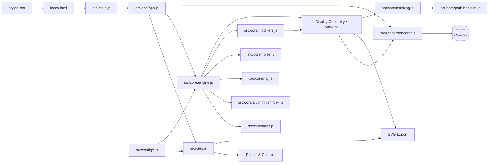
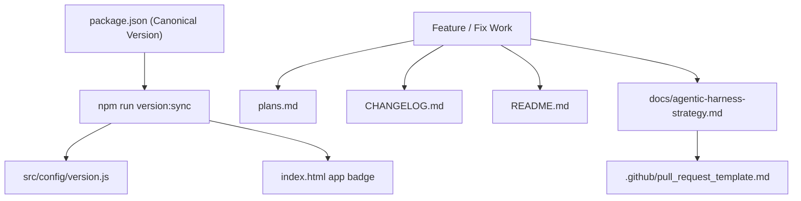

# Vectura Studio

**Physics-inspired vector generation for plotter-ready line art.** No build step, no framework — open `index.html` and go. Vectura combines a rich algorithm library (flowfields, boids, attractors, Petalis, and more) with a full layer system, mirror modifiers, SVG export with plotter optimization, and a Noise Rack for layered generative noise — all in vanilla JavaScript.

---

## Gallery

| Flowfield | Boids | Attractor |
| --- | --- | --- |
|  |  |  |

---

## Quick Start

**Option A — open directly:**
```
Double-click index.html
```

**Option B — serve locally:**
```bash
python -m http.server
# then visit http://localhost:8000
```

**For tests:**
```bash
npm install
npm run test:ci
```

> If your Node runtime doesn't support Unicode regex property escapes (some Node 18.16.x builds), run `npm run patch:test-runtime` first.

---

## Features

### Layers & Modifiers

Vectura uses an Illustrator-style layer system with full undo history for every structural edit — reorder, group, reparent, mask toggles, and modifier changes are all first-class history steps. Layers support per-layer stroke/line-cap settings, visibility, and drag-to-reorder. **Mirror Modifiers** let you wrap layers in a reflective container with a full mirror-axis stack.

<details>
<summary>Full layer & modifier feature list</summary>

- Layered generation with visibility toggles, ordering, and per-layer stroke/line-cap settings
- Illustrator-style parent masks from the Layers panel: a visible parent silhouette clips all indented descendants, with optional `Hide Mask Layer` for invisible mask artwork and a live dimmed-descendant preview while the mask parent is being transformed
- `Insert > Mirror Modifier` adds a group-like container with drag-to-assign or drag-out child layers, `+ Add` child-layer creation from a selected modifier, fully editable selected child layers, and mirrored closed-mask silhouettes for masked subtrees
- Mirror guides are dashed editor overlays with a centered reflection triangle; reflected geometry exports while guide lines stay editor-only
- The modifier row owns a Mirror Stack with per-axis show/hide, lock, delete, reorder, angle, and XY shift controls plus stack-level add/show-hide/lock/clear actions; deleting the modifier dissolves the wrapper and preserves children
- Layer grouping/ungrouping via `Cmd/Ctrl+G` and `Cmd/Ctrl+Shift+G`
- Undo/Redo treats document-mutating layer-structure edits as first-class history steps, including reorder, grouping, reparenting, parent-mask toggles, and modifier/container edits
- Multi-selection: shift-click ranges, `Cmd/Ctrl`-click to toggle, or drag a marquee on the canvas; then move/rotate the group together
- `Cmd/Ctrl+A` selects all drawable layers from anywhere outside text inputs
- Double-click a layer name to rename it inline
- Expand any layer into per-line sublayers for fine-grained selection and pen assignment (`Cmd/Ctrl+E`)
- Fast duplication: `Cmd/Ctrl+D` duplicates selection; Alt-drag (Option-drag) also duplicates
- Configurable undo with `Cmd/Ctrl+Z` and adjustable history depth

</details>

---

### Canvas & Tools

An Illustrator-style shared toolbar now drives the main canvas plus the embedded designer surfaces, including selection, direct selection, hand, pen (bezier), shape, scissor, and fill tools. Shape tools create true straight-edge primitives with corner rounding, the pen tool supports full bezier editing with Illustrator-style subtool shortcuts, and Pattern texture fills now support nested-region targeting with drag-pour behavior.

<details>
<summary>Full canvas & tool feature list</summary>

- Shared Illustrator-style toolbar with shortcuts: `V` selection, `A` direct selection, `Space` hand, `P` pen, `M` rectangle, `L` oval, `Y` polygon, `C` scissor, `F` fill, `Shift+F` erase fill; press again to cycle subtools where available
- Direct path editing for individual line endpoints and bezier handles
- `Rectangle (M)`, `Oval (L)`, and `Polygon (Y)` shape tools create editable expanded layers; fresh shapes stay straight-edged on mouse release
- Shape tools support center-draw / square-circle constraints (`Alt`), polygon side-count changes while dragging (`Arrow Up/Down`), and Illustrator-style corner rounding (Selection rounds all corners, Direct rounds one corner)
- Pen long-press subtool menu with Illustrator-style modes: `+` add anchor, `-` delete anchor, `Shift+C` convert anchor
- Scissor tool: drag a line/rect/circle to split intersecting paths
- Fill tool supports nested closed regions in the Texture Designer: click the smallest containing region, `Shift`-click to fill the whole containing stack, drag to keep pouring across new regions, and hold `Alt/Option` to temporarily erase fills while dragging
- The Texture Designer seam preview now includes a `Show Gaps` tolerance slider that reveals near-miss tile joins in yellow and offers auto-close fixes for closable seam endpoints
- Direct canvas manipulation: drag to move the selected layer, drag corner handles to resize, rotate via the upper-right handle (`Shift` snaps)
- Alignment guides for canvas center and size matching while dragging
- Guide visibility and snapping toggles in Document Setup (`Cmd` while dragging overrides snapping)
- Mask parents ghost-preview their masked descendants outside the silhouette while you move/resize/rotate them, then restore normal masking on release
- Tablet/touch parity: pointer-native canvas interactions, one-finger tool input, two-finger pan/pinch zoom, and touch modifier buttons (`Shift`, `Alt`, `Meta`, `Pan`)
- Switching algorithms restores transform defaults for the selected algorithm (position/scale/rotation do not carry over)
- Seeded, repeatable results with live transform controls (position, scale, rotation) via the collapsible `Transform & Seed` sub-panel
- Double-click any value to edit inline; double-click a control to reset to defaults
- Arrow keys to nudge layers (`Shift` for larger steps)

</details>

---

### Algorithms

14+ algorithm families power each layer, all seeded for repeatable results. The **Noise Rack** is a universal multi-algorithm noise stacking system shared across algorithms — add layers, pick noise types, blend modes, and octave shaping without touching algorithm-specific code.

<details>
<summary>Full algorithm feature list</summary>

- 14+ algorithm families: flowfield, boids, attractors, hyphae, lissajous, harmonograph, wavetable, rings, topo, grid, rainfall, phylla, petalis, spiral, shapepack
- Universal **Noise Rack** with per-layer engine selection, blend modes, offsets, octave shaping — shared across flowfield, grid, phylla, rings, topo, wavetable, and petalis
- Polygon Noise Rack layers now use intuitive zoom semantics: larger `Noise Zoom` / `Noise Scale` values create a larger polygon footprint, and vertical line-displacement systems treat positive amplitudes as upward motion
- Seeded, repeatable generation; the `Transform & Seed` sub-panel (collapsed by default) exposes seed, position, scale, and rotation
- Parameter randomization with algorithm-aware bias profiles for Shape Pack, Petalis, Rainfall, and Lissajous (strong defaults with occasional outliers)
- Live formula display and estimated pen distance/time
- `Reset to Defaults` restores full algorithm defaults including transform values
- Collapsible left-panel sections with persisted state: `Algorithm` and `Algorithm Configuration`
- Petalis has an embedded inline **Petal Designer** panel with a pop-out window (`⧉`) and pop-back-in (`↩`) action; shape comes from visible inner/outer designer curves with always-on dual-ring controls, a `PETAL VISUALIZER` (`Overlay` / `Side by Side`), a `PROFILE EDITOR` with per-side profile import/export plus shared `Export Pair`, and matching Shading Stack + Modifier Stack cards where each card has its own `Petal Shape` target (`Inner`/`Outer`/`Both`)
- Wavetable supports line structures: horizontal, vertical, grid, isometric, lattice, horizon perspective, plus a `Horizon 3D` projected heightfield mode for synthwave-style landscapes that builds a real terrain plane and hides rows/columns from the surface itself
- In Wavetable `Isometric`, `Line Gap` controls the visible cell spacing and `Row Shift` shears the whole lattice so the isometric cells stay locked together
- Harmonograph multi-pendulum list with add/delete/toggle controls, anti-loop drift + settle cutoff, and a Virtual Plotter preview with playhead scrubbing and speed presets
- Lissajous with per-endpoint truncation sliders and optional loose-tail trimming at self-intersection cutpoints
- Rings with Noise Rack layering, per-noise `Orbit Field` / `Concentric` / `Top Down` sampling, and a controllable center diameter
- Topo contours extracted from a Noise Rack height field with closed-contour mapping modes to avoid seam gaps
- Auto-colorization for active/selected/all layer scopes with `None` reset mode, one-shot Apply, and Continuous Apply Changes

</details>

---

### Export & Optimization

The SVG export modal offers a large preview pane with zoom/pan inspection, plotter optimization controls, and multi-layer line sort. Output is plotter-ready: millimeter-accurate, grouped by pen, and physically trimmed to your frame.

<details>
<summary>Full export & optimization feature list</summary>

- `File > Export SVG` opens an Illustrator-style modal: large left-side preview pane, right-side export settings, `Cancel` / `Export SVG` at bottom-right
- Preview is zoom/pan inspectable; export-preview `Line Sort` overlay styling stays scoped to the modal and never leaks into the main canvas
- `Remove Hidden Geometry` is enabled by default — exported SVGs physically trim masked or frame-hidden geometry to match the visible frame; turning it off preserves hidden source geometry through SVG clip paths
- Plotter optimization toggle with adjustable tolerance (mm) to remove fully overlapping paths per pen before export
- Multi-layer `Line Sort` respects the selected optimization scope across preview, stats, overlay rendering, and optimized SVG export
- `Line Sort` `Nearest` treats `Horizontal` and `Vertical` as true sweep directions, preserving left-to-right or top-to-bottom print-order progression while choosing the nearest local continuation inside each sweep band
- When preview mode is `Overlay` and `Line Sort` is active, the overlay gradient runs from `Overlay Color` to its complement by default, with a per-Line Sort secondary-color override and an on-canvas print-order legend
- `Export Optimized` is enabled by default; optimization scope defaults to `All Layers`
- `Line Simplify` is applied by default for new layers with Mode set to `Curve`; `Line Sort` is off by default for new layers
- One-click export with configurable precision and grouping by pen assignment
- Plotter-first output stored in millimeters with machine profiles (A3, A4, AxiDraw V3) plus a document-level Metric/Imperial display toggle

</details>

---

### UI & Workflow

Vectura's UI is Illustrator-familiar: a desktop menu bar with `File/View/Insert/Help` menus, a pen palette with drag-to-assign, Document Setup (`Cmd/Ctrl+K`), and full dark/light theming. Cookie-backed preference persistence keeps your settings between sessions.

<details>
<summary>Full UI & workflow feature list</summary>

- Desktop menu bar beside `VECTURA.STUDIO` with Illustrator-style shortcuts for Open/Save/Import/Export/Document Setup/Reset View/Help plus an `Insert` menu for modifier containers
- Top menu dropdowns render as overlays above the canvas/panes so they're never clipped by the header
- Global dark/light theming with a sun/moon toggle; switching theme restyles the full shell, flips the document background default, and swaps `Pen 1` between white and black
- `File > Document Setup` (`Cmd/Ctrl+K`) covers machine size, Metric/Imperial switch, optional blueprint-style dimension labels, margin, on-canvas crop, margin guides, selection-outline styling, plotter physics, optional 10mm grid overlay, and cookie preference saving with `Clear Saved Preferences`
- Pen palette with assignable colors/widths, reorderable list, drag-to-assign per layer or selection, and double-click-to-apply on selected layers
- Color controls use horizontal pills that open native color pickers; thickness controls use sliders with editable mm values and reset buttons
- ABOUT card is visible by default, toggled by the Algorithm info button, and remembered in saved UI preferences
- Parameter simplification controls with live line/point counts
- In-app help guide and shortcut menu (press `?`)
- `Save/Open` full projects via `.vectura` files; import SVGs as new layers
- Pattern layers now include a custom-tile workflow: import SVG tiles, preview a live `3x3` repeat, flag seam/fill mismatches before save, save valid custom patterns to the runtime library, and carry those custom patterns inside `.vectura` project files
- Petalis profile library loads from `src/config/petal-profiles` in both hosted and direct `file://` runs via a preloaded `library.js` bundle

</details>

---

### Mobile & Accessibility

Vectura runs on phones. A touch-friendly shell with slide-over drawers, a bottom-docked tool rail, and independent panel scrolling makes the full workflow usable on small screens.

<details>
<summary>Full mobile & accessibility feature list</summary>

- Mobile-first responsive shell for small phones including iPhone mini
- Touch-friendly `File/View/Help` top menus, bottom-docked tool rail, and slide-over side drawers for Generator/Layers panels on small screens
- Right-panel sections scroll independently on short screens including the Pens section
- Collapsed side panes keep a visible edge tab on very small phones
- Tablet/touch parity: pointer-native canvas interactions, one-finger tool input, two-finger pan/pinch zoom, and touch modifier buttons (`Shift`, `Alt`, `Meta`, `Pan`)

</details>

---

## Algorithm Library

| Algorithm | Description |
|---|---|
| **Flowfield** | Noise Rack-driven vector fields with stacked layers feeding angle or curl flow, plus density, step, and length controls |
| **Boids** | Emergent flocking paths with separation, alignment, and cohesion forces |
| **Attractors** | Lorenz-like and chaotic strange attractor systems |
| **Hyphae** | Branching, growth-like structures |
| **Lissajous** | Harmonic parametric curves with per-endpoint truncation and self-intersection trim |
| **Harmonograph** | Multi-pendulum curves with damping, anti-loop drift, settle cutoff, and a Virtual Plotter preview |
| **Wavetable** | Layered noise wave stacks with multiple line structures (horizontal, vertical, grid, isometric, lattice, Horizon perspective, Horizon 3D) |
| **Rings** | Concentric rings with Noise Rack layering, per-noise `Orbit Field` / `Concentric` / `Top Down` sampling, and a controllable center diameter |
| **Topo** | Contours extracted from a Noise Rack height field with stacked layers and closed-contour mapping modes |
| **Grid** | Rectilinear mesh deformed by a stacked Noise Rack field with `Warp` and `Shift` distortion modes |
| **Rainfall** | Rain traces with droplet shaping, wind, and silhouette/ground controls |
| **Phylla** | Phyllotaxis point spirals with Noise Rack-driven organic drift over the golden-angle layout |
| **Petalis** | Radial petal structures with presets, embedded inner/outer curve designer, dual-ring controls, shading/modifier stacks, and Noise Rack-driven angular drift |
| **Spiral** | Archimedean spiral with optional closure that loops the outer end back in |
| **Shape Pack** | Circle/polygon packing with perspective controls |

Algorithm defaults live in `src/config/defaults.js`, modifier defaults/descriptions in `src/config/modifiers.js`, and algorithm descriptions in `src/config/descriptions.js`.

---

## How to Use

1. **Pick an algorithm** in the left panel and adjust its parameters.
2. **Transform the layer** — expand `Transform & Seed` inside the Algorithm panel to adjust seed, position, scale, and rotation.
3. **Post-process** — use the Post-Processing Lab for smoothing/curves/simplify and optimization passes.
4. **Manage layers** on the right: add, reorder (drag the grip), duplicate, hide, rename (double-click), and expand into sublayers.

<details>
<summary>Layer masking workflow</summary>

Use `Mask` on a silhouette-capable parent row to clip all indented descendants with that parent's visible silhouette. Inside the mask editor, `Hide Mask Layer` keeps the parent as the clipping silhouette while removing its own artwork from view and export. Mask parents ghost-preview their masked descendants outside the silhouette while you transform them, then restore normal masking on release.

</details>

<details>
<summary>Mirror Modifier workflow</summary>

Use `Insert > Mirror Modifier` to add a modifier container, then drag layers onto it in the Layers panel. Drag a child back out to root to unparent it. When a modifier is selected, `+ Add` creates a normal drawable child under that modifier using the last active algorithm.

Select a child nested under a Mirror Modifier to edit it normally — the left panel switches back to `Algorithm` mode so parameter edits apply to the selected child while the mirror effect stays inherited from the parent.

The modifier row owns a Mirror Stack with per-axis show/hide, lock, delete, reorder, angle, and XY shift controls plus stack-level actions. Deleting the modifier dissolves only the wrapper and preserves its children.

</details>

<details>
<summary>Petalis & Petal Designer workflow</summary>

Switch to the Petalis algorithm to access the embedded inline Petal Designer panel. Use `⧉` to pop it out into a floating window or `↩` to dock it back in.

Petal shape is driven by visible inner/outer designer curves. Controls include: always-on inner/outer count + split controls, a `PETAL VISUALIZER` (`Overlay` / `Side by Side`), a `PROFILE EDITOR` with per-side profile import/export plus a shared `Export Pair` button below both cards, and `Shading Stack` + `Modifier Stack` cards where each entry has its own `Petal Shape` target (`Inner`/`Outer`/`Both`).

In overlay view, clicking the visible inactive silhouette selects that shape directly. Designer interactions support `Shift` to constrain, `Alt/Option` to convert/break/remove handles, `Cmd/Ctrl` for temporary direct mode, middle-drag pan, and wheel zoom-to-cursor.

</details>

<details>
<summary>Document Setup & theming</summary>

`File > Document Setup` (`Cmd/Ctrl+K`) covers: machine size, the document-level Metric/Imperial switch, optional blueprint-style dimension labels outside the canvas, margin, on-canvas crop, margin guides, selection-outline styling, plotter physics, optional 10mm grid overlay, and cookie preference saving with `Clear Saved Preferences`.

The sun/moon toggle in the upper-right header switches the full UI between dark and light themes.

</details>

<details>
<summary>Export workflow</summary>

Export from `File > Export SVG`, which opens a large preview modal. Zoom/pan the left-side preview to inspect detail. The right side controls:

- **Optimization scope** — single layer or all layers
- **Line Sort** — nearest-neighbor print-order optimization with overlay preview
- **Line Simplify** — curve simplification with adjustable tolerance
- **Remove Hidden Geometry** — physically trims masked/frame-hidden geometry (on by default)
- **Export Optimized** — bundles the active optimization passes into the exported SVG

Click `Export SVG` to download.

</details>

<details>
<summary>Keyboard shortcuts</summary>

| Action | Shortcut |
|---|---|
| **Tools** | |
| Selection tool | `V` |
| Direct selection | `A` |
| Hand / pan | `Space` |
| Pen tool | `P` |
| Fill | `F` |
| Erase fill | `Shift+F` |
| Add anchor | `+` |
| Delete anchor | `-` |
| Convert anchor | `Shift+C` |
| Rectangle | `M` |
| Oval | `L` |
| Polygon | `Y` |
| Scissor | `C` |
| **Canvas** | |
| Pan | `Shift + Drag` |
| Zoom | `Mouse Wheel` |
| Touch pan | Two-finger drag |
| Touch zoom | Pinch |
| **Layers** | |
| Select all drawable layers | `Cmd/Ctrl+A` |
| Shift-click range | Range select |
| `Cmd/Ctrl`-click | Toggle select |
| Drag marquee | Marquee select |
| Duplicate selection | `Cmd/Ctrl+D` |
| Duplicate by dragging | `Alt-drag` |
| Nudge | `Arrow keys` |
| Nudge large | `Shift + Arrow keys` |
| Expand layer | `Cmd/Ctrl+E` |
| Group layers | `Cmd/Ctrl+G` |
| Ungroup | `Cmd/Ctrl+Shift+G` |
| Rename layer | Double-click layer name |
| **Editing** | |
| Undo | `Cmd/Ctrl+Z` |
| Redo | `Cmd/Ctrl+Shift+Z` |
| Rotate (snap) | `Shift + rotate handle` |
| Constrain shape | `Shift` while drawing |
| Draw from center | `Alt/Option` while drawing |
| Polygon sides | `Arrow Up/Down` while dragging |
| Pen: close path | Double-click near start point |
| Pen: commit | `Enter` |
| Pen: cancel | `Esc` |
| Reset value to default | Double-click control |
| **UI** | |
| Document Setup | `Cmd/Ctrl+K` |
| Help / shortcuts | `?` |

</details>

---

## Development

### Testing

| Command | Purpose |
|---|---|
| `npm run test:unit` | Deterministic unit coverage for RNG/noise, algorithms, and utility helpers |
| `npm run test:integration` | Engine workflow, layer lifecycle, optimization pipeline, state roundtrip, export, UI bootstrap |
| `npm run test:e2e` | Playwright smoke tests on desktop + tablet-touch Chromium |
| `npm run test:visual` | SVG baseline regression checks against `tests/baselines/svg` |
| `npm run test:visual:screenshots` | Optional Playwright screenshot snapshot checks for high-risk UI shells |
| `npm run test:perf` | Stress/performance checks for generation and optimization |
| `npm run test:ci` | PR-gating suite: unit + integration + e2e |
| `npm run test:update` | Regenerates visual SVG baselines (review before commit) |

Vitest config: `vitest.config.mjs` · Playwright config: `playwright.config.js`

Manual CI-equivalent setup:
- `npm install`
- `npx playwright install --with-deps chromium`
- `npx playwright show-trace test-results/<failing-test>/trace.zip` opens a saved Playwright trace locally after a failed smoke run

| Change | Minimum test run |
|---|---|
| Core logic / algorithm behavior | `test:unit` + `test:integration` + `test:visual` |
| Export / serialization | `test:unit` + `test:integration` + `test:e2e` |
| UI interaction behavior | `test:integration` + `test:e2e` |
| Rendering output or baselines | `test:visual` (+ `test:perf` for heavy paths) |
| Docs-only | Link/path sanity review only |
| CI-gating confidence | `test:ci` |

### Operations

- `package.json` is the canonical version source. Run `npm run version:sync` after changing it so the UI badge and `src/config/version.js` stay aligned.
- `plans.md` is the active punchlist. Keep `Inbox`, `In Progress`, `Done`, and `Decisions` current in the same PR as the implementation.
- `CHANGELOG.md` is intentionally human-curated. Keep `Unreleased` current during development and cut versioned entries when shipping.
- Architecture documentation uses Mermaid diagrams-as-code. Update diagrams whenever the system structure materially changes.
- The universal multi-engine noise system is called `Noise Rack`; all future noise-capable algorithms should converge on that shared model.
- `npm run profiles:bundle` rebuilds `src/config/petal-profiles/library.js` from `index.json` + profile JSON files for `file://` local runs; run this after editing profile JSON files.

### Deployment (GitHub Pages)

1. Push this repo to GitHub.
2. In **Settings > Pages**, set Source to "Deploy from a branch".
3. Select your branch (e.g. `main`) and the root (`/`) folder.

All asset paths are relative (`./...`), so the site works under a GitHub Pages subpath.

<details>
<summary>Extension guide — adding algorithms, machines, palettes, and presets</summary>

**New algorithm:** create `src/core/algorithms/<name>.js`, register it in `src/core/algorithms/index.js`, wire defaults in `src/config/defaults.js`, add a description in `src/config/descriptions.js`, and add UI controls in `src/ui/ui.js`. Algorithm noise work must use the Noise Rack — do not introduce algorithm-specific noise stacks.

**Machine sizes:** live in `src/config/machines.js` and are used for bounds and export dimensions.

**Pen palettes:** live in `src/config/palettes.js` — edit or extend freely.

**Presets:** live in `src/config/presets.js` as a shared registry. Each entry requires `preset_system`, `id` (lowercase kebab-case prefixed by system, e.g. `petalis-camellia-pink-perfection`), `name`, and `params`. Use `preset_system` filtering in UI/engine code.

**Petalis profiles:** add `.json` files to `src/config/petal-profiles/`, list them in `index.json`, then run `npm run profiles:bundle` to update `library.js`. Keep profiles anchor-based (`inner`/`outer` shape payloads).

**Script order:** keep `src/config/` files before core, before UI/render, before `src/main.js` in `index.html`. All modules register on `window.Vectura` as IIFEs.

</details>

<details>
<summary>System architecture diagrams</summary>


```mermaid
flowchart LR
  HTML[index.html] --> Main[src/main.js]
  Main --> App[src/app/app.js]

  App --> UI[src/ui/ui.js]
  App --> Engine[src/core/engine.js]
  App --> Renderer[src/render/renderer.js]

  UI --> Controls[Panels & Controls]
  UI --> Export[SVG Export]
  Renderer --> Canvas[(Canvas)]

  Engine --> Layer[src/core/layer.js]
  Engine --> Algorithms[src/core/algorithms/index.js]
  Engine --> RNG[src/core/rng.js]
  Engine --> Noise[src/core/noise.js]
  Engine --> Modifiers["src/core/modifiers.js"]
  Engine --> Display["Display Geometry / Masking"]
  Modifiers --> Display
  Display --> Renderer
  Display --> Export
  Display --> Masking["src/core/masking.js"]
  Masking --> Boolean["src/core/path-boolean.js"]

  Config[src/config/*.js] --> UI
  Config --> Engine
  Styles[styles.css] --> HTML
```


```mermaid
flowchart TD
  Package["package.json (Canonical Version)"] --> Sync["npm run version:sync"]
  Sync --> Version["src/config/version.js"]
  Sync --> Badge["index.html app badge"]
  Work["Feature / Fix Work"] --> Plans["plans.md"]
  Work --> Changelog["CHANGELOG.md"]
  Work --> Readme["README.md"]
  Work --> Harness["docs/agentic-harness-strategy.md"]
  Harness --> PR[".github/pull_request_template.md"]
```

</details>

<details>
<summary>Project structure reference</summary>

| Path | Purpose |
|---|---|
| `index.html` | App shell, Tailwind CDN config, and script load order |
| `styles.css` | Custom UI styling and texture effects |
| `src/app/app.js` | Application orchestration, theme switching, cookie persistence, undo/redo history |
| `src/core/engine.js` | Layer lifecycle, algorithm execution, display geometry pipeline, serialization |
| `src/core/algorithms/` | One file per algorithm; `index.js` assembles the registry |
| `src/core/layer.js` | Layer state model |
| `src/core/rng.js` | Seeded random number generator |
| `src/core/noise.js` | Core noise primitives |
| `src/core/noise-rack.js` | Universal multi-algorithm noise stacking system |
| `src/core/modifiers.js` | Mirror-axis geometry, clipping, and reflection routines |
| `src/core/masking.js` | Silhouette capability detection, mask unions, live display-geometry masking |
| `src/core/path-boolean.js` | Polygon normalization and path segmentation used by masking |
| `src/core/geometry-utils.js` | Shared path smoothing, simplification, and cloning helpers |
| `src/core/optimization-utils.js` | Path length, sort, offset helpers used by the optimization pipeline |
| `src/render/renderer.js` | Canvas rendering, pan/zoom, multi-layer selection and transform handles |
| `src/ui/ui.js` | Panel management, parameter controls, Petal Designer, SVG export, file I/O |
| `src/ui/randomization-utils.js` | Shared parameter randomization engine with algorithm-specific bias profiles |
| `src/config/` | Machine profiles, algorithm defaults, modifier defaults/descriptions, palette library, preset registry |
| `src/config/petal-profiles/` | Petalis profile library: `index.json` + `.json` files + `library.js` bundle |
| `tests/` | Unit, integration, e2e smoke, visual baseline, and performance suites |
| `docs/agentic-harness-strategy.md` | Agentic workflow source of truth |
| `docs/testing.md` | Test command details and CI policy |
| `docs/pre-release-hardening-log.md` | Deferred beta hardening ideas tracked for final-release prep |
| `dist/` | Optional prebuilt output (not required for local dev) |

</details>

<details>
<summary>Workflow docs reference</summary>

| File | Purpose |
|---|---|
| `AGENTS.md` | Repository guardrails and mandatory contributor/agent instructions |
| `CHANGELOG.md` | Human-curated release history with an `Unreleased` section |
| `plans.md` | Active punchlist: Inbox, In Progress, Done, Decisions |
| `docs/agentic-harness-strategy.md` | Source-of-truth harness for task intake, evidence standards, testing matrix, and doc sync policy |
| `docs/github-governance.md` | GitHub-side setup targets for Projects, rulesets, release notes, and review policy |
| `docs/noise-rack-architecture.md` | Migration plan and target architecture for the universal Noise Rack system |
| `docs/testing.md` | Test command guidance and CI policy details |
| `docs/pre-release-hardening-log.md` | Deferred hardening items for final-release prep |

CI lives in `.github/workflows/test.yml`:
- **Pull requests:** unit, integration, and e2e smoke + dependency review
- **`main` + nightly:** visual regression and perf stress lanes
- **`main` + weekly:** CodeQL analysis

</details>

---

## Release Notes

### 0.6.80
- Restored legitimate Horizon vertical fan lines by building them from the full clipped terrain rows and hiding them only when actually occluded by nearer terrain strips.
- Relaxed the post-occlusion reconnect rule so verticals can disappear behind a ridge and reappear where they become visible again.

### 0.6.79
- Reduced remaining Horizon hidden-line clutter by pruning short shoulder column fragments that survived occlusion but did not carry enough visible surface to read as true contour lines.

### 0.6.78
- Fixed the Layers-panel `Clip` trigger so the clipping-mask popover opens reliably in the saved masking workflow.
- Changed Horizon masking to follow the first visible terrain row, restoring the intended sky bowl instead of filling the whole skyline basin.
- Tightened Horizon column visibility so only skyline-connected fan segments survive, reducing additional hidden backface lines on steep shoulders.

<details>
<summary>Older releases (0.6.77 and earlier)</summary>

### 0.6.77
- Fixed the saved Horizon-plus-Rings masking case by clipping against the visible terrain-strip polygons, which makes the rings hug the rendered landscape contour more closely.
- Reduced detached/backface Horizon column fragments on the shoulders, tightened the Layers-panel `Clip` affordance, and added a screenshot regression for the checked-in `broken-masking.vectura` fixture.

### 0.6.76
- Changed Horizon masking to follow the topmost visible Horizon row so masked circles meet the terrain edge without a gap.
- Tightened Horizon shoulder visibility by deriving the full vertical fan from the same culled visible-row set, removing additional backface lines on steep ridges.

### 0.6.75
- Removed Horizon's extra edge-anchor rays so the terrain mesh no longer emits off-pattern diagonal lines, and re-verified the saved broken masking scene against a fresh browser render.

### 0.6.74
- Fixed Horizon masking so hidden geometry is clipped against the final visible terrain surface strips, making saved landscape masks hug the projected contour instead of floating above it.
- Kept masking workflow in the Layers panel only, tightened the clipping-mask popover styling, and added a screenshot-based Playwright regression for the Horizon-plus-Rings composition.

### 0.6.73
- Fixed Horizon masking so terrain silhouettes follow the highest visible landscape envelope instead of only the top horizon row, making foreground landscape masks hide overlapping background structure correctly.
- Added a masking-specific SVG visual baseline and gave the new masking checkboxes explicit `id`/`name` wiring.

### 0.6.72
- Added live non-destructive layer masking for silhouette-capable layers, including layer-row `Mask` controls, mirrored left-panel masking controls, optional hidden mask-parent artwork, and `Convert To Geometry` materialization into expanded lines.
- Added the masking/display-geometry engine stage with silhouette providers for closed shapes, groups, and `Wavetable` Horizon terrain envelopes.
- Reworked Horizon vertical sampling so the fan follows the same visible terrain contours as the horizontal rows, and added edge anchor rays for full side coverage under strong vanishing pull.

### 0.6.71
- Increased the effective top end of Horizon `Fan Reach` so full reach still covers or overshoots the side boundaries even when `Vanishing Pull` is high.
- Put Horizon `Horizontal Lines`, `Vertical Lines`, and `Link` on one shared control row.

### 0.6.70
- Replaced Horizon's single `Lines` slider with `Horizontal Lines`, `Vertical Lines`, and a ratio-preserving `Link` toggle.

### 0.6.69
- Updated Horizon fan validation so full pull/full reach is treated correctly.

### 0.6.68
- Added `Fan Reach` to Horizon so the vertical fan can fully cover or overshoot the side edges independently of `Vanishing Pull`.

### 0.6.67
- Renamed the Horizon perspective controls to `Vanishing Point X` and `Vanishing Pull`.
- Rebalanced Horizon visibility so horizontal terrain rows stay readable while verticals are derived from an occluded visible surface.

### 0.6.66
- Reworked `Wavetable` Horizon visibility toward a sampled mesh model so the horizon grid clips against the skyline and derives verticals from the visible surface.

### 0.6.65
- Fixed `Wavetable` Horizon so noise displacement is no longer forced to vertical-only motion; Horizon now respects `Line Offset Angle` like the other wavetable structures.

### 0.6.64
- Added Horizon terrain-shaping controls for `Shoulder Lift`, `Mirror Blend`, and `Valley Profile`.
- Tuned shipped `Horizon` companion defaults against repeated rendered screenshot review.

### 0.6.63
- Added Horizon-specific companion defaults for `Wavetable` with a broader center valley / road profile plus layered terrain noise for a synthwave landscape aesthetic.
- Added Horizon-only shaping controls: `Center Dampening`, `Center Width`, `Center Basin`.

### 0.6.62
- Removed the remaining hard skyline clamp from `Wavetable` Horizon mode and raised far-horizon sampling energy so the terrain can break the horizon line instead of collapsing into a flat ribbon.

### 0.6.61
- Added `Horizon Relief` to `Wavetable` Horizon mode so the skyline itself can keep visible noise/displacement instead of collapsing into a flat vanishing line.

### 0.6.60
- Reworked `Wavetable` Horizon depth perspective so foreground ridges keep stronger displacement while distant terrain compresses toward the horizon, producing a more usable synthwave landscape profile.
- Added Petal Designer silhouette picking in overlay mode.
- Made the `Inner Shape` / `Outer Shape` profile editor cards explicitly clickable selection targets.

### 0.6.59
- Replaced the remaining Petalis one-off modifier noise sliders with nested Noise Rack stacks.
- Preserved backward compatibility for older Petalis documents by treating legacy modifier `scale` values as fallback zoom.

### 0.6.58
- Reworked `Rings` `Concentric` sampling into a true seam-corrected ring-path field.
- Added a `Center Diameter` control for `Rings` to widen the innermost ring.
- Improved Rings apply-mode help text for `Top Down`, `Concentric`, and `Orbit Field`.

### 0.6.57
- Fixed shared image-noise controls so `Invert Color` renders as a checkbox.
- Corrected `Noise Width` sampling so increasing it widens image-based noise fields.
- Centered polygon noise by default in `Wavetable` and other top-left-biased samplers.

### 0.6.56
- Moved Petalis angular drift onto a Noise Rack stack.
- Restored local Playwright smoke reliability by patching the runtime compatibility script.

### 0.6.55
- Migrated `flowfield`, `grid`, and `phylla` onto Noise Rack stacks with per-layer engine selection, blends, offsets, and octave shaping.

### 0.6.54
- Clarified `Rings` apply-mode semantics for `Top Down`, `Concentric`, and `Orbit Field`.
- Restored the orbit-style ring-local sampler as an explicit Rings apply mode.

### 0.6.53
- Updated Rings control language to describe `Top Down` and `Concentric` as distinct sampling models.

### 0.6.52
- Migrated `Topo` onto the Noise Rack stack while preserving all contour mapping modes.
- Moved Topo's fractal controls into per-noise-layer behavior.

### 0.6.51
- Migrated `Rings` onto the Noise Rack stack with multi-noise layering and per-noise `Concentric` / `Top Down` projection.

### 0.6.50
- Added canonical app-version plumbing through `src/config/version.js` and `npm run version:sync`.
- Added a maintained repository punchlist in `plans.md` and a human-curated `CHANGELOG.md`.
- Started the Noise Rack extraction with a shared core blend-combination module used by `wavetable`, `spiral`, and `rainfall`.

</details>
