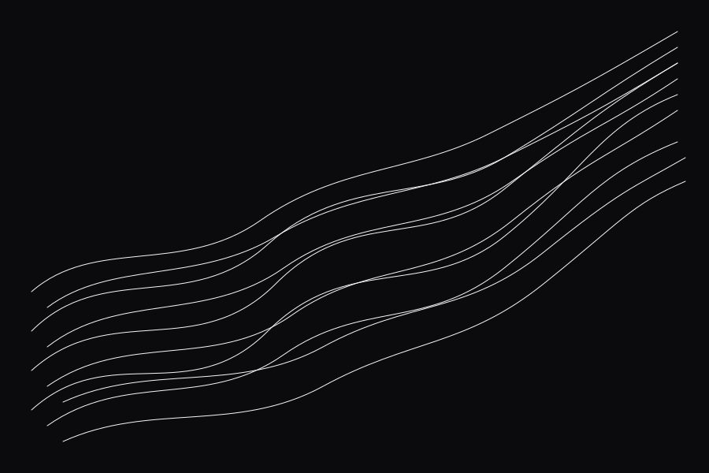
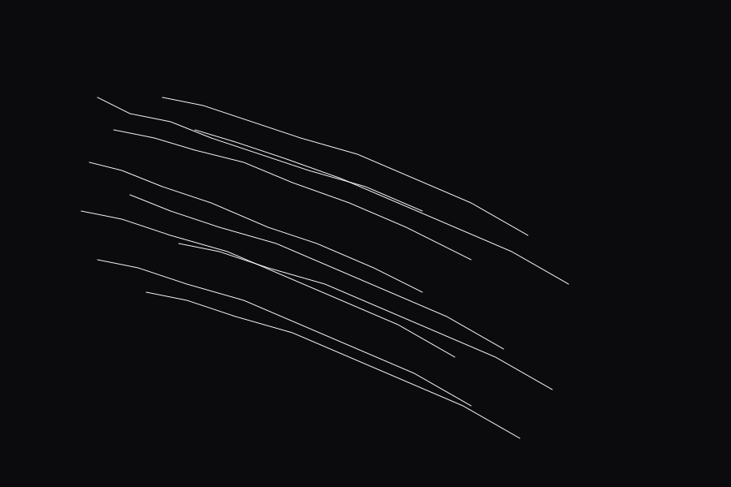
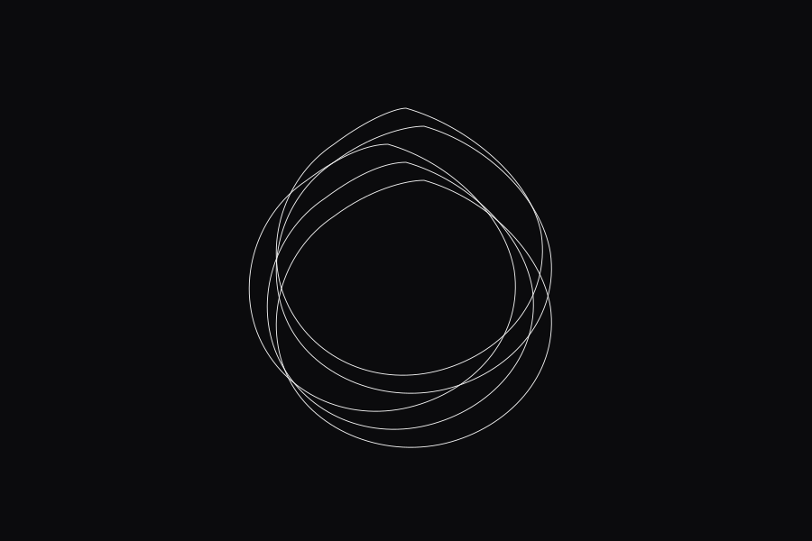
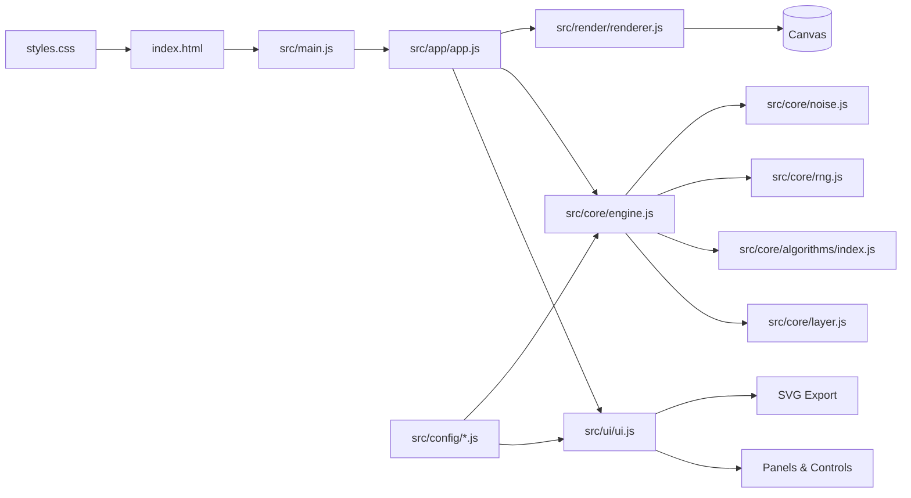
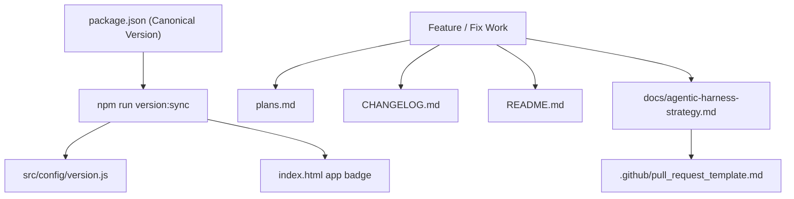

# Vectura Studio

Vectura Studio is a physics-inspired vector generator for plotter-ready line art. It is deliberately no-build: open `index.html` in a browser and everything runs with modular JavaScript and Tailwind loaded via CDN.

## Highlights
- Plotter-first output in millimeters with machine profiles (A3, A4, AxiDraw V3).
- Layered generation with visibility toggles, ordering, and per-layer stroke/line-cap settings.
- Seeded, repeatable results with live transform controls (position, scale, rotation).
- Switching algorithms restores transform defaults for the selected algorithm (position/scale/rotation do not carry over).
- Collapsible left-panel sections with persisted state: `Algorithm` (including a nested `Transform & Seed` sub-panel, collapsed by default) and `Algorithm Configuration`.
- ABOUT card is visible by default, toggled by the Algorithm info button, and remembered in saved UI preferences.
- Direct canvas manipulation: drag to move the selected layer, drag corner handles to resize, rotate via the upper-right handle, and double-click to rename layers.
- Multi-selection: shift-click ranges in the layer list, Cmd/Ctrl-click to toggle, or drag a marquee, then move/rotate the group together.
- Cmd/Ctrl+A selects all drawable layers from anywhere in the app (outside text inputs).
- Layer grouping/ungrouping via Cmd/Ctrl+G and Cmd/Ctrl+Shift+G.
- Desktop menu bar is anchored beside `VECTURA.STUDIO` with Illustrator-style shortcuts for Open/Save/Import/Export/Document Setup/Reset View/Help.
- Top menu dropdowns render as overlays above the canvas/panes so File/View/Help menus are never clipped by the header.
- Illustrator-style tool bar with selection, direct selection, hand, pen (bezier), and scissor tools (V/A/Space/P/C). Press V/P/C again to cycle subtools.
- Pen long-press subtool menu with Illustrator-style modes and shortcuts (P, +, -, Shift+C).
- Direct path editing for individual line endpoints and bezier handles.
- Expand any layer into per-line sublayers for fine-grained selection and pen assignment.
- Tablet/touch parity: pointer-native canvas interactions, one-finger tool input, two-finger pan/pinch zoom, and touch modifier buttons (`Shift`, `Alt`, `Meta`, `Pan`).
- Alignment guides for canvas center and size matching while dragging.
- Guide visibility and snapping toggles in Document Setup (Cmd while dragging overrides snapping).
- Optional 10mm grid overlay toggle in Document Setup for layout alignment.
- Auto-colorization for active/selected/all layer scopes with `None` reset mode, one-shot Apply, and Continuous Apply Changes (continuous updates now re-run correctly while editing pens/palettes, and manual Apply supports chaining one method and then another when continuous is off).
- Optional cookie-backed UI preference persistence from Document Setup.
- In-app help guide and shortcut menu (press `?`).
- Mobile-first responsive shell for small phones (including iPhone mini): touch-friendly `File/View/Help` top menus, bottom-docked tool rail, and slide-over side drawers for Generator/Layers panels; right-panel sections now scroll independently on short screens (including the Pens section), and collapsed side panes keep a visible edge tab on very small phones.
- Parameter randomization and simplification controls with live line/point counts.
- Algorithm-aware randomization bias for Shape Pack, Petalis, Rainfall, and Lissajous (strong defaults with occasional outliers).
- Reset to Defaults now restores full algorithm defaults, including transform values (seed, position, scale, rotation).
- Double-click any value to edit it inline, and double-click a control to reset to defaults.
- Fast duplication and nudging: Cmd/Ctrl+D duplicates selection, Alt-drag (Option-drag) to duplicate, arrow keys to nudge (Shift for larger steps).
- Configurable undo with Cmd/Ctrl+Z and adjustable history depth.
- Multiple algorithm families (flowfields, lissajous, harmonograph, wavetable, rings, topo, boids, attractors, hyphae, shape pack).
- Harmonograph pendulum list with add/delete/toggle controls and optional guide overlay.
- Harmonograph anti-loop controls (frequency drift + settle cutoff) and a Virtual Plotter preview with playhead scrubbing and speed presets.
- Rainfall generator with wind, droplet styling, and optional silhouette masking.
- Wavetable noise stack with selectable line structures (horizontal, vertical, grid, isometric, lattice, horizon perspective), plus Horizon depth perspective that raises distant noise frequency and damps near-view displacement; includes per-noise blend modes, tile patterns, image effects, polygon noise, and drag-to-reorder layers.
- Repository operating model with a maintained `plans.md` punchlist, human-curated `CHANGELOG.md`, Mermaid architecture diagrams, and synchronized app-version metadata.
- Petalis generator with radial petals, editable inner/outer designer curves, shading, modifier stacks, and 20 named presets (plus an in-dev light source marker). Hatch Angle rotates shading strokes in place inside petals rather than shifting shading placement on the canvas.
- Petalis algorithm with an embedded full Petal Designer panel in the parameter stack (shape comes from visible designer curves, without hidden legacy tip/base modifiers).
- Petalis layers now enable `Curves` by default, matching the designer silhouette out of the box.
- Petal Designer inline editor and pop-out window use high-DPI rendering with immediate canvas updates, always-on dual-ring controls (`Inner Petal Count`/`Outer Petal Count` plus `Split Feathering`), a `PETAL VISUALIZER` pane with `Overlay` / `Side by Side`, a `PROFILE EDITOR` (`Inner Shape`/`Outer Shape`) with per-side profile import/export and a shared `Export Pair` action below both cards, and matching `Shading Stack` + `Modifier Stack` controls where each card has its own `Petal Shape` target (`Inner`/`Outer`/`Both`). The inline panel can pop out (⧉) and pop back in (↩) while keeping the exact same controls and layout.
- Petalis profile transitions: `Inner = Outer` lock plus count-driven ring boundary and split feathering to morph from innermost to outermost petal profiles.
- Petalis profile library loads from `src/config/petal-profiles` in both hosted and direct `file://` runs (via a preloaded `library.js` bundle to avoid local CORS fetch errors).
- Petal Designer interactions include direct/pen anchor editing with modifier support (`Shift` constrain, `Alt/Option` convert, break, or remove handles, `Cmd/Ctrl` temporary direct), plus middle-drag pan and wheel zoom (when both petals are visible, wheel zoom updates both equally).
- Petalis layering now clips petals across both rings when `Layering` is enabled, preventing see-through overlaps.
- Petal Designer shading preview now reflects the full shading parameters (coverage, gaps, line style, jitter, angle, per-card targets, and stack enable/disable) without legacy radial fallback in designer mode.
- Custom Petalis preset reset now clears shading (`shadings=[]`) instead of re-enabling legacy shading toggles.
- Pen palette with assignable colors/widths, reorderable list, drag-to-assign per layer or selection, double-click-to-apply on selected layers, plus palette selection, collapsible panel controls, and add/remove actions.
- Plotter optimization toggle with adjustable tolerance (mm) to remove fully overlapping paths per pen before export.
- `EXPORT & OPTIMIZATION` section in Document Setup combines export precision/stroke settings with the optimization pipeline (linesimplify, linesort, filter, multipass), scope selection, preview overlays, and export toggle.
- `Export Settings` now appears as the first optimization card (above `Line Simplify`) and includes Precision, Stroke, Plotter Optimization, and Optimization Tolerance controls.
- Optimization defaults target `All Layers`, and `Export Optimized` is enabled by default.
- `Line Simplify` is applied by default for new layers, with Mode set to `Curve`.
- `Line Sort` is not applied by default for new layers.
- When preview mode is `Overlay` and `Line Sort` is active, the overlay gradient runs from `Overlay Color` to its complement by default, with a per-Line Sort secondary-color override and an on-canvas print-order legend.
- Color controls use horizontal pills that open native color pickers; thickness controls use slider + editable mm value with reset buttons where applicable.
- One-click SVG export with configurable precision and grouping by pen assignment.
- Live formula display and estimated pen distance/time.

## Gallery
Sample outputs included in `assets/gallery/`. 

| Flowfield | Boids | Attractor |
| --- | --- | --- |
|  |  |  |

## Quick Start
Option A - open directly:
- Double-click `index.html`.

Option B - serve locally:
```bash
python -m http.server
```
Then visit `http://localhost:8000`.

For automated tests:
```bash
npm install
```
If your Node runtime does not support Unicode regex property escapes (for example, some Node `18.16.x` builds), run:
```bash
npm run patch:test-runtime
```
To synchronize the runtime/app badge version after updating `package.json`, run:
```bash
npm run version:sync
```

## Testing
- `npm run test:unit` - deterministic unit coverage for RNG/noise, algorithms, and shared utility helpers.
- `npm run test:integration` - engine workflow integration coverage (layer lifecycle, optimization pipeline, state roundtrip, deterministic export) plus UI bootstrap integrity checks for non-empty Layers, Mathematical Model, and About panels.
- `npm run test:e2e` - Playwright smoke tests on desktop + tablet-touch Chromium.
- `npm run test:visual` - SVG baseline regression checks (`tests/baselines/svg`).
- `npm run test:visual:screenshots` - optional Playwright screenshot snapshot checks for high-risk UI shells.
- `npm run test:perf` - stress/performance checks for generation and optimization.
- `npm run test:ci` - PR-gating suite (`unit + integration + e2e`).
- `npm run test:update` - updates visual SVG baselines (requires review before commit).
- `npm run profiles:bundle` - rebuilds `src/config/petal-profiles/library.js` from `index.json` + profile JSON files for `file://` local runs.
- Vitest config is in `vitest.config.mjs`; Playwright config is in `playwright.config.js`.
- Beta-only deferred hardening ideas are tracked in `docs/pre-release-hardening-log.md`.

## Workflow Docs
- `AGENTS.md` - repository guardrails and mandatory contributor/agent instructions.
- `CHANGELOG.md` - human-curated release history with an `Unreleased` section.
- `docs/agentic-harness-strategy.md` - source-of-truth harness for task intake, evidence standards, testing matrix, and documentation synchronization policy.
- `docs/github-governance.md` - GitHub-side setup targets for Projects, rulesets, release notes, and review policy.
- `docs/noise-rack-architecture.md` - migration plan and target architecture for the universal Noise Rack system.
- `docs/testing.md` - test command guidance and CI policy details.
- `plans.md` - active repo punchlist for in-progress, upcoming, completed, and decided work.
- `docs/pre-release-hardening-log.md` - deferred hardening items intentionally tracked for final-release prep.

CI lives in `.github/workflows/test.yml`:
- Pull requests: unit, integration, and e2e smoke.
- `main` + nightly: visual regression and perf stress lanes.
- Pull requests also run dependency review; `main` and weekly schedules run CodeQL analysis.
- CI install steps run with `--no-audit --no-fund --loglevel=error` to keep test logs focused on failures.

## Development Operations
- `package.json` is the canonical version source; run `npm run version:sync` after changing it so the UI badge and runtime metadata stay aligned.
- `plans.md` is the active punchlist. Keep `Inbox`, `In Progress`, `Done`, and `Decisions` current in the same PR as the implementation.
- `CHANGELOG.md` is intentionally human-curated. Keep `Unreleased` current during development and cut versioned entries when shipping.
- Architecture documentation uses Mermaid diagrams-as-code. Update diagrams whenever the system structure materially changes.
- The universal multi-engine noise direction is called `Noise Rack`; all future noise-capable algorithms should converge on that shared model.

## Current Release Notes
### 0.6.58
- Reworked `Rings` `Concentric` sampling into a true seam-corrected ring-path field so it produces visible along-the-ring modulation without breaking loop closure.
- Added a `Center Diameter` control for `Rings` to widen the innermost ring before the stack expands outward.
- Improved the Rings apply-mode help text so `Top Down`, `Concentric`, and `Orbit Field` explain the underlying sampling models more clearly.

### 0.6.57
- Fixed shared image-noise controls so `Invert Color` is rendered as a real checkbox across Noise Rack stacks instead of a slider-like control.
- Corrected `Noise Width` sampling so increasing it widens image-based noise fields and decreasing it narrows them across the affected samplers, including `Rings`.
- Centered polygon noise by default in `Wavetable` and other remaining top-left-biased samplers so the polygon field starts in the canvas center instead of clipping from the corner.

### 0.6.56
- Moved Petalis angular drift onto a Noise Rack stack and routed the existing noise-driven Petalis modifier samplers through Noise Rack-compatible stack evaluation.
- Restored local Playwright smoke reliability on this machine by patching the runtime compatibility script, falling back to installed Chrome locally, and disabling local failure-video capture while keeping CI artifacts enabled.

### 0.6.55
- Migrated `flowfield`, `grid`, and `phylla` onto Noise Rack stacks with per-layer engine selection, blends, offsets, and octave shaping.
- Preserved each algorithm’s native high-level behavior by keeping `flowfield` force/curl mapping, `grid` distortion modes, and `phylla` noise influence as master controls above the shared stack.

### 0.6.54
- Clarified `Rings` apply-mode semantics so `Top Down` samples a universal XY field, `Concentric` samples noise along each ring’s unwrapped path length, and `Orbit Field` preserves the legacy ring-local field.
- Restored the orbit-style ring-local sampler as an explicit Rings apply mode instead of overloading the newer path-space mode.

### 0.6.53
- Updated Rings control language to describe `Top Down` and `Concentric` as distinct sampling models before restoring the legacy orbit-local mode as its own option.

### 0.6.52
- Migrated `Topo` onto the Noise Rack stack while preserving `Marching`, `Smooth`, `Quadratic Bezier`, and `Gradient Trace` contour mapping modes.
- Moved Topo’s meaningful fractal controls into per-noise-layer behavior so octave/lacunarity/gain settings apply where they actually matter.

### 0.6.51
- Migrated `Rings` onto the Noise Rack stack with multi-noise layering and per-noise `Concentric` / `Top Down` projection.
- Preserved ring-specific sampling behavior through per-noise drift and sample-radius controls instead of flattening the old model.

### 0.6.50
- Added canonical app-version plumbing through `src/config/version.js` and `npm run version:sync`.
- Added a maintained repository punchlist in `plans.md` and a human-curated `CHANGELOG.md`.
- Expanded the development harness so README, plans, changelog, version sync, and Mermaid diagrams are treated as first-class deliverables.
- Started the Noise Rack extraction with a shared core blend-combination module used by `wavetable`, `spiral`, and `rainfall`.

## How to Use
1. Pick an algorithm in the left panel and adjust its parameters.
2. Expand `Transform & Seed` inside the Algorithm panel, then use transform controls (seed, position, scale, rotation) to nudge the layer.
3. Use Post-Processing Lab for smoothing/curves/simplify plus optional optimization passes and preview.
4. Manage layers on the right: add, reorder (drag the grip), duplicate, hide, rename (double-click), expand into sublayers, and assign pens (drag a pen onto a layer to apply to the selection).
5. Use `File > Document Setup` for machine size, margin, on-canvas crop, hard export crop (`Crop Exports to Margin`, which trims path geometry to the margin rectangle and exports with flat caps), margin guides, stroke, SVG precision, optimization scope/preview/export settings, and optional cookie preference saving.
6. Save/Open full projects via .vectura files, or import SVGs as new layers.
7. Switch to the Petalis algorithm to use the embedded inline designer panel, then use ⧉ to pop it out into a floating window or ↩ to dock it back in. In Petalis, petal shape is driven by visible inner/outer designer curves, always-on inner/outer count + split controls, a `PETAL VISUALIZER` (`Overlay` / `Side by Side`), a `PROFILE EDITOR` with per-side profile import/export controls plus a shared `Export Pair` button below both profile cards, and `Shading Stack` + `Modifier Stack` cards where each entry has its own `Petal Shape` target (`Inner`/`Outer`/`Both`) plus symmetry controls.
8. Export from `File > Export SVG`.

Pan: Shift + Drag. Zoom: Mouse Wheel. Touch: one-finger tool input, two-finger pan/pinch zoom. On phones, use the top `File/View/Help` menu bar, then open Generator/Layers with pane toggles (including edge tabs) and expand/collapse the Model panel with the floating Model button. Move layer: Drag. Resize layer: Drag corner handles. Rotate: Drag the upper-right handle (Shift snaps). Duplicate: Alt-drag. Expand: Cmd/Ctrl + E. Pen tool: click to add points, click-drag for bezier curves (Shift constrains, Alt breaks handles), double-click near the first point to close, Enter commits, Esc cancels. Pen subtools: `+` add anchor, `-` delete anchor, `Shift+C` convert anchor. Direct tool (`A`) edits endpoints and handles on individual line paths. Scissor tool: drag a line/rect/circle to split intersecting paths. Petal Designer adds middle-drag panning, wheel zoom-to-cursor (both visible petals zoom together), and Illustrator-style `Shift`/`Alt`/`Cmd/Ctrl` editing modifiers.

## Algorithm Library
Each layer is powered by an algorithm with its own parameters and formula preview:
- Flowfield: Noise Rack-driven vector fields with stacked layers feeding angle or curl flow, plus density, step, and length controls.
- Boids: emergent flocking paths.
- Attractors: Lorenz-like and chaotic systems.
- Hyphae: branching, growth-like structures.
- Lissajous: harmonic parametric curves.
- Harmonograph: multi-pendulum curves with damping, anti-loop drift, settle cutoff, and an interactive plotter preview.
- Wavetable: layered noise wave stacks with multiple line structures, noise types, image effects, and polygon shaping.
- Rings: concentric rings with Noise Rack layering, per-noise `Orbit Field`, `Concentric`, or `Top Down` sampling, and a controllable center diameter for the innermost ring.
- Topo: contours extracted from a Noise Rack height field, with stacked layers and mapping modes preserving closed contour loops to avoid seam gaps.
- Grid: a rectilinear mesh deformed by a stacked Noise Rack field while preserving `Warp` and `Shift` distortion modes.
- Rainfall: rain traces with droplet shaping, wind, and silhouette/ground controls.
- Phylla: phyllotaxis point spirals with Noise Rack-driven organic drift layered over the golden-angle layout.
- Petalis: radial petal structures with presets and embedded inner/outer curve editing, always-on dual inner/outer rings, a per-side `PROFILE EDITOR` with import/export support plus a shared `Export Pair` action below both cards, matching shading/modifier stacks with per-card `Petal Shape` targeting (`Inner`/`Outer`/`Both`), count-driven transition/split-feather controls, and a collapsible randomness/seed panel where angular drift now uses a Noise Rack stack while the existing noise-driven modifier paths sample through the shared rack runtime.
- Spiral: includes optional closure for looping the outer end back into the spiral.
- Shape Pack: circle/polygon packing with perspective controls.

Defaults live in `src/config/defaults.js` and descriptions in `src/config/descriptions.js`.

## Architecture

```mermaid
flowchart LR
  HTML[index.html] --> Main[src/main.js]
  Main --> App[src/app/app.js]

  App --> UI[src/ui/ui.js]
  App --> Engine[src/core/engine.js]
  App --> Renderer[src/render/renderer.js]

  UI --> Controls[Panels & Controls]
  UI --> Export[SVG Export]
  Renderer --> Canvas[(Canvas)]

  Engine --> Layer[src/core/layer.js]
  Engine --> Algorithms[src/core/algorithms/index.js]
  Engine --> RNG[src/core/rng.js]
  Engine --> Noise[src/core/noise.js]

  Config[src/config/*.js] --> UI
  Config --> Engine
  Styles[styles.css] --> HTML
```


```mermaid
flowchart TD
  Package["package.json (Canonical Version)"] --> Sync["npm run version:sync"]
  Sync --> Version["src/config/version.js"]
  Sync --> Badge["index.html app badge"]
  Work["Feature / Fix Work"] --> Plans["plans.md"]
  Work --> Changelog["CHANGELOG.md"]
  Work --> Readme["README.md"]
  Work --> Harness["docs/agentic-harness-strategy.md"]
  Harness --> PR[".github/pull_request_template.md"]
```

## Project Structure
- `index.html` - app shell, Tailwind CDN config, and script order.
- `styles.css` - custom UI styling and texture effects.
- `src/app/` - application orchestration and lifecycle.
- `src/core/` - vector engine, layers, RNG/noise, and algorithms.
- `src/core/geometry-utils.js` - shared path smoothing/simplification and cloning helpers.
- `src/core/optimization-utils.js` - shared path length/sort/offset helpers used by optimization flow.
- `src/core/algorithms/*.js` - one file per algorithm, with `src/core/algorithms/index.js` assembling the registry exposed to the engine.
- `src/render/` - canvas rendering and view transforms.
- `src/ui/` - panels, controls, settings, and SVG export.
- `src/ui/randomization-utils.js` - shared parameter randomization engine with algorithm-specific bias profiles.
- `src/config/` - machine profiles, defaults, UI descriptions, palette library, and cross-system preset registry.
- `src/config/petal-profiles/` - project profile library ingested by Petalis (`index.json` + `.json` profile files with explicit anchors, plus `library.js` for `file://` local loading).
- `tests/` - unit, integration, e2e smoke, visual baseline, and performance suites.
- `docs/agentic-harness-strategy.md` - agentic workflow source of truth, including test/doc synchronization contracts.
- `docs/testing.md` - testing workflow details, baseline policy, and CI behavior.
- `docs/pre-release-hardening-log.md` - deferred beta hardening ideas to complete before final public release.
- `dist/` - optional prebuilt output (not required for local dev).

## Customization Tips
- Add new algorithms by creating `src/core/algorithms/<algorithm>.js`, registering it in the algorithm registry, and wiring defaults/UI in `src/config/` and `src/ui/ui.js`.
- Machine sizes live in `src/config/machines.js` and are used for bounds and export dimensions.
- Pen palettes live in `src/config/palettes.js` and can be edited or extended.
- Presets live in `src/config/presets.js` as a shared registry; each entry requires `preset_system`, `id`, `name`, and `params`.
- Petalis project profile files are loaded from `src/config/petal-profiles/*.json` (listed in `src/config/petal-profiles/index.json`) and mirrored in `src/config/petal-profiles/library.js` for `file://` runs.
- After editing profile JSON files, run `npm run profiles:bundle` so `library.js` stays in sync for direct `index.html` usage.
- Keep project profile definitions anchor-based (`inner`/`outer` shape payloads) so runtime loading does not depend on built-in shape aliases.
- Post-Processing Lab includes smoothing/curves/simplify plus the optimization pipeline (linesimplify, linesort, filter, multipass).
- Keep script order intact in `index.html`; `src/main.js` expects globals to be registered on `window.Vectura`.

## Deployment (GitHub Pages)
1. Push this repo to GitHub.
2. In Settings > Pages, set Source to "Deploy from a branch".
3. Select your branch (for example, `main`) and the root (`/`) folder.

All asset paths are relative (`./...`), so the site works under a GitHub Pages subpath.
