# Meridian Blue Skin Migration — Implementation Plan

> Refines an earlier draft. Honors three user decisions: (1) `themes-mockup.html` is the spec, (2) keep Tailwind and re-skin via tokens, (3) execute the full 5-phase rewrite. Tightens scope, fixes assumptions that don't match the codebase, and adds a dependency diagram.

---

## Status

| Phase | Status | Commit |
|---|---|---|
| **Phase −1** — Mockup provenance | ✅ done | `7d9f426` |
| **Phase 0** — Skin foundation | ✅ done | `7d9f426` (+ graphify rebuild `e442a4b`) |
| **Phase 1** — Component library | ✅ done | `16ec81d` `440c84a` `d959a9b` `554ee88` `65791e5` `c7fa0db` |
| **Phase 2** — Shell, panels, orchestrator | ⏳ in progress (step 1/7 done) | `a16ad57` `313d427` |
| **Phase 3** — Modals, overlays, menus | ⏳ pending | — |
| **Phase 4** — Editors & specialized surfaces | ⏳ pending | — |
| **Phase 5** — Polish, SDK, cleanup | ⏳ pending | — |

**Where work lives:** `/Users/jayphi/Documents/github/vectura-studio-meridian` (worktree on branch `meridian-blue-skin`). Main repo at `/Users/jayphi/Documents/github/vectura-studio` is untouched on `main`.

**Picking up the plan:** read this document, then `git log --oneline meridian-blue-skin` for done-work context. After Phase 0, all five existing skins (`dark`, `light`, `lark`, `meridian-dark`, `meridian-light`) load and swap; `dark`/`light`/`lark` are visually byte-identical to pre-migration; `meridian-*` paint correctly but the DOM still uses today's classes (Phase 2 changes that).

### Phase wrap-up protocol (mandatory)

Every time a phase reaches "done" — last commit landed, all required tests green per the [Testing Matrix](../../CLAUDE.md#testing-matrix) — Claude **must** run this seven-step closeout before declaring the phase complete to the user. Skipping any step strands the next session: it'll re-derive state from commit messages and likely diverge from the plan.

1. **Verify the suite.** Run the change-class minimum from `CLAUDE.md`'s Testing Matrix. For Phase work, that's at least `npm run test:unit && npm run test:integration`; for phases that touch rendering or shell DOM, also `npm run test:visual` and `npm run test:perf`. Record the green totals — they go into step 4.
2. **Update the Status table** at the top of `docs/design/meridian-migration-plan.md`: flip the just-finished phase from `⏳` to `✅`, list every phase commit SHA in the Commit column (oldest first), and mark the next phase as `⏳ next`.
3. **Append a "Phase N actuals" note** immediately above the next phase's `### Phase N+1: ...` heading. Capture: what files actually shipped, deviations from the planned spec (component count, file moves, additions, deletions), test totals before → after, and anything the next phase must know about. Be specific — mention class names, helper function names, locked contracts.
4. **Rewrite the "Resuming from Phase N-1" appendix** as "Resuming from Phase N". Step-by-step instructions tailored to this exact branch state: include the latest-commit SHA the next session should expect at HEAD, the specific test command to confirm green, the exact first move (e.g. "extract X into Y, write compile-gate test before extracting predicates"), and any deferred-from-prior-phase items that become mandatory now.
5. **Update the memory file** at `/Users/jayphi/.claude/projects/-Users-jayphi-Documents-github-vectura-studio/memory/project_meridian_migration.md` so a fresh-context Claude reading the memory pointer (before opening the plan) sees current state. Keep the "Done as of <ISO date>" line accurate, the "Pending" list trimmed, and the "How to apply" line pointed at the latest resume appendix.
6. **Commit the doc + memory update** as a single `docs(skin):` commit. Memory lives outside the repo so commit only the plan; mention the memory refresh in the commit body.
7. **Tell the user, verbatim:**
   > Phase N is complete and committed. You can preview the worktree at `file:///Users/jayphi/Documents/github/vectura-studio-meridian/index.html` (no server needed — just open in a browser). Recommend you `/clear` to start a fresh context window — the plan and memory are updated so the next session can pick up cleanly. To resume, type: **`continue the Meridian migration`** (or **`begin Phase N+1`**).

The protocol exists because the plan is too detailed to reconstruct from commit messages — and the user has explicitly asked for this closeout after every phase. Don't skip steps "for brevity"; the next Claude won't have the context you do.

**Test status as of Phase 0:** 416 unit + integration passed, 13 visual passed (0-px diff vs pre-migration baselines), 2 perf passed.

---

## 0. Context

Vectura Studio's UI lives in:

- `src/ui/ui.js` (16,288 lines) — a single `class UI` orchestrating every panel, control, modal, menu, and animation. All 17 algorithm parameter schemas are inline as `CONTROL_DEFS` at line 2196 and assigned to `this.controls` at line 6441. `buildControls()` at line 12729 reads them and rebuilds the dynamic-controls container.
- `src/ui/ui-{noise-rack,petal-designer,pattern-designer,auto-colorize,fill-panel,file-io,touch,document-units,randomization}.js` — nine satellite modules already extracted.
- `index.html` (793 lines, 41–725 are app body) — Tailwind via CDN with custom `vectura-*` color utilities resolved from CSS variables.
- `styles.css` (3,964 lines) — custom CSS layered on top of Tailwind, themed via `--color-*` and `--vectura-*-rgb` variables.
- `src/app/app.js:422` — `applyTheme()` already implements: write `data-theme` attribute, push the active theme's `cssVars` map to `document.documentElement.style`, persist to cookie, refresh UI. The `dark/light/lark` theme registry lives at `src/config/defaults.js:55` (`window.Vectura.THEMES`).
- `src/render/renderer.js` (4,829 lines) reads theme tokens via a small `getThemeToken('--color-*')` cache (`src/ui/ui.js:182`).

**Goal:** ship a fourth visual skin ("Meridian Blue") matching `themes-mockup.html` pixel-near, by (a) extending the existing theme registry into a multi-skin "Skin Registry," (b) decomposing `ui.js` into one-component-per-file so the new design language can be authored coherently, and (c) preserving every behavior already shipping. Tailwind stays; new skins override the `vectura-*` token RGBs and add Meridian-specific component classes loaded from a swappable stylesheet.

**Mockup source (resolved):** the user provided `themes-mockup.html` contents during planning. Phase −1's first action is to commit those contents verbatim to `docs/design/themes-mockup.html` so the implementing engineer has the on-disk reference. Concrete facts read from the mockup that anchor this plan:

- Single skin family ("Meridian Blue") with two modes: `data-mode="dark"` and `data-mode="light"` toggled via the floating bottom switcher.
- Mockup is 100% bespoke CSS (no Tailwind). Fonts: `Space Grotesk` (UI) + `JetBrains Mono` (mono/values).
- Pane widths: `--pane-left-width: 290px`, `--pane-right-width: 258px`, `--bottom-pane-height: 148px`, `--row-height: 30px`.
- Dark accent `#4e9ee1`; light accent `#0e6fe0`; slider gradient starts at `#80c4f0` (dark) / `#60b0f0` (light).
- Section header has a 3×14 px `::before` left-accent bar in `--ui-accent` (opacity 0.45 → 1 on hover) — frequently missed; record as a required detail.
- Mockup's section collapse uses `display: none` (instant). The new design language UPGRADES this to an animated `max-height` collapse (220 ms cubic-bezier(0.22,1,0.36,1)), per the draft's R-C1.
- Animation timings (verbatim from mockup):
  - `fx-pulse-fill`: 0.55 s ease-out, peak opacity 0.36 at 12% keyframe, 4 px white box-shadow halo.
  - `thumb-release`: 0.35 s ease-out, halo `0 0 0 7px var(--ui-accent-2)` → `0 0 0 0`.
  - `btn-press`: 0.30 s ease-out, opacity 1 → 0.42 → 1.
  - `dial-wave` (rAF): 520 ms, easing `1 - (1 - p)^2.5`, r `1 → 25`, stroke-width `1.4 → 0.4`, opacity `0.63 → 0`, clipped via `<clipPath id="dial-face-clip">` per dial.
- Pen sliders are 3 px tall (vs 4 px main sliders).
- Estimation stats live inside the Pens tab (not a separate panel).

---

## 1. What's Reused (do not rebuild)

| Existing | File:line | Used as |
|---|---|---|
| `window.Vectura.THEMES` registry | `src/config/defaults.js:55` | Skin manifest store. Add `meridian-dark` / `meridian-light` entries; rename `dark`/`light`/`lark` → `classic-dark`/`classic-light`/`lark` (keep aliases). |
| `App.applyTheme()` | `src/app/app.js:422` | Skin activation. Add the swappable `<link>` + `data-skin-swapping` 60ms transition-suppression behavior into this method; rename to `applySkin` with `applyTheme` alias. |
| `App.toggleTheme()` cycle | `src/app/app.js:483` | Replace with cycle through registered skins. |
| `CONTROL_DEFS` literal | `src/ui/ui.js:2196` | Extracted unchanged into `src/ui/controls-registry.js`. Keep the `showIf`, `noiseKey`, `inlineEditor`, `infoKey` metadata. |
| `buildControls()` | `src/ui/ui.js:12729` | Pulled into `src/ui/panels/algo-config-panel.js`; identical behavior, components from new library. |
| `ui-noise-rack.js`, `ui-fill-panel.js`, `ui-auto-colorize.js`, `ui-petal-designer.js`, `ui-pattern-designer.js`, `ui-touch.js`, `ui-randomization.js`, `ui-document-units.js`, `ui-file-io.js` | `src/ui/*` | Stay where they are. New panels delegate into them. Re-skinned only — no internal rewrites. |
| `getThemeToken()` cache | `src/ui/ui.js:182` | Promote to `src/ui/skin/tokens.js`; renderer & UI continue calling the same API. |
| Tailwind `vectura-*` palette in `index.html:24-34` | as-is | Skin's job is to overwrite the underlying `--vectura-*-rgb` variables. No HTML class changes needed for color. |
| `data-theme` attribute on `<html>` | `src/app/app.js:437` | Renamed to `data-ui-skin`. CSS selectors for current themes update with it. |
| `tests/` directory | existing | Vitest unit/integration/visual/perf + Playwright e2e harness already exists. Add new tests in same locations. |

The "skin manifest" is an **extension** of the existing theme entry, not a parallel structure. Each entry adds a few new fields (`family`, `paneLeftWidth`, `paneRightWidth`, `motion`, `capabilities`) — `applyTheme` already iterates `cssVars` and writes them to `:root`, so the addition is one extra `Object.entries(theme.motion)` loop and one stylesheet `<link>` swap.

---

## 2. Architecture (Refined)

```mermaid
flowchart TB
    subgraph IDX["index.html (Tailwind CDN, mount point)"]
        ROOT[/"#app-root"/]
        SKINLINK[/"link#active-skin (swappable)"/]
    end
    subgraph CONFIG["src/config/"]
        THEMES["defaults.js<br/>window.Vectura.THEMES<br/>(adds meridian-* + manifest fields)"]
    end
    subgraph SKIN["src/ui/skin/"]
        TOKENS["tokens.css (defaults)"]
        COMP["components.css (skin-agnostic structure)"]
        MOTION["motion.css (@keyframes library)"]
        SKINMGR["skin-manager.js<br/>(extends App.applyTheme)"]
        MERIDIAN["meridian-dark.css / -light.css"]
        CLASSIC["classic-dark.css / -light.css / lark.css<br/>(legacy palettes, alias --color-* to --ui-*)"]
    end
    subgraph UI["src/ui/ (rewritten)"]
        ORCH["ui.js (orchestrator, ~600 LOC)"]
        SHELL["shell/* (header, panes, workspace, bottom)"]
        COMPS["components/* (slider, dial, section, ...)"]
        OVERLAYS["overlays/* (modal, toast, tooltip, menu)"]
        PANELS["panels/* (algorithm, layers, pens, ...)"]
        MODALS["modals/* (doc-setup, color, export, ...)"]
        REG["controls-registry.js<br/>(extracted from ui.js:2196)"]
    end
    subgraph LEGACY["preserved as-is"]
        PETAL["ui-petal-designer.js"]
        PATTERN["ui-pattern-designer.js"]
        NOISE["ui-noise-rack.js"]
        FILL["ui-fill-panel.js"]
        AUTOCOL["ui-auto-colorize.js"]
        FILEIO["ui-file-io.js"]
        TOUCH["ui-touch.js"]
        RAND["ui-randomization.js"]
        UNITS["ui-document-units.js"]
    end
    subgraph CORE["untouched"]
        ENGINE["engine.js"]
        RENDERER["renderer.js (just reads --ui-*)"]
        ALGOS["core/algorithms/*"]
    end

    THEMES -->|manifest| SKINMGR
    SKINMGR -->|swap href| SKINLINK
    SKINMGR -->|set data-ui-skin| ROOT
    MERIDIAN -.->|loaded when active| SKINLINK
    CLASSIC -.->|loaded when active| SKINLINK
    TOKENS --> ROOT
    COMP --> ROOT
    MOTION --> ROOT
    ORCH --> SHELL
    ORCH --> SHELL
    SHELL --> PANELS
    PANELS --> COMPS
    PANELS --> REG
    PANELS --> NOISE
    PANELS --> FILL
    PANELS --> AUTOCOL
    MODALS --> COMPS
    MODALS --> OVERLAYS
    ORCH --> MODALS
    ORCH -->|mounts inline| PETAL
    ORCH -->|mounts inline| PATTERN
    ORCH -->|delegates I/O| FILEIO
    ORCH -->|delegates touch| TOUCH
    ORCH --> RAND
    ORCH --> UNITS
    ORCH -->|reads/writes| ENGINE
    ORCH -->|reads/writes| RENDERER
    RENDERER -.->|getThemeToken| TOKENS
```



### 2.1 Tailwind Interop (per user decision: keep Tailwind)

The mockup itself uses zero Tailwind. The implementer's job is to bridge the existing Tailwind+`vectura-*` infrastructure to the mockup's bespoke component CSS.

- `index.html` retains the Tailwind CDN script and Tailwind config (`vectura-bg`, `vectura-text`, etc.). Existing top-level layout primitives (`flex flex-col h-screen`) keep their utility classes — these don't conflict with mockup CSS.
- `vectura-*` color RGBs are remapped per skin: in `meridian-dark`, `--vectura-bg-rgb` resolves to the mockup's `#1b1b1b` decomposition, `--vectura-panel-rgb` → `#252525`, `--vectura-text-rgb` → `#e0e0e0`, `--vectura-accent-rgb` → `#4e9ee1`, etc. This means any leftover `bg-vectura-panel` class anywhere keeps working but takes the Meridian palette automatically.
- Mockup-derived classes (`.sect`, `.sect-hdr`, `.ctrl-slider`, `.sld-fx-wrap`, `.angle-dial`, `.tog-grp`, `.seg-ctrl`, `.sw-toggle`, `.num-step`, `.tab-bar`, `.pen-item`, `.menu-dropdown`, `.tool-bar`, `.app-header`, `.pane-left`, `.pane-right`, `.bottom-pane`, etc.) are imported into `src/ui/skin/components.css` **verbatim from the mockup** — every selector, every property, every value preserved. The only edits are: (a) replace `[data-mode="dark"]` / `[data-mode="light"]` selectors with `[data-ui-skin="meridian-dark"]` / `[data-ui-skin="meridian-light"]` and (b) hoist the mode-independent `:root` block to `tokens.css`.
- New components built in Phase 1 use **only** mockup classes. They do NOT mix in Tailwind utility classes (no `class="ctrl-slider w-full bg-vectura-panel"` — would double-set background). This is the "skin-agnostic structure, palette via tokens" boundary.
- Net effect: `index.html` outer chrome (header layout flex containers, main grid) keeps Tailwind layout classes. Inside the new component DOM tree (everything `Shell.mount()` builds), markup uses mockup classes only. The 3,964-line `styles.css` is split — Tailwind keeps doing its job, mockup CSS slots into `src/ui/skin/components.css` + `motion.css` + per-skin palette files.

### 2.2 Skin Registry: Extension of `window.Vectura.THEMES`

Existing entries add three new fields (everything else stays):

```js
'meridian-dark': {
  id: 'meridian-dark',
  label: 'Meridian Blue · Dark',
  colorScheme: 'dark',
  metaThemeColor: '#0a1320',
  documentBg: '#0f1a2c',
  pen1Color: '#e6f1ff',
  // NEW:
  family: 'meridian',
  stylesheet: './src/ui/skin/meridian-dark.css',
  manifest: {
    paneLeftWidth: 290,
    paneRightWidth: 258,
    bottomPaneHeight: 148,
    rowHeight: 30,
    fontUi: "'Space Grotesk', system-ui, sans-serif",
    fontMono: "'JetBrains Mono', monospace",
    motion: { sliderPulse:{dur:550, ease:'ease-out', peak:0.36}, btnFade:{dur:300, ease:'ease-out', dip:0.42}, dialWave:{dur:520, ease:'cubic-bezier(0.23,1,0.32,1)', peak:0.63, maxR:24}, panelSlide:{dur:220, ease:'cubic-bezier(0.22,1,0.36,1)'}, modalEnter:{dur:220}, toastIn:{dur:260}, toastOut:{dur:200} },
    capabilities: { dialReleaseWave: true, twoColControls: false },
  },
  cssVars: { /* full --ui-* and --vectura-*-rgb map per mockup */ },
}
```

`applyTheme()` is amended in `src/app/app.js`:
1. Write `root.dataset.uiSkin = themeName` (alongside existing `data-theme`).
2. Toggle `data-skin-swapping="true"` for 60ms (CSS rule suppresses transitions).
3. Update `<link id="active-skin">` href if `theme.stylesheet` differs from current.
4. Push `manifest.motion.*` to CSS vars (`--motion-*-dur`, `--motion-*-ease`, `--motion-*-peak`).
5. Push `manifest.paneLeftWidth/paneRightWidth/bottomPaneHeight/rowHeight` to CSS vars.
6. Dispatch `vectura:skin-change` on document.
7. Existing behavior (cssVars push, pen sync, doc bg sync, UI refresh) continues unchanged.

`App.toggleTheme()`'s `CYCLE` array becomes the registry's keys.

### 2.3 ui.js Decomposition (per user decision: full rewrite)

Module tree per the draft (§3.4) with these refinements:

- **Components are plain factories**, not classes. Pattern: `export factory(host, props) → { el, update, destroy }` exposed via the existing IIFE → `window.Vectura.UI.<Name>` namespace pattern. No bundler — each file is a `<script defer>` in `index.html`.
- **Helper modules** (the 9 already-extracted satellites) move to a flat `src/ui/helpers/` directory but keep their `window.Vectura.<Helper>` global names. Existing call sites continue to work; no behavioral changes.
- **`controls-registry.js`** is a near-verbatim copy of `CONTROL_DEFS` from `ui.js:2196-6437`. Internal helper functions referenced by `showIf` predicates that were `const` inside the old IIFE need to be exposed (e.g., `window.Vectura.FillPanel.buildFillControlDefs` is already global, so most predicates work as-is — verify each).
- **Old `ui.js`** is renamed to `_ui-legacy.js` during the transition (Phase 2) and removed in Phase 5. While present, it is NOT loaded — index.html's `<script src="./src/ui/ui.js">` points at the new orchestrator from Phase 2 onward.

### 2.4 Legacy `ui.js` → New File Decomposition Map

The 16,288-line file decomposes as follows. Line ranges are inclusive; "→" target file is final destination.

| Lines | Old name (line) | → New file |
|---|---|---|
| 3–27 | IIFE deps destructure | `src/ui/ui.js` (orchestrator preamble) |
| 30–223 | Preset libraries, layer-type sets, wallpaper groups, `WAVE_NOISE_OPTIONS`, etc. | `src/ui/constants.js` (NEW, ~470 LOC) |
| 30–35 | `getThemeToken` cache + token helpers | `src/ui/skin/tokens.js` (Phase 0, BEFORE Phase 2) |
| 209–605 | Math/geometry/path/SVG helpers | `src/ui/helpers/geometry.js` (NEW) |
| 535–605 | Display formatters (`formatValue`, `formatDisplayValue`, `attachKeyboardRangeNudge`, etc.) | `src/ui/utils.js` (Phase 1) |
| 605–715 | `COMMON_CONTROLS`, `OPTIMIZATION_STEPS`, `EXPORT_INFO` | `src/ui/constants.js` |
| 1212–2175 | All NOISE_DEFS blocks (WAVE/RINGS/TOPO/FLOWFIELD/GRID/PHYLLA/PETALIS_DRIFT) | `src/ui/noise-defs.js` (NEW) |
| 1498–2134 | Modifier/shading factory functions | `src/ui/helpers/factories.js` (NEW) |
| 1947–2194 | PETAL_DESIGNER + PETALIS_DESIGNER constants | `src/ui/constants.js` |
| **2196–3688** | **CONTROL_DEFS literal** | `src/ui/controls-registry.js` (Phase 2) |
| 3688–3729 | PETALIS_DESIGNER removal filters | `src/ui/controls-registry.js` |
| 3745–6437 | INFO database (in-app help text) | `src/ui/info-db.js` (NEW) |
| 5883–6437 | Path smoothing / bounds / transform | `src/ui/helpers/geometry.js` |
| 6439–6511 | `class UI` constructor | `src/ui/ui.js` (orchestrator) |
| 6513–7123 | Export modal system (11 methods incl. `openExportModal` 6884) | `src/ui/modals/export-svg.js` (Phase 3) |
| 7124–7260 | Top-menu nav (`initTopMenuBar`, `setTopMenuOpen`, `triggerTopMenuAction` body, panel keyboard nav) | `src/ui/shell/menubar.js` (Phase 2) |
| 7262–7299 | Theme refresh + scroll restoration | `src/ui/shell/theme-switcher.js` + `src/ui/persistence.js` |
| 7301–7429 | Modal infrastructure (`createModal`, `openModal`, `openColorModal`, `closeModal`) | `src/ui/overlays/modal.js` + `src/ui/modals/color-picker.js` |
| 7431–7556 | Left-panel collapsible-section state | `src/ui/shell/pane-left.js` |
| 7557–7837 | Help content + layer-type defaults + `storeLayerParams`/`restoreLayerParams`/`buildMirrorModifierControls` | `src/ui/modals/help-shortcuts.js` (help) + `src/ui/panels/modifiers-panel.js` (mirror controls) + `src/ui/helpers/layer-defaults.js` (NEW) |
| 8157–8465 | Layer hierarchy / grouping / type queries | `src/ui/panels/layers-panel.js` |
| 8507–8642 | Group/ungroup/duplicate ops | `src/ui/panels/layers-panel.js` |
| 8642–8776 | Mask editor + descendant queries | `src/ui/panels/layers-panel.js` |
| 8777–8881 | Validation / info-button wiring | `src/ui/components/info-badge.js` + `src/ui/utils.js` |
| 8881–9207 | Module/machine/palette/pen dropdowns + `initPensSection`, `initPaletteControls`, `initSettingsValues` | `src/ui/panels/pens-panel.js` + `src/ui/panels/algorithm-panel.js` |
| 9207–9388 | Pane toggles + resizers + light source tool | `src/ui/shell/pane-{left,right}.js` + `src/ui/shell/workspace.js` |
| 9396–9692 | `initToolBar` (canvas tools) | `src/ui/shell/toolbar.js` |
| 9693–10371 | `bindGlobal` (top-level shortcut wiring) | `src/ui/shortcuts.js` |
| 10371–10413 | `handleTopMenuShortcut` + `triggerTopMenuAction` dispatcher | `src/ui/shell/menubar.js` |
| 10414–10755 | `bindShortcuts` (all canvas/layer keyboard handlers) | `src/ui/shortcuts.js` |
| 10756–10900 | Layer-list icon factory + add menu + filter menu + search wiring | `src/ui/panels/layers-panel.js` (icons inlined into `src/ui/icons.js`) |
| 11003–11822 | `renderLayers` + drag/drop/visibility/lock/mask/rename | `src/ui/panels/layers-panel.js` |
| 11822–12010 | `renderPens` | `src/ui/panels/pens-panel.js` |
| 12011–12347 | `expandLayer`, `splitShapeLayer`, `applyScissor`, `startLightSourcePlacement` | `src/ui/panels/layers-panel.js` (split shape op) + `src/ui/shell/toolbar.js` (light source) |
| 12347–12728 | `openLayerSettings`, `loadNoiseImageFile`, `openNoiseImageModal`, harmonograph plotter | `src/ui/modals/layer-settings.js` (NEW Phase 3) + `src/ui/components/harmonograph-plotter.js` |
| **12729–16195** | **`buildControls()`** (1490 lines) | `src/ui/panels/algo-config-panel.js` (Phase 2; calls into components, FillPanel, NoiseRack, designers) |
| 16196–16288 | `updateFormula` | `src/ui/panels/formula-panel.js` |
| 16288+ | Mixins (touch, units, randomization, pattern, petal, noise rack, file-io, auto-colorize) | unchanged — still `src/ui/ui-*.js`, mounted by orchestrator via `Object.assign(UI.prototype, _UI*Mixin)` |

`buildControls()` is the single largest extraction risk. Its render loop dispatches on `control.type`; the dispatch table goes into `algo-config-panel.js` and each branch invokes a Phase 1 component or a satellite mixin (`ui-noise-rack.js`, `ui-pattern-designer.js`, etc.).

### 2.5 Component API Contract

Every Phase 1 file (`src/ui/components/*.js`, `src/ui/overlays/*.js`) exports a single factory via the existing IIFE-on-`window.Vectura.UI.<Name>` pattern:

```js
/**
 * @typedef {Object} ComponentInstance
 * @property {HTMLElement} el           - The component's root element. Caller may append to its own host.
 * @property {(props: object) => void} update  - Apply a new full props object. Component diffs internally.
 * @property {() => void} destroy       - Detach listeners; remove `el` from DOM if attached.
 */

/**
 * @param {HTMLElement} host  - Where the component will append `el`. May be null; caller appends manually.
 * @param {object} props      - Initial props. Schema is per-component (see component file's @typedef).
 * @returns {ComponentInstance}
 */
window.Vectura.UI.Slider = function createSlider(host, props) { /* ... */ };
```

Conventions:
- `el` is owned by the component. Caller never mutates it; mutations go through `update(newProps)`.
- `update` is **full-props replace**, not partial patch. Component diffs (`oldProps` cached on instance) and only re-renders the parts that changed.
- `destroy` removes all `addEventListener`s the component added, removes `el` from its parent if attached, and clears any rAF/timeout handles. After destroy the instance is unusable.
- Components do NOT subscribe directly to engine state. The parent panel is the sole bridge: panel listens to engine, calls `slider.update({value: newValue})`.
- Props always include an optional `onChange(value, ...)` callback. Components never reach into `app.engine` directly.

### 2.6 Skin Manifest Schema (locked)

```js
/**
 * @typedef {Object} SkinManifest
 * @property {string} id                 - Globally unique skin id, kebab-case (e.g., 'meridian-dark').
 * @property {string} label              - Human-readable name shown in skin picker.
 * @property {'dark'|'light'} colorScheme - Determines `meta[name=theme-color]` content + native form controls.
 * @property {string} family             - Skin-family group ('classic' | 'meridian' | string). Used for grouping in picker.
 * @property {string} stylesheet         - Path (relative to index.html) of the per-skin palette CSS file.
 * @property {string} metaThemeColor     - Color piped into `meta[name=theme-color]`.
 * @property {string} documentBg         - Default canvas background color when first loaded.
 * @property {string} pen1Color          - Default pen 1 color (existing field).
 * @property {Object<string,string>} cssVars  - Map of `--ui-*` (and `--vectura-*-rgb`) CSS variable values, applied to `:root`.
 * @property {SkinManifestExtras} manifest    - Layout, motion, font, capability bundle (NEW).
 *
 * @typedef {Object} SkinManifestExtras
 * @property {number} paneLeftWidth      - px
 * @property {number} paneRightWidth     - px
 * @property {number} bottomPaneHeight   - px
 * @property {number} rowHeight          - px
 * @property {string} fontUi             - CSS font-family stack
 * @property {string} fontMono           - CSS font-family stack
 * @property {Object<string, MotionSpec>} motion  - Keyed motion specs (sliderPulse, btnFade, dialWave, panelSlide, modalEnter, toastIn, toastOut).
 * @property {Object<string, boolean>} capabilities - Optional features (`dialReleaseWave`, `twoColControls`, etc.).
 *
 * @typedef {Object} MotionSpec
 * @property {number} dur     - Duration in ms.
 * @property {string} ease    - CSS easing string.
 * @property {number} [peak]  - Optional peak amplitude (0..1).
 * @property {number} [dip]   - Optional minimum amplitude (0..1).
 * @property {number} [maxR]  - Optional max radius (px) — used by `dialWave`.
 */
```

Skin authors fill this object. SkinManager validates: missing required fields throw at `register()`. CSS variables not declared by the skin fall back to `tokens.css` defaults.

### 2.7 `vectura:skin-change` Event Payload

```js
/**
 * Dispatched on `document` after a skin swap completes (one rAF after stylesheet load).
 *
 * @typedef {CustomEvent<SkinChangeDetail>} SkinChangeEvent
 * @typedef {Object} SkinChangeDetail
 * @property {string} skinId            - The newly active skin id.
 * @property {string} previousSkinId    - The id that was active before this swap (may equal skinId on re-apply).
 * @property {SkinManifest} manifest    - The full manifest for the new skin.
 * @property {'dark'|'light'} colorScheme - Convenience copy.
 * @property {string} family            - Convenience copy.
 * @property {boolean} reducedMotion    - Result of `matchMedia('(prefers-reduced-motion: reduce)').matches` at swap time.
 */
```

Renderers listen to this event to invalidate the token cache (`src/ui/skin/tokens.js#invalidate()`); panels listen to re-skin transient state (e.g., dial wave halo color).

### 2.8 Hidden DOM Stash Inventory

The new `Shell.mount()` in Phase 2 must preserve these elements (or recreate them in their original ids) — JS code references them by id and breaks on absence.

| id / selector | Purpose | index.html line |
|---|---|---|
| `#optimization-controls-stash` | Hidden host for export panel when modal closes | 728 |
| `#file-open-vectura` | Hidden file input (`.vectura`) | 198 |
| `#file-import-svg` | Hidden file input (`.svg`) | 199 |
| `#file-import-pattern-svg` | Hidden file input (pattern designer SVG import) | 200 |
| `#inp-bg-color` | Native `<input type="color">` for canvas bg | 480 |
| `#set-margin-line-color` | Hidden color input for margin outline color | 577 |
| `#set-selection-outline-color` | Hidden color input for selection outline color | 637 |
| `#set-grid-color` | Hidden color input for grid color | 716 |
| `#custom-size-fields` | Container shown only when "Custom" paper profile picked | 522 |
| `#touch-modifier-bar` | Touch-only modifier bar (hidden on desktop) | 327 |
| `#optimization-overlay-legend` | Legend for line-sort overlay (renderer reads) | 338 |
| `#layer-add-menu` | Layer add dropdown | 386 |
| `#layer-filter-menu` | Layer filter dropdown | 405 |
| `#palette-menu` | Palette selection dropdown | 423 |
| `#view-grid-checkmark` | Checkmark indicator for View > Grid Overlay | 103 |

Plus dynamically created: `#anchored-color-proxy-input` (off-canvas color picker proxy, created on first use). The new `Shell.mount()` is responsible for keeping every entry above in the DOM (visibility/display rules unchanged).

### 2.9 Closure-Captured Helper Globalization

`CONTROL_DEFS` (lines 2196–3688) contains ~200 inline `showIf: (p) => …` arrows. Most use only their `p` argument and external constants — those compile cleanly outside the IIFE. The ones that don't fall into three groups:

1. **References to other module-level helpers in `ui.js`**: `clamp`, `clonePathsWithMeta`, etc. All math/geometry helpers move to `src/ui/helpers/geometry.js` (per §2.4) and get exposed as `window.Vectura.UI.helpers.<name>`. Update CONTROL_DEFS predicates accordingly.
2. **References to satellite-module helpers**: e.g., `FillPanel.buildFillControlDefs` — already global as `window.Vectura.FillPanel.*`, so the predicate works as-is.
3. **References to `INFO`, `NOISE_DEFS`, `WAVE_NOISE_OPTIONS`, etc.**: these constants move out of `ui.js` (§2.4) and become `window.Vectura.UI.NOISE_DEFS`, etc. Predicates updated.

Phase 2 includes a "compile gate" step before merging: load `controls-registry.js` standalone in JSDOM, iterate every entry's `showIf`, invoke with a representative param object, assert no `ReferenceError`. The harness lives at `tests/unit/controls-registry-compile.test.js` and runs in `npm run test:ci`.

### 2.10 CONTROL_DEFS Type Catalog

The 19 distinct `type` values used by the registry, mapped to the Phase 1 component (or mixin) that renders them:

| Type | Renderer |
|---|---|
| `range` | `components/slider.js` |
| `angle` | `components/angle-dial.js` |
| `checkbox` | `components/sw-toggle.js` |
| `select` | `components/select.js` |
| `colorModal` | `components/color-pill.js` (opens `modals/color-picker.js`) |
| `rangeDual` | `components/slider.js` (dual-thumb mode) |
| `section` | `components/section.js` (header bar with `::before` accent) |
| `collapsibleGroup` / `collapsibleGroupEnd` | `components/section.js` (nested) |
| `noiseList` | delegates to `ui-noise-rack.js` mixin |
| `modifierList` | `panels/modifiers-panel.js` |
| `petalModifierList` | `panels/modifiers-panel.js` (petal variant) |
| `pendulumList` | `components/pendulum-list.js` (NEW; harmonograph) |
| `harmonographPlotter` | `components/harmonograph-plotter.js` |
| `patternSelect` | `components/select.js` (with thumbnails) |
| `patternDesignerInline` | delegates to `ui-pattern-designer.js` mixin |
| `patternSubPens` | `components/pen-list.js` (NEW; subpens) |
| `petalDesignerInline` | delegates to `ui-petal-designer.js` mixin |
| `svgImportButton` | `components/btn-pulse.js` + hidden file input |
| `image` | `components/image-input.js` (NEW) |

Phase 1 file list updates accordingly: add `pendulum-list.js`, `pen-list.js`, `image-input.js`, `harmonograph-plotter.js` to the 16-file list (now 20 components). The `modifierList`/`petalModifierList`/`*Inline` types are panel-level concerns rather than reusable components and stay out of `components/`.

### 2.11 Keyboard Shortcut Inventory

Consolidated for `src/ui/shortcuts.js`. Each row migrates from `bindShortcuts` / `bindGlobal` / `handleTopMenuShortcut` / inline modal handlers into a single dispatcher table.

| Combo | Action | Scope | Source line (legacy `ui.js`) |
|---|---|---|---|
| Ctrl/Cmd+Z | Undo | global | 10374 |
| Ctrl/Cmd+Shift+Z, Ctrl/Cmd+Y | Redo | global | 10374 |
| Ctrl/Cmd+O | Open .vectura | global | 10374 |
| Ctrl/Cmd+S | Save .vectura | global | 10374 |
| Ctrl/Cmd+Shift+P | Import SVG | global | 10374 |
| Ctrl/Cmd+Shift+E | Export SVG | global | 10374 |
| Ctrl/Cmd+K | Toggle Settings panel | global | 10395 |
| Ctrl/Cmd+0 | Reset zoom | global | 10400 |
| F1 | Open help | global | 10403 |
| Ctrl+G | Toggle grid overlay | global | 10408 |
| Space (hold) | Hand pan tool | global | 10441 |
| Alt (hold, fill active) | Fill-erase modifier | global | 10451 |
| ? / Shift+/ | Open help (focus shortcuts) | global | 10459 |
| Ctrl/Cmd+D, Alt+D | Duplicate selected layer | global | 10465–10488 |
| V / A / M / L / Y / F / P / C | Tool selection (cycle submode on repeat) | global | 10491–10563 |
| Shift+= or + | Pen add-point | pen tool | 10536 |
| − (minus) | Pen delete-point | pen tool | 10542 |
| Shift+C | Pen anchor | pen tool | 10548 |
| Ctrl/Cmd+A | Select all drawable layers | global | 10565 |
| Esc | Cancel pen path / shape draft / scissor / modal / menu | scoped | 10580–10623 |
| Enter | Commit pen path | pen draw | 10586 |
| Backspace | Undo last pen point | pen draw | 10596 |
| Cmd+G / Cmd+Shift+G | Group / Ungroup | global | 10626–10634 |
| Ctrl/Cmd+E | Expand selected layers | global | 10636 |
| Ctrl/Cmd+[ / ] | Move layer down / up | global | 10646 |
| Ctrl/Cmd+Shift+[ / ] | Move layer to bottom / top | global | 10651 |
| Delete / Backspace | Delete selected layers (or light source) | global | 10660 |
| Arrow keys | Nudge ±1 (Ctrl/Cmd ±10) | layer/poly | 10683 |
| Arrow Right/Left/Down | Menu nav | top menu | 7183 |
| Arrow Down/Up, Home, End | Panel item nav | open panel | 7221–7243 |
| Tab / Shift+Tab | Input nav | inputs | 12995 |
| Esc | Cancel inline edit | input | 12991 |
| (Petal designer) Esc, A, V, P, +, −, Shift+C | Tools | designer modal | ui-petal-designer.js:2287–2315 |
| (Pattern designer) Ctrl/Cmd+Z, F, Shift+F, V, A, S, P, R, O, Delete, Arrows, Esc | Tools / undo / nudge | designer modal | ui-pattern-designer.js:405–2603 |

The dispatcher in `shortcuts.js` exposes `register(combo, scope, handler)` and `unregister(combo, scope)`. Designer-scoped handlers register/unregister on modal open/close so they don't leak into global scope.

### 2.12 Petal & Pattern Designer Re-skin Boundaries

"Chrome" = re-skinnable. "Internals" = byte-identical, cannot be touched.

**`ui-petal-designer.js`:**
- **Chrome (re-skin):** lines 1029–1111 (header, toolbar, structure-panel slider labels, transition-lock checkbox, visualizer header, profile editor header, stack headers + "+ Add" buttons). Re-skin via swapping CSS classes/Tailwind utilities for mockup classes; no JS changes.
- **Internals (do not touch):** lines 1070–1083 (canvas grid trio: overlay/inner/outer), 1150–2400+ (canvas rendering, point manipulation, anchor/handle drag, profile array logic, shading/modifier stacks, keyboard handler at 2287–2315). All `data-petal-*` attributes are state binders — preserve verbatim.

**`ui-pattern-designer.js`:**
- **Chrome (re-skin):** modal lines 481–532 (header, fill-control row, status, validation header, gap-tolerance slider) and inline lines 179–260 (header, fill settings, status bar, path-actions row).
- **Internals (do not touch):** lines 400–450 (history stack), 1130–1680 (pointer-event region/fill detection), 1150–1350 (`pd.fills` rendering), 2200–2620 (direct edit mode, anchor/handle ops), 800–1000 (validation tile-seam logic). All `data-pd-*` attributes are state binders.

The Phase 4 PR's diff for these two files must touch ONLY: (a) chrome JSX-equivalent template strings (the `innerHTML = '...'` blocks that build header/toolbar markup), (b) CSS class names mentioned in those blocks, (c) the inline style attribute for chrome elements. Any modification to a data-attribute selector, canvas event handler, or state mutation is a review-block.

---

## 3. Phased Roadmap

Each phase = one PR, green `npm run test:ci` before merge. Skins are gated by `data-ui-skin`; all classic users see no change until Phase 5.

### Phase −1: Mockup Provenance (½ day, blocking) — ✅ DONE in `7d9f426`
- Commit the mockup contents (provided during planning) verbatim to `docs/design/themes-mockup.html`.
- Open it in a browser and capture screenshots of every interactive state (header w/ File menu open, header right buttons, each section collapsed/expanded, every menu open, slider idle/hover/dragging/post-release, dial idle/dragging/post-release, segmented control idle/active, toggle group, pill switch, number stepper, every layer-item state, every pen-item state, both modes). Save under `docs/design/mockup-baselines/`.
- Extract token + motion specs into `docs/design/meridian-tokens.md` (template values already enumerated in §0 of this plan).
- **Acceptance:** mockup file committed; token table merged; screenshot grid covers every interactive state in both modes.

> **Phase −1 actuals (`7d9f426`):** mockup at `docs/design/themes-mockup.html`; token reference at `docs/design/meridian-tokens.md`. Screenshot grid not captured — recommend doing this before starting Phase 4 (when designer chrome is re-skinned and visual baselines need a side-by-side reference).

### Phase 0: Skin Foundation (2 days) — ✅ DONE in `7d9f426`
**Files created:**
- `src/ui/skin/tokens.css` — mode-independent structural tokens copied verbatim from the mockup's `:root` block (pane widths, row heights, radii, spacing scale, font families, font sizes).
- `src/ui/skin/motion.css` — every `@keyframes` (`fx-pulse-fill`, `thumb-release`, `btn-press`) plus the new derivations: `section-collapse` (max-height), `modal-enter`/`modal-exit`, `toast-in`/`toast-out`, `tooltip-fade`, `drop-zone-pulse`, `progress-indeterminate`, `tab-fade`, `menu-open`. Copy mockup keyframes verbatim; add reduced-motion media query that collapses durations to ≤80 ms.
- `src/ui/skin/components.css` — every component selector from the mockup CSS (`.app-header`, `.brand`, `.menu-dropdown`, `.pane-left`, `.sect`, `.sect-hdr` (including `::before` left-accent bar), `.ctrl-grp`, `.ctrl-sel-wrap`, `.seg-ctrl`, `.tog-grp`, `.sw-toggle`, `.angle-ctrl`, `.angle-dial` SVG element styles, `.num-step`, `.slider-row`, `.ctrl-slider`, `.sld-fx-wrap` + `::after`, `.pen-sld` (3 px), `.tool-bar`, `.tab-bar`, `.layer-item`, `.pen-item`, `.bottom-pane`, `.formula-eq`, `.formula-params`, `.bg-row`, `.stats-grid`, `#theme-switcher`). Selectors that referenced `[data-mode="dark|light"]` are rewritten to `[data-ui-skin^="meridian"]` and palette tokens come from the per-skin file.
- `src/ui/skin/classic-dark.css`, `classic-light.css`, `lark.css` — token-renamed copies of today's three palettes. Keep `--color-*` and `--vectura-*-rgb` set to the same values; add `--ui-*` aliases pointing at them so legacy palettes also satisfy components.css.
- `src/ui/skin/meridian-dark.css`, `meridian-light.css` — palettes copied verbatim from the mockup `[data-mode="dark"]` and `[data-mode="light"]` blocks. Each file also sets the `--vectura-*-rgb` Tailwind tokens to RGB-decomposed mockup values so existing Tailwind utility classes paint correctly under Meridian.
- `src/ui/skin/skin-manager.js` — IIFE exporting `window.Vectura.SkinManager` with `register(id, manifest)`, `activate(id)`, `getActive()`. `activate()` toggles `data-skin-swapping`, swaps the `<link id="active-skin">` href, writes manifest motion tokens to CSS vars, fires `vectura:skin-change`, and delegates the existing per-theme cssVars push to `App.applyTheme` (which it wraps).

**Files modified:**
- `src/config/defaults.js` — add `family`, `stylesheet`, `manifest` fields to existing entries; add `meridian-dark`, `meridian-light` entries; rename internal keys with backwards-compat aliases (`dark` → `classic-dark`, `light` → `classic-light`).
- `src/app/app.js:422-481` — extend `applyTheme()` per §2.2; rename `data-theme` → `data-ui-skin` (keep `data-theme` mirror for one release).
- `src/app/app.js:483-495` — replace `CYCLE = ['dark','lark','light']` with `Object.keys(window.Vectura.THEMES)`.
- `index.html:16` — replace single `<link rel="stylesheet" href="./styles.css">` with three: `<link href="./src/ui/skin/tokens.css">`, `<link href="./src/ui/skin/components.css">`, `<link href="./src/ui/skin/motion.css">`, plus `<link id="active-skin" rel="stylesheet" href="./src/ui/skin/classic-dark.css">`. Keep loading `./styles.css` for now (Phase 5 deletes).
- `src/render/renderer.js:47-61` (token cache) — extend cache to also read `--ui-*` names with fallback to `--color-*`. Verify by grepping all `getThemeToken` calls in the codebase.
- **Token-cache migration ordering (BLOCKING for Phase 2):** `getThemeToken` (currently at `ui.js:182`) MUST move to `src/ui/skin/tokens.js` in this phase, exposed as `window.Vectura.UI.tokens.get()` AND keep a back-compat `window.Vectura.UI.getThemeToken` alias. Reason: in Phase 2 the legacy `ui.js` stops loading; if `getThemeToken` still lives there at that point, the renderer breaks the moment the swap lands. Phase 0 PR is rejected if `tokens.js` doesn't ship.

**Acceptance:** existing `dark`/`light`/`lark` look pixel-identical to today (visual baselines unchanged). Selecting `meridian-dark` paints `--ui-*` tokens but DOM is still old, so it looks visually wrong but functionally fine — that's expected for this phase.

> **Phase 0 actuals (`7d9f426`):**
> - All foundation files shipped at `src/ui/skin/{tokens.css,motion.css,components.css,classic-dark.css,classic-light.css,lark.css,meridian-dark.css,meridian-light.css,skin-manager.js,tokens.js}`.
> - `defaults.js` got `CLASSIC_MANIFEST` + `MERIDIAN_MANIFEST` shared objects + meridian-dark/light entries.
> - `applyTheme()` writes `data-ui-skin` (kept `data-theme` mirror) + delegates to `SkinManager.activate`. `toggleTheme()` cycles every registered skin BUT preserves the legacy `dark → lark → light` order (legacy first, new appended) so existing keyboard muscle memory doesn't break.
> - `getThemeToken` migration: `tokens.js` ships `window.Vectura.UI.tokens.get` + back-compat `window.Vectura.UI.getThemeToken` alias. The closure copy in `ui.js:199` is left in place (no breakage). `renderer.js` not yet modified — its token cache still reads only `--color-*` names; legacy palette files alias `--ui-*` to `--color-*` so this is fine for Phase 0 but **Phase 2 must update renderer.js to read `--ui-*` directly when meridian-* is active**.
> - Tests: `tests/unit/skin/skin-manager.test.js` (16 tests), `tests/integration/skin-swap.test.js` (5 tests). All green; full suite 416/416 unit+integration passed, 13/13 visual baselines unchanged.

**Test cases (each is a named `it(...)` block):**
- `tests/unit/skin/skin-manager.test.js`:
  - `register() throws on missing required field` (id, label, cssVars, manifest)
  - `register() throws on duplicate id`
  - `activate(id) sets data-ui-skin on documentElement`
  - `activate(id) toggles data-skin-swapping for ~60ms then clears`
  - `activate(id) updates link#active-skin href when stylesheet differs`
  - `activate(id) writes manifest.motion.* keys to --motion-*-{dur,ease,peak,dip,maxR}`
  - `activate(id) dispatches vectura:skin-change with correct detail shape`
  - `activate(id) is a no-op (no event) when called with already-active id`
  - `getActive() returns last-activated id, defaulting to classic-dark`
- `tests/integration/skin-swap.test.js`:
  - `cycle through all 5 skins in order; renderer.getThemeToken('--ui-fg') returns expected hex per skin`
  - `swapping mid-render does not flash unstyled content (data-skin-swapping suppresses transition)`
  - `vectura_prefs cookie persists active skin across reloads`
  - `--color-* legacy tokens still resolve under classic-* skins via aliases`
- Visual baselines: `classic-dark.png`, `classic-light.png`, `lark.png` show 0-pixel diff vs Phase −1 baselines.

### Phase 1: Component Library (5 days) — ⏳ NEXT
Build every primitive in `src/ui/components/` and overlay in `src/ui/overlays/`. Each is a small file (~80–250 LOC) exposing `window.Vectura.UI.<Name>` and tested in isolation.

**Files created (each with sibling `tests/unit/components/<name>.test.js`):**
- `src/ui/components/{slider,number-input,select,seg-ctrl,tog-grp,sw-toggle,num-step,angle-dial,color-pill,info-badge,btn-pulse,section,tabs,tooltip,layer-item,pen-item}.js` (16 files)
- `src/ui/overlays/{modal,dialog,toast,menu,drag-drop,empty-state}.js` (6 files)
- `src/ui/motion.js` — rAF helpers, FLIP utility, `triggerBtnPulse(el)`, `triggerDialWave(svg, x, y)`.
- `src/ui/focus.js` — focus trap, focus-ring management.
- `src/ui/utils.js` — `clamp`, `formatNumber`, `tabularNum`, `cssVarPx`.
- `tests/visual/sandboxes/components.html` — every component rendered with sample props for visual regression. Loaded by Playwright.
- `src/ui/icons.js` — central inline-SVG export used by all components.

Plus the four §2.10-additions: `pendulum-list.js`, `pen-list.js`, `image-input.js`, `harmonograph-plotter.js` (20 components total).

**Acceptance:** every component renders in `tests/visual/sandboxes/components.html` under all three Meridian states (idle/hover/active). Unit tests cover R-S1..R-Y2 from the draft's §11.4. No consumer code yet.

**Test cases (per-component, all in `tests/unit/components/<name>.test.js`):** every component file gets at minimum: `mount returns {el, update, destroy}`; `el is detached until host appends`; `update applies new value without recreating DOM`; `destroy removes all event listeners` (verify via `getEventListeners` shim); `destroy detaches el if attached`; `Tab/Shift+Tab move focus per WAI-ARIA`. Per-type:
- `slider.test.js`: drag fires `onChange` continuously; release fires single `onCommit`; release halo plays unless `prefers-reduced-motion`; clamps to min/max; respects `step` rounding; arrow keys nudge.
- `angle-dial.test.js`: pointer drag updates angle; release triggers `dial-wave` rAF (svg circle radius animates 1→24); reduced-motion skips wave.
- `slider.test.js (rangeDual mode)`: two thumbs; thumbs cannot cross; inverts when `min>max` swap requested.
- `seg-ctrl.test.js`: arrow-left/right cycle; Home/End jump.
- `tog-grp.test.js`: multi-select honors `multiple` prop.
- `sw-toggle.test.js`: Space/Enter toggle; aria-checked mirrors state.
- `num-step.test.js`: ±/± keys, drag, wheel; respects step.
- `select.test.js`: open via Enter/Space/Down; type-ahead picks first match; Esc closes.
- `color-pill.test.js`: click invokes `props.onOpen`; outline matches color luma.
- `info-badge.test.js`: hover shows tooltip via `overlays/tooltip.js`; long content shows "Read more" → modal.
- `btn-pulse.test.js`: click triggers `btn-press` keyframe.
- `section.test.js`: header click toggles collapse; collapse is animated unless reduced-motion; left-accent `::before` rendered.
- `tabs.test.js`: arrow nav between tabs; tab change fires `onChange`.
- `tooltip.test.js`: positioning collides correctly with viewport edges.
- `layer-item.test.js` / `pen-item.test.js`: drag-handle drag fires `onReorder`; visibility/lock toggles dispatch correctly.
- `overlays/modal.test.js`: focus trap; Esc closes (unless `keyboard:false`); click-outside opt-in via `dismissOnBackdrop`; restores focus to trigger on close.
- `overlays/menu.test.js`: arrow nav; type-ahead; Esc closes.
- `overlays/toast.test.js`: auto-dismiss after `duration`; pause on hover; danger variant has correct aria-role.
- `overlays/dialog.test.js`: confirm/cancel; Esc maps to cancel.
- `overlays/drag-drop.test.js`: shows on `dragenter`; hides on `dragleave` from window; calls `onDrop` with FileList.
- `overlays/empty-state.test.js`: renders inline SVG illustration + `cta` button.

**Visual baselines:** Playwright captures `tests/visual/sandboxes/components.html` under each of `classic-dark`, `meridian-dark`, `meridian-light` (3 baselines × 22 components). Threshold: 0.1% pixel diff per baseline.

> **Phase 1 actuals (`16ec81d` → `c7fa0db`, six commits):**
> - **Scaffolding (`16ec81d`):** `src/ui/{utils,motion,focus}.js` + `tests/visual/sandboxes/components.html` shell + `tests/helpers/load-ui-component.js` (loads single component scripts into a minimal JSDOM via `vm.runInContext`, so component tests don't pay the index.html boot cost).
> - **Components (20):** `src/ui/components/{btn-pulse, info-badge, section, sw-toggle, seg-ctrl, tog-grp, num-step, select, color-pill, slider, number-input, angle-dial, tabs, layer-item, pen-item, pendulum-list, pen-list, image-input, harmonograph-plotter}.js` (note: `info-badge` consumes overlays/tooltip; layer-item ships native HTML5 drag/drop with a custom MIME type for reorder).
> - **Overlays (6):** `src/ui/overlays/{tooltip, modal, dialog, toast, menu, drag-drop, empty-state}.js`. Modal owns the focus-trap; Dialog composes Modal; Menu has type-ahead + arrow-key nav skipping disabled entries.
> - **Tests:** 178 new unit tests across `tests/unit/{components,overlays}/`. Suite went from 350 unit / 66 integration → **530 unit / 66 integration**, all green. Visual baselines NOT captured — the sandbox shell is in place but the per-component renderers haven't been registered yet (deferred to Phase 2 alongside the panel-level visual baselines, since component renders depend on no panel state and can be batched).
> - **Component API contract (locked in `c7fa0db`):** `factory(host, props) -> { el, update, destroy }` registered on `window.Vectura.UI.<Name>` (or `window.Vectura.UI.overlays.<Name>`). Plain factory, not class. Components don't reach into engine state — the parent panel is the bridge. `update(newProps)` is full-props replace; component diffs internally and never recreates `el`.
> - **Two minor deviations from §3:** (a) Phase 1 file count was 22 (16 base + 6 specialized + tooltip — tooltip moved to overlays/ since it's used by info-badge and modal as an underlay), not 20 + 6 as planned. (b) `info-badge.js` composes the tooltip overlay rather than re-implementing tooltip logic; consequence: `tests/unit/components/info-badge.test.js` loads `['utils', 'tooltip', 'info-badge']`. Phase 2 panels should follow the same composition pattern.
> - **Phase 2 unblocked.** All component primitives the planned `algo-config-panel` dispatch table needs are present.

> **Phase 2 step 1 actuals (`a16ad57` toolbar fix + `313d427` extraction):**
> - **CONTROL_DEFS extracted** from `src/ui/ui.js:2212-3759` (1548 lines) to a new IIFE at `src/ui/controls-registry.js`. Exposed as `window.Vectura.UI.CONTROL_DEFS`. Loaded BEFORE `ui.js` via new `<script>` in `index.html`.
> - **Compile gate landed first:** `tests/unit/controls-registry-compile.test.js` runs every `showIf` predicate against `ALGO_DEFAULTS` (and `{}`) in JSDOM, asserting no `ReferenceError`. It immediately caught three closure-captured locals my static grep missed — `PETALIS_PRESET_OPTIONS`, `TERRAIN_PRESET_OPTIONS`, `PETAL_PROFILE_OPTIONS` — which now live in the registry IIFE's prelude alongside the preset libraries they derive from (`PETALIS_PRESET_LIBRARY`, `TERRAIN_PRESET_LIBRARY`). Legacy `ui.js` keeps its own duplicate copies for now; later steps will dedupe.
> - **Single function-call site** inside `CONTROL_DEFS` is `window.Vectura.FillPanel?.buildFillControlDefs(...)` — already global, works as-is.
> - **`tests/unit/rings-ui-controls.test.js`** retargeted to parse `controls-registry.js` instead of `ui.js`.
> - **Test totals:** 535 unit (was 530, +5 compile-gate) + 66 integration. All green.
> - **`ui.js` shrinks** from 17,706 → 16,162 lines (–1544). Still 16K-line monolith — Phase 2 step 2 (algo-config-panel) is the next big extraction.
> - **Toolbar visibility fix (`a16ad57`):** unrelated companion fix. Legacy `styles.css` `.tool-bar` had no `max-height` — capped at `calc(100% - 40px)` with a thin scrollbar fallback. More important: `components.css`'s meridian centering rule (`top: 50%; transform: translateY(-50%)`) bled into classic skins (`styles.css` overrode `top` but not `transform`, pulling the toolbar up by half its height and clipping the first ~5 buttons). Scoped the centering rule to `[data-ui-skin^="meridian"]` so it can't leak.

### Phase 2: Shell, Panels, Orchestrator (7 days)
**Files created:**
- `src/ui/shell/{shell,header,menubar,pane-left,pane-right,workspace,toolbar,bottom-pane,theme-switcher}.js` (9 files)
- `src/ui/panels/{algorithm-panel,algo-config-panel,noise-rack-panel,modifiers-panel,transform-panel,layers-panel,pens-panel,auto-colorize-panel,formula-panel}.js` (9 files)
- `src/ui/controls-registry.js` — extracted `CONTROL_DEFS` literal from `ui.js:2196-6437`. Verify every `showIf` predicate compiles outside the old IIFE; expose any inner helper functions on `window.Vectura.UI.helpers`.
- `src/ui/persistence.js` — cookie + localStorage glue (today scattered across `app.js` and `ui.js`).
- `src/ui/shortcuts.js` — global keyboard shortcut table + dispatcher (today inline in `ui.js`; grep for `keydown` listeners and consolidate).
- New thin `src/ui/ui.js` (~600 LOC) — orchestrator per draft §9.1.

**Files modified:**
- `index.html:41-726` — body replaced with `<div id="app-root"></div>` + the 8-9 hidden stash divs that legacy code expects (e.g., `#optimization-controls-stash`). The new `Shell.mount()` builds the DOM. Tailwind utility classes go on the new DOM where appropriate.
- `index.html:778-790` — script load order updated for new module tree. Order:
  1. config + core (unchanged)
  2. helpers (the 9 satellite UI modules + `randomization-utils.js`)
  3. `src/ui/skin/skin-manager.js`
  4. `src/ui/utils.js`, `motion.js`, `focus.js`, `icons.js`
  5. `src/ui/components/*` (alpha order)
  6. `src/ui/overlays/*` (alpha order)
  7. `src/ui/controls-registry.js`
  8. `src/ui/shell/*`, `src/ui/panels/*`
  9. `src/ui/persistence.js`, `src/ui/shortcuts.js`
  10. `src/ui/ui.js` (new orchestrator)
  11. `src/app/app.js`, `src/main.js`
- Old `src/ui/ui.js` renamed to `src/ui/_ui-legacy.js` and **not** loaded.
- `src/render/renderer.js` token cache: read `--ui-*` names directly under meridian-* skins (Phase 0 deferred this — meridian-* aliases `--color-*` only via the palette file; under classic-* skins the legacy aliases keep working via `classic-*.css`'s `--ui-* → var(--color-*)` mapping).

**Acceptance:** with `meridian-dark` active, app shell visually matches mockup; every algorithm renders its parameter list correctly; layers/pens panels work; angle dial release wave plays; section collapse animates. With `classic-dark`, the app falls back to a Tailwind-styled but new-DOM rendering — visually different from today (because DOM changed) but functionally identical. **This is the highest-risk phase**; do not merge until manual regression of every algorithm passes.

**Test cases:**
- `tests/unit/controls-registry-compile.test.js` (compile gate): for each algorithm type, instantiate ALGO_DEFAULTS, iterate every CONTROL_DEFS entry, call its `showIf` (if present) with the defaults — assert no `ReferenceError`. Failure blocks merge.
- `tests/integration/ui-orchestration.test.js`:
  - `create layer of every algorithm type (17), assert algo-config-panel renders the expected control count per controls-registry`
  - `change every numeric parameter once via slider component → engine.updateLayerParam called with right id+value`
  - `change every checkbox once → param committed`
  - `change every select once → param committed`
  - `toggle layer visibility → renderer.invalidate fires`
  - `reorder layers via layer-item drag → engine.reorderLayer called`
  - `add pen → palette gains entry, renderPens shows it`
  - `swap algorithm type for an existing layer → storeLayerParams cached + restoreLayerParams applied`
- `tests/e2e/golden-flow.spec.ts` (Playwright):
  - `open app → add SVG-distort layer → drop SVG file → import succeeds → save project → reload → state restored bit-for-bit`
  - `add 3 layers, group them, save, reload, verify group hierarchy`
  - `enter pen tool, draw 4-point path, commit with Enter, verify drawable layer added`
- Visual baselines: shell-empty, shell-with-layers, each panel collapsed/expanded, each algorithm's controls list — across all 5 skins.
- Performance (`tests/perf/`):
  - `slider drag at 60 fps with 50 layers active` (frame budget 16.7ms p95)
  - `panel switch (tabs) under 80ms (no layout thrash)`
  - `algorithm-change rebuild of dynamic-controls under 120ms with 100 controls`

### Phase 3: Modals, Overlays, Menus (5 days)
**Files created:**
- `src/ui/modals/{document-setup,grid-settings,color-picker,help-shortcuts,export-svg,about,rainfall-silhouette}.js` (7 files).

**Modal/menu migration mapping (from `ui.js` line numbers):**
| Old | New |
|---|---|
| `openColorModal()` ui.js:7349 | `modals/color-picker.js` |
| Help/shortcuts UI ui.js:7557 | `modals/help-shortcuts.js` |
| Export SVG ui.js:6884 | `modals/export-svg.js` |
| Document Setup `index.html:499-683` | `modals/document-setup.js` |
| Grid Settings `index.html:685-725` | `modals/grid-settings.js` |
| Layer add menu `#layer-add-menu` | `overlays/menu.js` instance |
| Palette dropdown `#palette-menu` | `overlays/menu.js` instance |
| Layer filter menu `#layer-filter-menu` | `overlays/menu.js` instance |
| Layer right-click context menu (NEW) | `overlays/menu.js` instance |

**Wire up:**
- Toast for: layer-add success, project save/load success/failure, export complete, error states.
- Tooltip replaces every `info-btn`-triggered modal (long content opens modal via "Read more" button inside the tooltip).
- DragDropOverlay for: SVG import, `.vectura` open, rainfall silhouette, pattern import. Today these are scattered handlers; consolidate.

**Acceptance:** every modal entry point still works; focus trap correct; Esc-closes; click-outside opt-in; tooltips replace info-modal-on-click; toasts surface for all I/O; drop overlay shows on file drag.

**Test cases:**
- `tests/integration/modals/<modal>.test.js` — for each of the 7 modals: `opens via expected trigger`, `focus moves to first focusable`, `Tab cycles within modal`, `Esc closes and returns focus to trigger`, `click outside dismisses if dismissOnBackdrop=true`, `state preserved across open/close cycles`.
- `tests/e2e/export-flow.spec.ts`: open Export modal → tweak optimization step → preview canvas redraws → "Save" downloads SVG with expected element count.
- `tests/e2e/doc-setup-flow.spec.ts`: open Document Setup → switch to Custom profile → custom-size-fields appears → enter dims → apply → canvas resizes → save.
- `tests/a11y/modals.spec.ts`: axe-core run against every modal-open state, zero violations.
- Visual baselines per modal × skin (7 modals × 5 skins = 35 baselines).

### Phase 4: Editors & Specialized Surfaces (4 days)
**Files modified:** `src/ui/ui-petal-designer.js`, `src/ui/ui-pattern-designer.js`, `src/ui/ui-auto-colorize.js`, `src/ui/ui-touch.js`. Re-skin chrome only (color tokens, fonts, spacing, button styles); zero behavior changes. The internal SVG drawing surfaces of petal/pattern designers stay byte-identical.

**Files created:**
- Empty-state SVG illustrations (inline) for: empty layer list, empty canvas, empty palette, empty pattern catalog. Designed in monochrome `--ui-muted`.
- Indeterminate progress bar wired into: export pipeline (`ui-file-io.js` callbacks), large algorithm regenerations (engine.generate exceeds 200 ms), file save.

**Acceptance:** every specialized surface looks coherent with new chrome; mobile/tablet pass on Playwright tablet preset + manual iPad pass; no surface bleeds the old aesthetic.

**Test cases:**
- `tests/integration/petal-designer-roundtrip.test.js`: open designer → edit profile control points → save profile → close → reopen → state preserved → save .vectura → reload → state still preserved.
- `tests/integration/pattern-designer-roundtrip.test.js`: open designer → paint regions → save pattern → close → reopen layer using pattern → fills render identically.
- `tests/integration/auto-colorize.test.js`: enable auto-colorize on layer with N pens → re-run on edit → colors deterministic for same input.
- `tests/e2e/tablet.spec.ts` (Playwright tablet preset): all panels fit; touch modifier bar visible; pinch-zoom works.
- **Diff guardrail:** Phase 4 PR diff for `ui-petal-designer.js` and `ui-pattern-designer.js` is automatically scanned by a pre-merge script that flags any change to lines outside the chrome ranges in §2.12. Hits require explicit reviewer override.

### Phase 5: Polish, SDK, Cleanup (2 days)
- `docs/skin-authoring.md` — how to add a new skin (one CSS file + one manifest entry).
- `src/ui/skin/_template.css` — palette template.
- `scripts/skin-new.js` + `npm run skin:new` — generates a new skin from the template.
- Smoke-test the SDK by adding `meridian-twilight` (or accept-test variant) using only the SDK (zero JS edits beyond the manifest).
- Reduced-motion compliance pass (every keyframe respects `prefers-reduced-motion`).
- Keyboard a11y audit (Tab order, focus rings, Esc paths).
- **Cleanup (concrete deprecation schedule):**
  - Delete `src/ui/_ui-legacy.js` — confirm zero `<script src>` references, then `git rm`.
  - Delete `styles.css` — confirm every selector has been migrated to `src/ui/skin/{tokens,components,motion,*.css}`, then `git rm`. Visual-baseline diff must be 0 px.
  - Delete legacy `--color-*` aliases inside skin CSS files. Pre-delete: `rg "var\(--color-" src/ tests/` returns zero hits.
  - Drop `data-theme` mirror attribute. Pre-drop: `rg 'data-theme[\"\\=\\]]' src/ tests/` returns zero hits in JS code AND `rg '\\[data-theme' src/ui/skin/ styles.css 2>/dev/null` returns zero hits in CSS. (`styles.css` is already gone by this bullet, so the check is just `src/ui/skin/`.)
  - The `data-theme` write in `app.js:applyTheme` is removed in this same PR; the prior cleanup bullets above are preconditions in the PR's checklist.
- Final visual sweep with baseline updates.
- Doc updates: `README.md`, `CHANGELOG.md`, `plans.md`, `docs/agentic-harness-strategy.md`, `AGENTS.md`.

**Acceptance:** new skin authored without JS changes; axe-core green; no legacy files; full visual sweep clean.

---

## 4. EARS Functional Requirements (carried from draft, scoped to refined plan)

The draft's §11.4 EARS requirements (R-S1..R-A3) carry forward. Two additions reflecting the refined architecture:

- **R-K4 (Ubiquitous):** The system shall persist the active skin under the existing `vectura_prefs` cookie (today's `SETTINGS.uiTheme` field), so no new persistence code path is introduced.
- **R-K5 (Event-driven):** When `applyTheme()` is invoked with a new skin id, the system shall emit `vectura:skin-change` AFTER all CSS vars and stylesheet swap are applied (single-frame later via `requestAnimationFrame`).

---

## 5. Risk Adjustments (over draft §12)

| Risk | Mitigation in this refined plan |
|---|---|
| `themes-mockup.html` not in repo | Phase −1 makes commit-the-mockup the FIRST action; without it Phase 0 cannot proceed. |
| Tailwind utility classes contradicting skin styling | Tailwind retained per user decision; skin authors override `--vectura-*-rgb` only and must not redefine `bg-*`/`text-*` directly. Lint via grep in CI: skin CSS files must not contain `.bg-vectura-*` rules. |
| `CONTROL_DEFS` extraction breaks `showIf` predicates that closure-captured local helpers in old `ui.js` | Phase 2 includes a "compile" step: load `controls-registry.js` standalone in JSDOM and assert every `showIf` runs without ReferenceError. Any captured helper (e.g., FillPanel call) must be on `window.Vectura.*`. |
| Renderer breaks when `--color-*` aliases drop in Phase 5 | Phase 0's renderer cache already supports both names; Phase 5 grep verifies no `--color-*` references remain in JS before deletion. |
| 16K-line legacy `ui.js` has hidden state in IIFE-locals | Phase 2 keeps `_ui-legacy.js` on disk (just not loaded) so a kill-switch revert is one HTML edit. |
| Tailwind CDN unavailable mid-migration | No change from today (already a dependency). Phase 5 considers vendoring the CDN script locally; logged but not required. |

---

## 6. File Inventory

### Created
**Phase −1:** `docs/design/themes-mockup.html`, `docs/design/meridian-tokens.md`, `docs/design/mockup-baselines/*.png`. (Done; baseline PNGs deferred — recommend Phase 4 prep.)

**Phase 0:** `src/ui/skin/{tokens.css, components.css, motion.css, classic-dark.css, classic-light.css, lark.css, meridian-dark.css, meridian-light.css, skin-manager.js, tokens.js}`. (Done.)

**Phase 1:** 16 component files in `src/ui/components/` (+ `pendulum-list.js`, `pen-list.js`, `image-input.js`, `harmonograph-plotter.js` = 20), 6 overlay files in `src/ui/overlays/`, `src/ui/motion.js`, `src/ui/focus.js`, `src/ui/utils.js`, `src/ui/icons.js` (already exists at `src/ui/icons.js` — extend rather than create), `tests/visual/sandboxes/components.html`, plus 26 unit-test files in `tests/unit/components/` and `tests/unit/overlays/`.

**Phase 2:** 9 shell files in `src/ui/shell/`, 9 panel files in `src/ui/panels/`, `src/ui/controls-registry.js`, `src/ui/persistence.js`, `src/ui/shortcuts.js`, new `src/ui/ui.js`, `tests/integration/ui-orchestration.test.js`.

**Phase 3:** 7 modal files in `src/ui/modals/`, integration tests for each modal lifecycle.

**Phase 5:** `src/ui/skin/_template.css`, `scripts/skin-new.js`, `docs/skin-authoring.md`.

### Modified
- `index.html` — body, `<head>` link tags, script load order. (Phase 0: link tags + 2 script tags done; Phase 2: body rewrite + load order shuffle.)
- `src/config/defaults.js` — extended THEMES entries. (Phase 0: done.)
- `src/app/app.js` — `applyTheme` extension, `toggleTheme` cycle. (Phase 0: done.)
- `src/render/renderer.js` — token cache supports `--ui-*`. (Phase 2: not yet done.)
- `package.json` — `skin:new` script.
- `src/ui/ui-petal-designer.js`, `ui-pattern-designer.js`, `ui-auto-colorize.js`, `ui-touch.js` — chrome re-skin only.
- `README.md`, `CHANGELOG.md`, `plans.md`, `AGENTS.md`, `docs/agentic-harness-strategy.md`, `docs/testing.md`.

### Deleted (Phase 5)
- `src/ui/_ui-legacy.js` (renamed from old `ui.js`, kept during transition)
- `styles.css`
- Legacy `--color-*` aliases inside skin CSS files
- `data-theme` mirror attribute

---

## 7. Verification (End-to-End)

After each phase merges, run `npm run test:ci` (currently: unit + integration + e2e + visual + perf). All must be green.

**Manual verification at the end of Phase 5:**
1. `python -m http.server` → `localhost:8000`.
2. From skin picker, cycle through `classic-dark`, `classic-light`, `lark`, `meridian-dark`, `meridian-light`. Each transition is instant; no flash of unstyled content.
3. Side-by-side compare `meridian-dark` against `docs/design/themes-mockup.html` — every component matches.
4. Open every modal from menus and confirm parity with mockup language (no rogue Tailwind utility class colors leaking through).
5. Drag-drop an SVG → drop overlay shows → file imports → toast confirms.
6. Create a layer of each algorithm type (17 algorithms) → confirm `algo-config-panel` builds correct controls per `controls-registry.js`.
7. Edit pen colors → color picker round-trip works, pen sync to layers preserved.
8. Open Petal Designer → edit profile → save → reload project → state preserved.
9. Open Pattern Designer → paint regions → fill renders.
10. Force a save error (read-only filesystem) → danger toast surfaces.
11. Toggle `prefers-reduced-motion` in DevTools → animations collapse to ≤80 ms; dial wave / slider pulse skipped.
12. Resize viewport to 800 px → mobile pane handles take over; touch modifier bar visible.
13. Run `npm run skin:new -- twilight`; edit only the generated CSS palette; reload; select Twilight from skin picker; verify visuals match without any JS edits.

If all 13 steps pass and `npm run test:ci` is green, the migration is complete.

---

## 8. Estimated Effort

| Phase | Days | Status |
|---|---|---|
| −1 Mockup provenance | 0.5 | ✅ done |
| 0 Skin foundation | 2 | ✅ done |
| 1 Component library | 5 | ⏳ next |
| 2 Shell + panels + orchestrator | 7 | ⏳ |
| 3 Modals + overlays | 5 | ⏳ |
| 4 Editors + specialized | 4 | ⏳ |
| 5 Polish + SDK + cleanup | 2 | ⏳ |
| **Total** | **~5.5 weeks** for one engineer (Phase 1 component work and Phase 2 shell can overlap if two engineers; Phase 3 modals and Phase 4 editors can overlap). |

---

## Appendix: Resuming Phase 2 mid-flight (step 1 done, step 2 next)

Phase 2 is split into seven sequential steps. Step 1 (compile gate + `CONTROL_DEFS` extraction) and the toolbar fix landed in `a16ad57` + `313d427`. The remaining six steps are still pending.

After clearing context, the fastest way to pick up Phase 2 step 2:

1. `cd /Users/jayphi/Documents/github/vectura-studio-meridian` (the worktree, on branch `meridian-blue-skin`).
2. `git log --oneline -10` — confirm the top commit is `313d427` (CONTROL_DEFS extraction) preceded by `a16ad57` (toolbar fix), `82ee516`, `8fcc4ef`, `c7fa0db` (Phase 1 closeout). If you're somewhere else on the branch, stop and orient.
3. Read this file's "Phase 2 step 1 actuals" note (immediately above the `### Phase 2:` heading) for what's already on disk. Then re-read §3 Phase 2 + §2.4 decomposition + §2.5 component API contract.
4. Confirm tests are green before changing anything: `npm run test:unit && npm run test:integration` (535 unit, 66 integration). The 5-test compile-gate suite (`tests/unit/controls-registry-compile.test.js`) is now baseline — must stay green through the rest of Phase 2.
5. **`window.Vectura.UI.CONTROL_DEFS` is canonical.** Don't reach back into legacy `ui.js`'s closure copy of `CONTROL_DEFS` — it's now `const CONTROL_DEFS = window.Vectura?.UI?.CONTROL_DEFS;` (a reference). The closure helpers `PETALIS_PRESET_OPTIONS`, `TERRAIN_PRESET_OPTIONS`, `PETAL_PROFILE_OPTIONS`, `PETALIS_PRESET_LIBRARY`, `TERRAIN_PRESET_LIBRARY` exist BOTH in legacy `ui.js` AND in `controls-registry.js`'s prelude. Step 5+ will dedupe; for now this is fine.
6. **Phase 2 remaining moves**, in order:
   - **Step 2 — `src/ui/panels/algo-config-panel.js`.** Extract `buildControls()` (legacy `ui.js:12729-16195`, ~1490 lines) — the dispatch loop on `control.type` that builds dynamic-controls. Use the §2.10 type-catalog: each branch invokes a Phase 1 component (`window.Vectura.UI.<Slider|SwToggle|...>`) or delegates to an existing satellite (`ui-noise-rack.js`, `ui-fill-panel.js`, etc.). This is the largest single extraction in the entire migration and gates every algorithm's rendering — land it before the surrounding shell so other panels have a working composition example. After it lands, the legacy ui.js still calls into it; new orchestrator (step 5) wires it directly.
   - **Step 3 — shell/.** `pane-left`, `pane-right`, `workspace`, `header`, `menubar`, `toolbar`, `bottom-pane`, `theme-switcher`, `shell` (9 files). Mostly thin layout wrappers — should land fast once `algo-config-panel` proves the panel pattern. Preserve every id in §2.8 (Hidden DOM Stash Inventory).
   - **Step 4 — remaining panels.** `algorithm-panel`, `noise-rack-panel`, `modifiers-panel`, `transform-panel`, `layers-panel`, `pens-panel`, `auto-colorize-panel`, `formula-panel` (8 files; `algo-config-panel` from step 2 is the 9th).
   - **Step 5 — orchestrator + persistence + shortcuts.** New thin `src/ui/ui.js` (~600 LOC), `src/ui/persistence.js` (cookie/localStorage glue), `src/ui/shortcuts.js` (consolidated keyboard table per §2.11).
   - **Step 6 — `index.html` body rewrite + script load order.** Rewrite body 41–725 to a thin `#app-root` + the §2.8 stash divs. Update script order per §3 Phase 2 step 6. Rename old `ui.js` → `_ui-legacy.js` (kept on disk but NOT loaded) so revert is one HTML edit.
   - **Step 7 — renderer token cache.** `src/render/renderer.js` token cache must read `--ui-*` directly under meridian-* skins (deferred from Phase 0; mandatory before Phase 5 deletes the `--color-*` aliases).
7. Plan budget: 7 days for one engineer per §8. Step 1 took ~½ day. Step 2 is the bulk of the remaining time. The components shipped in Phase 1 absorb roughly 1 day of Phase 2's original budget since the §2.10 type-catalog is fully covered.
