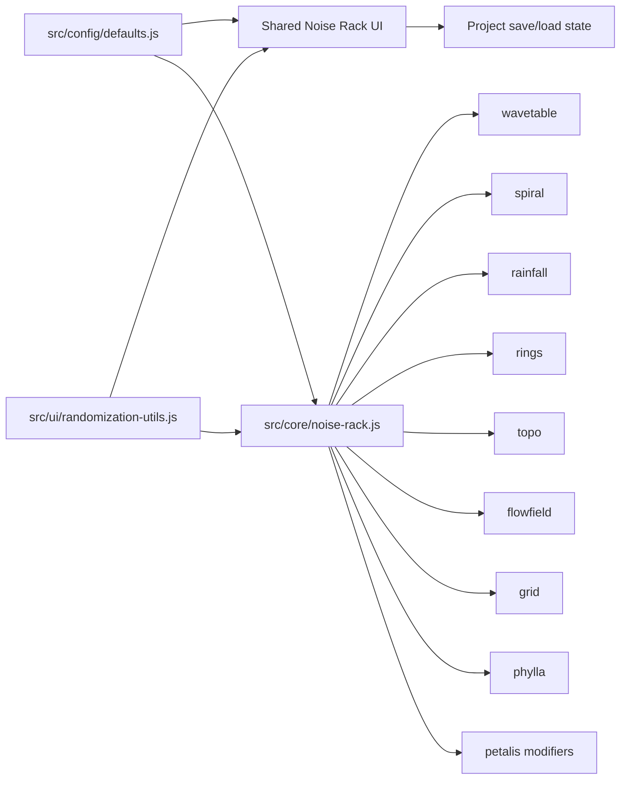

# Noise Rack Architecture

`Noise Rack` is the shared, universal multi-engine noise system for Vectura Studio.

## Goals
- Give every noise-capable algorithm access to the same layered noise engine model.
- Preserve existing algorithm-specific strengths while eliminating duplicated stack implementations.
- Keep serialization, randomization, UI controls, and testing consistent across algorithms.

## Scope

`Universal` means all current noise-capable algorithms:
- `wavetable`
- `spiral`
- `rainfall`
- `rings`
- `topo`
- `flowfield`
- `grid`
- `phylla`
- Petalis noise-driven modifier surfaces

## Target Architecture

## Migration Phases

### Phase 0
- Normalize repo language around `Noise Rack`.
- Document current gaps and parity goals.
- Establish tests and planning artifacts for the migration.

### Phase 1
- Extract shared scalar-noise evaluation and blend logic from `wavetable`, `spiral`, and `rainfall`.
- Introduce a common schema for a noise layer and a normalized stack.

### Phase 2
- Migrate `rings` to Noise Rack.
- Add multi-noise stacking.
- Add `Top Down` and `Concentric` projection options.

### Phase 3
- Migrate `topo` to Noise Rack.
- Replace misleading global controls with per-layer fractal controls where relevant.
- Preserve working contour mapping modes.

### Phase 4
- Migrate remaining noise-capable algorithms and direct noise consumers.
- Unify randomization and serialization behavior.
- Current status: `flowfield`, `grid`, `phylla`, `rings`, and `topo` are on visible Noise Rack stacks, while Petalis drift plus its existing noise-driven modifier samplers now run through Noise Rack-compatible stack evaluation. Remaining work is explicit per-modifier stack UI parity and any leftover bespoke direct samplers.

## Non-Goals
- Reducing algorithm capability to the lowest common denominator.
- Removing algorithm-specific controls that still add unique value.
- Shipping partially duplicated noise systems indefinitely.
